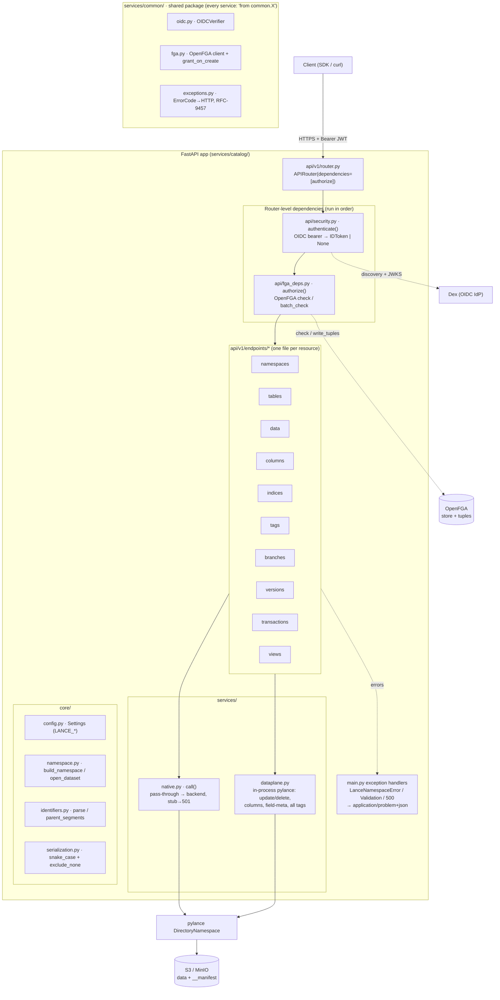
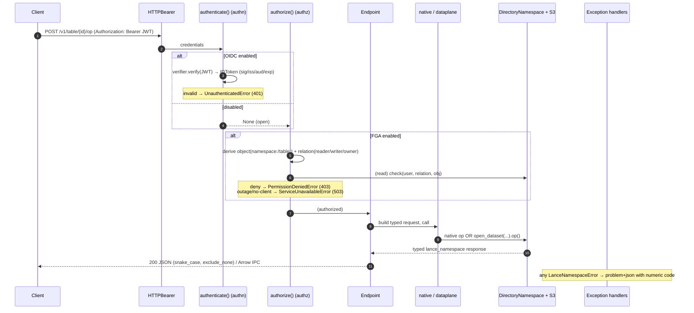
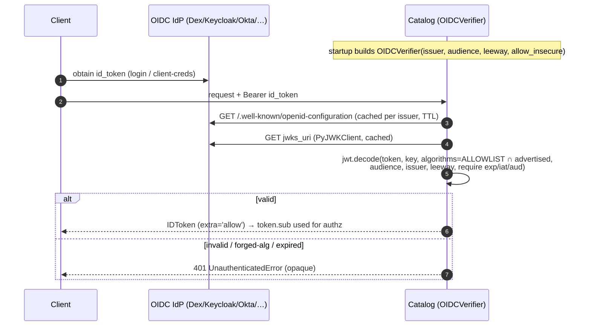
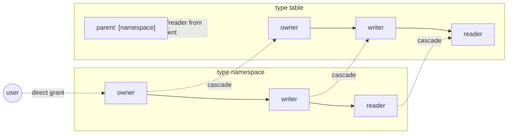
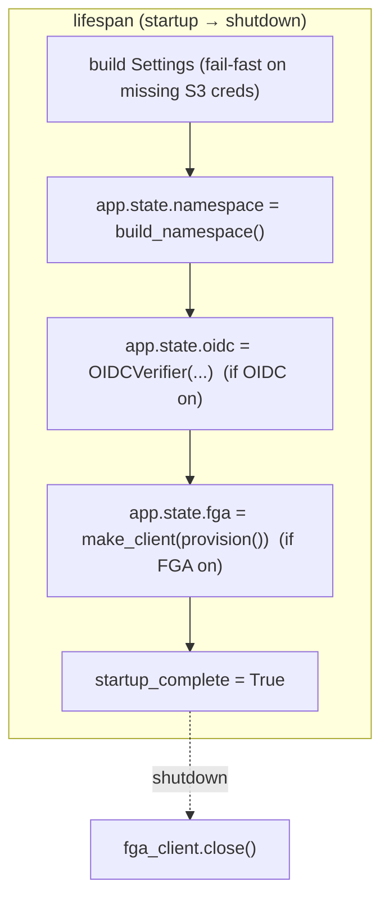

# Lance Namespace REST Catalog

A FastAPI server implementing the **Lance Namespace OpenAPI spec** (`spec.yaml`, v1.0.0)
over the native **pylance `DirectoryNamespace`** backend on **S3/MinIO**, with an in-process
**pylance data plane** filling operations the native backend stubs. Authentication and
authorization are **opt-in**: OIDC (PyJWT + JWKS) for *who you are*, OpenFGA (Zanzibar-style)
for *what you may do*. With auth disabled it is a plain, open catalog.

---

## 1. Architecture



**Layering (strict, one direction):** `api` → `services` → `core` → backend. Endpoints never
touch the object store directly; they go through `native.call` (delegates to the Rust
`DirectoryNamespace`) or `dataplane` (opens the dataset with pylance for ops the backend stubs).

---

## 2. Request lifecycle & middleware

Cross-cutting **auth** concerns are **FastAPI dependencies** wired once at the router
(`APIRouter(dependencies=[Depends(authorize)])`, and `authorize` itself depends on `authenticate`).
Order is deliberate: cheap authn first, then the OpenFGA round-trip. Exactly **two ASGI middlewares**
sit outside the router: `BodySizeLimitMiddleware` (outermost — rejects an oversized request body with a
problem+json **413** *before* it is buffered, via Content-Length fast-reject plus a streaming byte
counter; `LANCE_MAX_BODY_BYTES`, default 256 MiB — big media belongs on the direct-to-storage path, not
this API) and the read-only `maintenance_middleware` (503 + Retry-After on mutations when
`LANCE_MAINTENANCE_READ_ONLY` is set).



**Relation tiers** (`fga_deps.py`): read ops (`describe/exists/list/query/count_rows/stats/…`)
→ `reader`; generic mutations → `writer`; lifecycle (`drop/deregister`) → `owner`.
**Create-on-parent:** `create/declare/register` authorize against the **parent namespace**
(the child doesn't exist yet). **Fail-closed:** enabled-but-unwired auth raises, never opens.

---

## 3. Authentication flow (OIDC, provider-agnostic)



Hardening beyond a naive verifier: **local asymmetric-only algorithm allowlist** (defeats
`HS256`/`none` alg-confusion even if the IdP advertises them), **HTTPS-enforced** issuer/JWKS
(`LANCE_OIDC_ALLOW_INSECURE` opt-out for the http dev IdP), **discovery-issuer match**,
**clock-skew leeway**, **opaque errors**. Library: **PyJWT** (not python-jose).

---

## 4. Authorization model & write-side (OpenFGA)



Concentric: `owner ⊇ writer ⊇ reader`. A table inherits from its namespace **only when the
`table#parent@namespace` tuple exists** — so tuples must be seeded on create:

```mermaid
sequenceDiagram
    autonumber
    participant C as Client (alice)
    participant E as create_* endpoint (async)
    participant B as DirectoryNamespace (threadpool)
    participant F as OpenFGA

    C->>E: POST /v1/table/db1$t/create (Bearer)
    Note over E: authorize() → writer on parent namespace:db1
    E->>B: run_in_threadpool(native.call, "create_table", req, arrow)
    B-->>E: 200
    E->>F: grant_on_create(owner table:db1$t, parent namespace:db1@table:db1$t)
    Note over F: idempotent; only after backend success
    E-->>C: 200
```

`GET /v1/table` (list) is filtered per caller via `list_objects`. **Top-level** namespace/table
creation needs only authentication by default (`LANCE_FGA_LOCK_ROOT_CREATE=true` to require a
grant on `fga_root_object`). The store/model are **provisioned idempotently** at startup
(reused by name across restarts so tuples are never orphaned).

---

## 5. State & lifecycle



| State | Where | Lifetime | Persistent? |
|---|---|---|---|
| Settings, namespace handle, OIDC verifier, FGA client, `startup_complete`/`shutting_down` | `app.state` (lifespan) | process | no (rebuilt each boot) |
| OIDC discovery + JWKS | in `OIDCVerifier` (TTL cache) | TTL | no |
| Catalog metadata (namespaces, tables, versions, tags) | Lance `__manifest` + table dirs | durable | **S3/MinIO** |
| Table data (Arrow) | Lance dataset files | durable | **S3/MinIO** |
| Authz tuples (owner/writer/reader, parent) | OpenFGA store | durable | **OpenFGA DB (SQLite/Postgres)** |

The app holds **no database of its own** — catalog + data live in Lance/S3, permissions in
OpenFGA. `/livez` = process up; `/readyz` = 3-state (`starting` / `ready` + namespace id / `shutting_down`).
The lifespan additionally wires (diagram omits for brevity): the **OpenBao secret fetch**
(`LANCE_SECRETS_FROM_DAPR` — fail-closed sole source for the S3 secret), the **credential vendor**
(`core/vending.py`), and the **lineage emitter** (`core/lineage_emit.py`, http or Dapr transport) — all
torn down independently on shutdown.

---

## 6. Data plane: native vs in-process pylance

| Path | Ops | Mechanism |
|---|---|---|
| **native** (`services/catalog/services/native.py`) | create/insert/merge/query/count, describe/exists/list, register/deregister/rename/restore/stats, indices, versions, transactions, materialized views | delegate to Rust `DirectoryNamespace`; missing/stub → spec-correct **501** |
| **pylance data plane** (`services/catalog/services/dataplane.py`) | `update`, `delete`, add/alter/drop columns, field-metadata, all 5 tag ops, **branches**, version list/checkout, **blob-v2 create** (a `lance.blob` column routes to a direct `data_storage_version="2.2"` write — declare → write → rollback-on-failure — because the native create pins 2.1 and rejects blob columns; `#88` also strips the catalog's root `storage_options` from every create response) | `open_dataset(...)` then call pylance directly |

Writes/reads of table **data** exchange **Arrow IPC** (`application/vnd.apache.arrow.stream` in,
`application/vnd.apache.arrow.file` out). All metadata responses are typed `lance_namespace`
Pydantic models, serialized snake_case with `exclude_none`. Errors are **RFC-9457 problem+json**
carrying the numeric Lance `ErrorCode`. *(Branches are now BACKED in-process via the data plane —
the former 501s became real operations; batch transactions remain spec-correct 501.)*

---

## 7. Configuration (`LANCE_*` env)

| Var | Default | Purpose |
|---|---|---|
| `LANCE_REST_IMPL` / `LANCE_REST_ROOT` | `dir` / `s3://lance-catalog` | backend + root |
| `LANCE_NS_DELIMITER` | `$` | identifier delimiter |
| `LANCE_S3_ENDPOINT` / `_ACCESS_KEY_ID` / `_SECRET_ACCESS_KEY` / `_REGION` | MinIO defaults; **creds required** | object store |
| `LANCE_OIDC_ENABLED` / `_ISSUER` / `_AUDIENCE` / `_CACHE_TTL` / `_LEEWAY` / `_ALLOW_INSECURE` | off | OIDC authn |
| `LANCE_FGA_ENABLED` / `_API_URL` / `_STORE_ID` / `_MODEL_ID` / `_ROOT_OBJECT` / `_LOCK_ROOT_CREATE` | off | OpenFGA authz |
| `LANCE_MAX_BODY_BYTES` | 256 MiB | 413 body cap (Arrow-IPC OOM guard; steer big media to direct-to-storage) |
| `LANCE_ALLOW_EXTERNAL_BLOBS` | off | blanket: accept `Blob.from_uri` external-pointer columns pointing ANYWHERE (SSRF/GC caveats — see `core/config.py`) |
| `LANCE_EXTERNAL_BLOB_BASES` | — | the safer allowlist: comma-separated approved base URIs — external pointers accepted only *under* a registered base, blanket flag left off |
| `LANCE_VENDING_MODE` / `_VENDING_TTL_SECONDS` / `_S3_ASSUME_ROLE_ARN` / `_S3_STS_ENDPOINT` | `mode_b` | data-plane credential vending (server-mediated / STS / static) |
| `LANCE_LINEAGE_EMIT_ENABLED` / `_LINEAGE_TRANSPORT` / `_LINEAGE_URL` / `_DAPR_PUBSUB` / `_DAPR_TOPIC` | off | best-effort OpenLineage emit on writes (http or Dapr pub/sub) |
| `LANCE_SECRETS_FROM_DAPR` / `_DAPR_SECRET_STORE` / `_DAPR_SECRET_KEY` | off | fetch the S3 secret from OpenBao at boot (fail-closed sole source) |
| `LANCE_MAINTENANCE_READ_ONLY` | off | 503 + Retry-After on mutations (migration windows) |

The full set (with rationale comments) lives in `services/catalog/core/config.py` — that file is the
source of truth; this table is the highlights.

---

## 8. Run & test

```bash
# Bring up the full auth stack (catalog + MinIO + OpenFGA-SQLite + Dex) and assert the chain.
# KEEP_STACK=1 leaves it running afterwards.
KEEP_STACK=1 ./scripts/auth_e2e.sh

# Drive it by hand:
TOKEN=$(curl -s -X POST http://localhost:5556/dex/token \
  -d grant_type=password -d client_id=lance-catalog \
  -d username=alice@example.com -d password=password -d scope=openid \
  | python3 -c 'import sys,json;print(json.load(sys.stdin)["id_token"])')

curl -X POST  http://localhost:2333/v1/namespace/myns/create        -H "Authorization: Bearer $TOKEN" -H 'content-type: application/json' -d '{}'
curl -X POST "http://localhost:2333/v1/table/myns\$t/create"        -H "Authorization: Bearer $TOKEN" -H 'content-type: application/vnd.apache.arrow.stream' --data-binary @table.arrows
curl -X POST "http://localhost:2333/v1/table/myns\$t/count_rows"    -H "Authorization: Bearer $TOKEN"

# Endpoints: catalog :2333 (/docs) · Dex :5556/dex · OpenFGA :8080 (+ Playground :3000) · MinIO console :9901
# Inspect the real OpenFGA store/tuples (NOT the Playground): curl localhost:8080/stores
# Tear down: docker compose -f .docker/docker-compose.yml -f .docker/docker-compose.auth.sqlite.yml -f .docker/docker-compose.local.yml down -v
```

Local dev (no Docker): `uv sync` then `uv run pytest` (380+ unit/integration tests; e2e is gated).
Quality gates: `uvx ruff check .` · `uvx ty check` · `make ci` (hermetic, via Dagger).

> The commands above are the **standalone-catalog** dev path (docker-compose, still runnable). The **canonical
> full system** — the event-driven medallion lakehouse (lance-ray producer + raw→bronze→silver→gold Dapr
> movers, lineage→AGE, OpenFGA, compaction, OpenBao, GreptimeDB observability) — deploys to **kind + Helm**
> via `make up`. Read [`docs/FLOW.md`](docs/FLOW.md) for the end-to-end flow and [`docs/DEPLOY.md`](docs/DEPLOY.md) to run it.
>
> Beyond the catalog, the platform now also ships: the **multimodal blob/media pipeline** (blob-v2 columns at
> file format 2.2; the cascade derives thumbnails + embeddings and lineage records the media schema —
> [`docs/MEDALLION.md`](docs/MEDALLION.md)), a **provider-agnostic ingest/egress seam**
> (`services/common/sources.py` / `sinks.py`: external S3/local → bronze with source-URI provenance, gold →
> external sink), and a **real Ray compute seam** — `make ray-demo` runs a genuine Ray cluster in kind and
> `ray job submit`s a distributed Lance write/index/evolve/compact against RustFS; the movers can submit
> their stage transform as a Ray job on their Dapr trigger (`medallion.ray`) — [`docs/RAY.md`](docs/RAY.md).
> The **Ray TRAIN workload class** (training jobs producing governed, versioned model artifacts — the
> model registry is itself a Lance dataset pointing at plain-path S3 weights) is a decided design awaiting
> implementation: [`docs/RAY-TRAIN.md`](docs/RAY-TRAIN.md).
