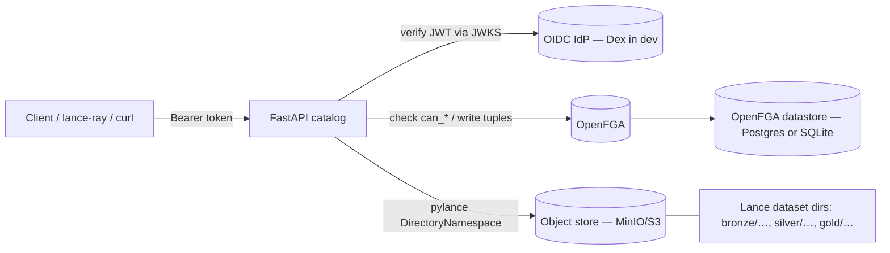
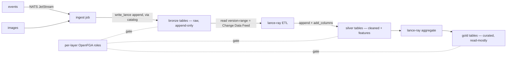

# lance-ns — Architecture & Status

The doc to read first. Plain-language map of **what we're building, how the pieces fit,
where we are right now, and what's next**. Skim the diagrams; read the section you need.

> 🧭 **Want the end-to-end pipeline in order — ingest → movers → gates → lineage → compaction?** Read
> **[`FLOW.md`](FLOW.md)**: the single coherent narrative of the *implemented* flow, with the distributed
> (KubeRay / Ray Data) variants clearly marked as the rask future.
>
> 🔬 **Are we correct, and what do we lack vs Lakekeeper / Marquez?** See **[`FEATURE-GAP.md`](FEATURE-GAP.md)** —
> a docs-grounded confidence review (HIGH) + an honest feature-gap map.
>
> 📜 **What contract do producers and consumers actually rely on?** See **[`DATA-CONTRACT.md`](DATA-CONTRACT.md)** —
> "the Lance manifest is the schema, the version is the handshake": the storage/bus/identity
> contract, its three enforcement points (quality gate / FGA / reconcile), what Dapr+NATS do and
> don't enforce, the honest prod-readiness split (breaking changes are the known gap), and the
> Lakekeeper comparison.

> 🖱️ **Prefer to click through it?** Open [`system-diagram.html`](system-diagram.html) — an
> interactive walk-through of the four core flows (create / read / promote / lineage), with the
> data-plane mode toggle (Mode B server-mediated vs STS vending) and real payloads per step.
> ([`system-diagram.md`](system-diagram.md) is the text companion.)

---

## 1. What this is (one paragraph)

`lance-ns` is a **REST catalog for Lance datasets** — a thin HTTP service (FastAPI) that
lets clients create/list/describe namespaces & tables, read/write table data (Arrow-IPC),
and does it with **authentication** (OIDC) and **fine-grained authorization** (OpenFGA,
Zanzibar-style). The actual table bytes live in object storage (MinIO/S3) as **Lance
datasets**; the catalog is the *control plane* that names them, locates them, hands out
scoped credentials, and decides **who may do what**. Think "Iceberg REST catalog /
Lakekeeper, but for Lance (multimodal: vectors + blobs + columns)."

---

## 2. The two planes (the single most important idea)

```
                CONTROL PLANE                          DATA PLANE
        (this service — decides + locates)     (engines — move the bytes)
   ┌─────────────────────────────────────┐   ┌──────────────────────────────┐
   │  FastAPI REST catalog                │   │  lance-ray / pylance / a job │
   │  - namespaces & tables CRUD          │   │  - read_lance / write_lance  │
   │  - describe -> location + creds      │──▶│  - add_columns (ETL)    │
   │  - OIDC authn + OpenFGA authz        │   │  - compaction / vector search│
   │  - seeds ownership tuples on create  │   │  - commits new Lance versions│
   └─────────────────────────────────────┘   └──────────────────────────────┘
                    │                                        │
                    ▼                                        ▼
        OpenFGA (tuples)  +  OIDC IdP (Dex)          Object store (MinIO/S3)
                                                      Lance dataset dirs (*.lance)
```

The catalog **never moves data itself** (no heavy ETL inside the API process). It
authorizes, locates, and records. Compute is a **client** of the catalog. This is why
"promotion between layers" (below) is a *job*, not a catalog endpoint.

### Credential vending & STS — how, and why it matters for the lakehouse

A client opens a table, then calls `POST /v1/table/{id}/credentials?tier=read|write` to get a
**credential** to reach object storage directly. Four pluggable modes (`chart` `vending.mode`;
`services/catalog/core/vending.py`), strongest first:

1. **STS vending (`StsVendor`) — recommended.** The catalog calls the S3 backend's STS
   `AssumeRole` with an **inline session policy** scoped to *just this table's bucket/prefix and
   tier* (read vs write), and gets a **short-TTL** `{access_key, secret_key, session_token}`. The
   client reads/writes the bytes directly with that token. Works on **MinIO, Ceph RGW, AWS**.
2. **Mode B (`ModeBVendor`) — safe default.** No credential is vended; the client uses the
   catalog's server-mediated Arrow-IPC endpoints. Backend-agnostic; nothing is delegated.
3. **Web-identity (`web_identity`) — the RustFS-native path.** RustFS rejects plain `AssumeRole`, so
   the caller's Dex id_token is exchanged via `AssumeRoleWithWebIdentity` for creds bound to a role
   policy, narrowed per-table by an inline session policy. This is what makes scoped STS work on RustFS.
4. **Static (`StaticPrefixVendor`).** A long-lived per-bucket key — for S3 backends without STS
   *policy scoping* (e.g. GCS interop).

**Why STS is the right default for a *governed* lakehouse:**

- **Least privilege, per table.** The session policy means a token minted for `silver$features`
  can't touch `gold$revenue`. The OpenFGA decision (`can_read_data` / `can_write_data`) is
  **projected onto the storage layer**, so authorization still holds on the direct-I/O fast path —
  not just at the API.
- **Short-lived.** Tokens expire in minutes (`expires_at_millis`); a leaked one has a small,
  bounded blast radius instead of being a standing key.
- **No durable secrets on compute.** lance-ray / jobs never hold long-lived storage keys — they
  get a fresh scoped token per table and authenticate to the catalog with **workload identity**.
- **Direct I/O, no proxy bottleneck.** Bytes flow client ↔ storage (not through the catalog), so
  the catalog stays a thin control plane while large **multimodal** reads/writes scale on the engine.
- **One identity, three axes.** The same `table:<id>` gates *who-may* (OpenFGA), *which token*
  (the vended STS creds), and *what-changed* (Lance versions + lineage).

---

## 3. Component map



Code layout (where each concern lives). The catalog service lives under
`services/catalog/`, layered into `api/` (routes/deps/security), `core/` (config + infra),
and `services/` (business logic); the five cross-service modules (`secrets`, `dapr_auth`,
`fga`, `oidc`, `exceptions`) live in `services/common/` and every service imports them as
`from common.X`:

| Path | Responsibility |
|---|---|
| `services/catalog/main.py` (entrypoint `catalog.main:app`) | App lifespan: build OIDC verifier + OpenFGA client into `app.state`, graceful shutdown |
| `services/catalog/api/security.py` | **Authn** — verify the OIDC token → `CurrentToken` (or fail closed) |
| `services/catalog/api/fga_deps.py` | **Authz** — `authorize` (router-level pre-op `can_*` check) **and** `seed_ownership` (post-create grant). The op→`can_*` map is the only policy logic in the app. |
| `services/common/fga.py` | Shared OpenFGA client wrapper (imported as `from common import fga`): `check`/`batch_check`/`list_objects`/`write_tuples`/`grant_on_create`, id helpers, retry + fail-closed |
| `services/common/auth/model.fga` / `model.json` / `model.fga.yaml` | The authorization **model** (DSL, the JSON the app loads, and the model tests) — the model owns the privilege math |
| `services/catalog/api/v1/endpoints/*` | Thin HTTP handlers → `services.native`/`services.dataplane` for the backend, `fga_deps.seed_ownership` for grants |
| `services/catalog/services/native.py`, `dataplane.py` | Call pylance (run in a threadpool — it's blocking) |
| `services/catalog/core/config.py` | `pydantic-settings` (env-driven config) |

---

## 4. Request lifecycle (what happens on every call)

```
HTTP request
  │
  ├─ 1. Authn  (services/catalog/api/security.py)
  │      verify the OIDC JWT (signature via JWKS, iss/aud/exp, alg allowlist).
  │      → CurrentToken (the caller's sub) or 401. Fail closed if verifier missing → 503.
  │
  ├─ 2. Authz  (services/catalog/api/fga_deps.authorize — a router-level dependency)
  │      derive (object, can_* relation) from the route, e.g.
  │        describe table  -> check can_get_metadata on table:<id>
  │        insert  table   -> check can_write_data   on table:<id>
  │        drop    table   -> check can_drop         on table:<id>   (owner tier)
  │        create  table   -> check can_create_table on the PARENT    (create-on-parent)
  │      OpenFGA says yes/no. No → 403. OpenFGA down → 503 (never silent allow).
  │
  ├─ 2b. Overwrite gate  (create mode=Overwrite of an EXISTING table, in the create handler)
  │      Overwrite is spec-defined as drop+recreate, so it ADDITIONALLY requires owner-tier
  │      can_drop on the existing table — BEFORE the destructive write. Without it a mere
  │      namespace writer could overwrite (destroy) and, via step 4b, seize another user's table.
  │
  ├─ 3. Handler  (services/catalog/api/v1/endpoints/*)
  │      run the pylance backend op in a threadpool (it's blocking I/O).
  │
  ├─ 4. Seed  (only on create — fga_deps.seed_ownership)
  │      write owner + parent tuples for the new object so the creator keeps access
  │      and the new object inherits the cascade. No-op when FGA is off/unauthenticated.
  │
  └─ 4b. Revoke  (on drop/deregister/rename-source/overwrite — fga_deps.revoke_ownership)
         delete EVERY tuple on the removed object so a reused id can't inherit stale grants
         (privilege bleed). A Cascade namespace drop enumerates its descendants first and
         revokes each; an Overwrite resets the replaced table's ACL (owner-gated at 2b).
```

**Why two authz touch-points?** Step 2 is the *pre-op check* ("may you?"). Step 4 is the
*post-create grant* ("you made it, you own it; link it into the tree"). Step 4b is the
*revoke-on-removal* (drop/overwrite clears grants so a reused id starts clean). All live in
`fga_deps.py` so all request-time authz policy is in one module.

---

## 5. The authorization model (OpenFGA)

### What exists today (P0 — shipped & tested)

```
catalog                      (the root; "the project" today)
  └── namespace              (self-nesting: bronze, bronze$domain1, …)
        └── table

types:   user, role, catalog, namespace, table
subjects: user:<sub>  AND  role:<name>#assignee   (grant a team/role, not just a person)
rungs:   owner ⊇ writer ⊇ reader   (concentric; cascade DOWN via `parent`)
actions: can_get_metadata, can_read_data, can_write_data, can_drop, can_deregister,
         can_delete, can_create_table, can_create_namespace, …   (the app checks THESE)
```

- **Concentric**: an `owner` is automatically a `writer` is automatically a `reader`.
- **Cascade**: a grant on a namespace flows to its nested namespaces and tables via the
  `parent` edge (which `seed_ownership` writes on create).
- **Roles as subjects**: `role:data_eng#assignee` can be granted a rung on any object;
  add people to the role and they all inherit it. (This is how "teams" work.)
- **`can_*` actions**: the app never checks raw `owner/writer/reader`; it checks an action
  like `can_write_data`, and the *model* decides that reduces to the writer rung. Move the
  policy in the model, not the code.

The model is in three kept-in-sync files: `model.fga` (human DSL, source of truth),
`model.json` (what the app loads into OpenFGA), `model.fga.yaml` (model tests with a
medallion scenario: bronze/silver/gold + ingestion/data_engineer/analyst roles).

### Planned (P1 — the 3-axis model you asked for)

Three separations — **teams × projects × layers**:

```
catalog
  └── project            (NEW: membership boundary; per-project admin)
        └── namespace     (= layer: project$bronze / project$silver / project$gold)
              └── table

teams/roles  = role:<x>#assignee  granted a rung per (project, layer)
projects     = a `project` type; project membership cascades to its layers
layers       = namespaces; a person's can_* is restricted per layer
```

A person is in a **team**; the team is granted a **rung per layer** of a **project**
(e.g. `data_eng#assignee` → reader on `alpha$bronze`, writer on `alpha$silver`). Optional
hard isolation: gate every layer grant on project membership (intersection). This is a
*superset* of P0 — add a `project` type, keep everything else. See §8.

---

## 6. The medallion data flow (bronze → silver → gold)

Layers are **namespaces**; datasets are **Lance tables** (each a `*.lance` directory).
Default storage: **one bucket per project, layers = prefixes** (a layer is *not* its own
bucket unless you deliberately configure per-layer storage — authz and physical storage
are independent axes).



- **Bronze** = raw (images/events) appended as-is. Lance is blob/vector-native.
- **Silver** = cleaned + enriched via `lance-ray` (`write_lance(mode="append")`,
  `add_columns` for distributed backfill like embeddings). Read only the **new
  bronze versions** since last run — Lance's version history *is* the Change Data Feed.
- **Gold** = curated/aggregated, analysts get reader.

**"Promotion" is a compute job (a client), not a catalog feature.** It: authenticates →
`describe`(bronze) [authz `can_read_data` + get location/creds] → read → transform →
`create`/`insert`(silver) [authz `can_create_table`/`can_write_data`] → commit a new
Lance version. The catalog authorizes + locates + records; the engine moves bytes. **You
can do this today with the existing endpoints** — and the promotion *job* is now built too: the
event-driven medallion movers (see §7, [`FLOW.md`](FLOW.md)).

---

## 7. Where we are right now (status)

| Capability | Status |
|---|---|
| Control plane: namespaces/tables CRUD, `describe` → location + creds | ✅ done |
| Data plane (single-table): insert/append, merge_insert, update, delete, query, count, add_columns | ✅ done |
| Authn (OIDC, PyJWT, JWKS, alg allowlist, fail-closed) | ✅ done |
| Authz (OpenFGA, `can_*` per op, concentric + parent cascade, roles-as-subjects) | ✅ done, e2e-verified |
| Post-create ownership seeding (single `seed_ownership` helper) | ✅ done |
| Resilience (retry + fail-closed incl. transport errors; one retry layer; bounded) | ✅ done |
| Medallion model + tests (bronze/silver/gold + persona roles) | ✅ done (model + `model.fga.yaml`) |
| **Promotion pipeline** (bronze→silver→gold; event-driven Dapr movers + opt-in authz + quality gates) | ✅ built & tested — see [`FLOW.md`](FLOW.md), [`MEDALLION.md`](MEDALLION.md) |
| Distributed promotion at scale (real lance-ray Ray Data job on KubeRay) | 🔶 rask integration — the in-process fake-Ray compute fills the same contract today ([`FLOW.md` §7](FLOW.md#7-future--the-distributed-variants)) |
| `project` type + 3-axis governance (teams × projects × layers) | ✅ modeled (`model.fga`: project/warehouse/team/validator) + fga-tested; app-side auto-seed of the full hierarchy is partial (see `DEPLOY.md`) |
| Orchestration (cron → NATS → Dapr) | ✅ Dapr cron binding (compaction) + NATS/Dapr pub-sub built & deployed; Dapr **Workflow** still deferred |
| Lineage (OpenLineage ingest + graph queries over Apache AGE; producer-side emitter) | ✅ service built & deployed; read-side authz implemented + SvelteKit UI (see §9, `docs/LINEAGE.md`) |
| OTel observability (GreptimeDB + Vector + Perses, OTLP-direct) | ✅ built, deployed, `make e2e-obs`-verified |

---

## 8. "Commit auth" — what it is and how it's already handled

A **commit** here = writing a new Lance version (append/merge/update/delete, or a
version/batch-commit). In a governed catalog you want a commit to be **(a) authorized,
(b) audited, (c) lineage-tracked** — three *different* things:

| Concern | Question | Who answers it | Status |
|---|---|---|---|
| **(a) Authorization** | "May this caller commit to this table?" | **OpenFGA** — `authorize` checks `can_write_data` (or `can_commit`) on the table before the handler runs | ✅ already wired |
| **(b) Audit trail** | "What versions exist; what changed?" | **Lance versioning** — every commit is an immutable, time-travelable version | ✅ free from the format |
| **(c) Lineage** | "Where did this data come from?" | **OpenLineage** (emit on commit) → the in-service Apache AGE graph | ✅ built & deployed (see §9 + `docs/LINEAGE.md`) |

So **commit auth already exists**: committing goes through the same `authorize` dependency
that gates every write, checking `can_write_data` on `table:<id>`. **It does NOT need
OpenLineage or a graph database.**

If you want **commit as a *distinct* permission** (e.g. a "reviewer" who can stage writes
but not commit an official version), the model already has a `can_commit` relation — we'd
route the commit/version endpoints to `can_commit` instead of `can_write_data`. That's a
small, contained change in `fga_deps._action_relation`, no new infrastructure.

---

## 9. Lineage (OpenLineage + graph DB) — a *separate* axis

This is what your "OpenLineage + graph database + dummies in between" intuition is really
about — and it's **provenance/observability, not access control**:

- **OpenLineage** = an open standard for emitting "a job *run* read inputs X, wrote outputs
  Y" events. The **promotion job emits** these (it's instrumentation in the compute layer,
  not the catalog).
- **Backend** = where events land and become a queryable graph: **Marquez** (the reference
  server, Postgres-backed) or a **graph database** (Neo4j) if you want rich graph traversal
  ("what gold tables derive from this bronze image set?").
- **"Dummies in between"** = the dev stubs we already use elsewhere (Dex for OIDC, moto for
  S3) — for lineage you'd run a local/dummy collector or Marquez until the real one exists.

How it relates to commit auth: **complementary, not the same.** On a governed commit:
OpenFGA says *may you* (authz), Lance records *a new version* (audit), OpenLineage records
*derived-from bronze@v3* (lineage). You can ship commit auth **without any of this**;
lineage is a later governance/observability layer.

```
commit  ──▶  OpenFGA check (may you?)        ← access control      [done]
        ──▶  Lance new version (what/when)   ← audit trail         [free]
        ──▶  OpenLineage event (from where?) ← lineage graph       [built]
```

**Built as a lightweight Marquez.** Rather than Marquez (Java/Dropwizard + relational
Postgres) or Neo4j, the `services/lineage/` service is a small FastAPI app that ingests OpenLineage
events at the standard `POST /api/v1/lineage` path and stores them in **Apache AGE** (a
Postgres graph extension), so lineage traversal is native openCypher. Producers emit via the
official `openlineage-python` client (see `services/lineage/seed.py` for the mock medallion emitter).
Full design + API in [`docs/LINEAGE.md`](LINEAGE.md).

---

## 10. How to run / verify (dev)

```bash
# unit + integration tests (no network)
uv run pytest -q
uvx ruff check . && uvx ty check

# full auth stack end-to-end (Docker: catalog + Dex + OpenFGA + Postgres + MinIO)
./scripts/auth_e2e.sh           # anon 401 → alice create/read/write 200 → bob 403
AUTH_OVERLAY=.docker/docker-compose.auth.sqlite.yml ./scripts/auth_e2e.sh   # lighter SQLite stack
```

Config is env-driven (`LANCE_*`, see `services/catalog/core/config.py`): `LANCE_OIDC_ENABLED`,
`LANCE_FGA_ENABLED`, `LANCE_FGA_API_URL`, `LANCE_FGA_ROOT_OBJECT` (default `catalog:lance`),
`LANCE_FGA_TIMEOUT_SECONDS`, etc.

---

## 11. Glossary

- **Control plane / data plane** — decide+locate (this service) vs move bytes (engines).
- **Namespace** — a logical container (a path prefix); a medallion *layer* is a namespace.
- **Table / dataset** — a Lance dataset; physically a `*.lance` **directory** (versioned).
- **Tuple** — an OpenFGA fact, e.g. `user:alice owner table:db1$users`.
- **`can_*` relation** — an action permission the app checks (model maps it to a rung).
- **Concentric** — owner ⊇ writer ⊇ reader.
- **Cascade** — a grant flows down the `parent` edge (catalog → namespace → table).
- **Create-on-parent** — creating a child is authorized against its parent.
- **Credential vending** — the catalog returns scoped storage creds per table (`describe`).
- **Medallion** — bronze (raw) → silver (cleaned) → gold (curated) data tiers.
