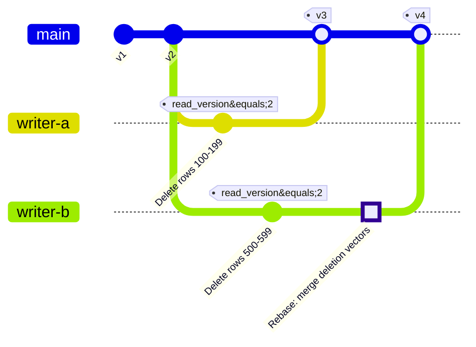
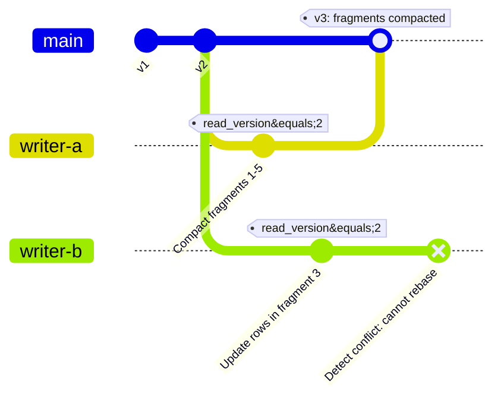
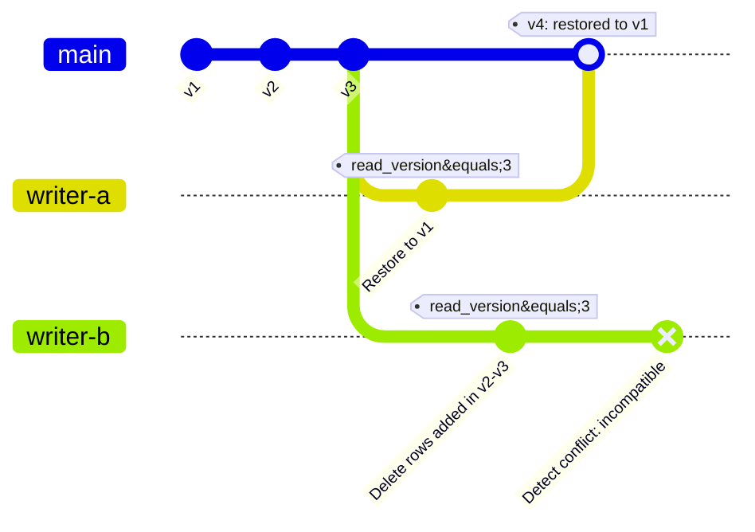

Directory structure:
└── format/
    ├── AGENTS.md
    ├── index.md
    ├── .pages
    ├── file/
    │   ├── encoding.md
    │   ├── index.md
    │   ├── versioning.md
    │   └── .pages
    ├── index/
    │   ├── index.md
    │   ├── .pages
    │   ├── scalar/
    │   │   ├── bitmap.md
    │   │   ├── bloom_filter.md
    │   │   ├── btree.md
    │   │   ├── fmindex.md
    │   │   ├── fts.md
    │   │   ├── label_list.md
    │   │   ├── ngram.md
    │   │   ├── rtree.md
    │   │   ├── zonemap.md
    │   │   └── .pages
    │   ├── system/
    │   │   ├── frag_reuse.md
    │   │   ├── mem_wal.md
    │   │   └── .pages
    │   └── vector/
    │       ├── index.md
    │       └── .pages
    └── table/
        ├── branch_tag.md
        ├── index.md
        ├── layout.md
        ├── mem_wal.md
        ├── row_id_lineage.md
        ├── schema.md
        ├── transaction.md
        ├── versioning.md
        └── .pages


Files Content:


================================================
FILE: docs/src/format/AGENTS.md
================================================
# Format Documentation Guidelines

Also see [root AGENTS.md](../../../AGENTS.md) for cross-language standards.

## Style

- Keep format docs as concise, text-only reference — no code examples (put those in user guide sections).
- Express file schemas as `pyarrow` schema definitions, not markdown tables or informal text — pyarrow schemas are unambiguous and executable.
- Use language-agnostic definitions (JSON Schema, protobuf) — not language-specific code like Rust structs.

## Content

- Explain schema/data evolution with concrete mechanics (field IDs, tombstones, data rewrites) — don't just name operations or defer to external specs.
- Describe all algorithms with full detail: parameters, precision, ordering, normalization bounds, and implementation steps — never reference an algorithm by name alone.
- Index docs must include explicit file schemas and describe reader navigation (page type distinction, root/entry point location) — follow the pattern in `index/scalar/bitmap.md`.


================================================
FILE: docs/src/format/index.md
================================================
# Lance Lakehouse Format Specifications

Lance is a lakehouse format defined as a stack of interoperating specifications, rather than as a single file format or metadata layout. The storage-facing layers cover files, tables, indices, and catalogs. A unified namespace interface sits above those layers and gives engines a consistent way to work with Lance tables across catalog implementations.

## Architecture Overview

Modern lakehouses are built from complementary layers. Lance keeps those layers intentionally decoupled so that the file format, table metadata, indices, and catalogs can evolve independently without forcing lock-in across the stack.


At a high level:

- The **file format** stores column data in large pages optimized for random access and avoids row groups.
- The **table format** manages fragments, manifests, deletions, schema evolution, and ACID commits.
- The **index formats** define redundant search structures such as scalar, vector, full-text, and system indices.
- The **catalog specs** define how tables are discovered, registered, and coordinated across engines and services.
- The **namespace client spec** provides a unified interface for engines to interact with any catalog implementations.

The layers are designed so that only table readers, table writers, and index readers or writers need to understand the on-disk Lance file layout.

## Design Themes

### File Format

The Lance file format is optimized for cloud object storage and highly selective reads. It avoids Parquet-style row groups, uses structural encodings for efficient random access, and keeps statistics and search structures out of the file format so those concerns can evolve independently as indices.

### Table Format

The Lance table format organizes data in two dimensions: rows are grouped into fragments, and each fragment can contain multiple data files, each contributing a subset of columns. This makes column additions and backfills primarily metadata operations instead of data rewrites, which is especially useful for feature engineering and embedding workflows.

### Index Formats

Indices are first-class table objects. Lance tables define how indices are discovered, versioned, and coordinated transactionally. The index formats themselves remain decoupled from both the file encoding and the table manifest structure.

### Catalog Specs

Lance provides both storage-native and service-oriented catalog options. The [Directory Catalog](catalog/dir/index.md) supports zero-infrastructure deployments directly on object stores, while the [REST Catalog](catalog/rest/index.md) standardizes enterprise-facing APIs and can act as an external manifest store.

### Namespace Client Spec

The [Namespace Client Spec](namespace/index.md) provides a language-agnostic interface for engines to interact with any catalog implementation, including Lance-native catalogs and third-party catalog systems. This abstraction allows applications to switch between directory-based, REST-based, and third-party catalogs without changing their code.

## Specifications

The main specification entry points are:

1. **File Format**: [Lance file format](file/index.md)
2. **Table Format**: [Lance table format](table/index.md)
3. **Index Formats**: [Scalar, vector, and system index formats](index/index.md)
4. **Catalog Specs**: [Directory and REST catalog specs](catalog/index.md)
5. **Namespace Client Spec**: [Lance namespace interface](namespace/index.md)


================================================
FILE: docs/src/format/.pages
================================================
nav:
  - Overview: index.md
  - File Format: file
  - Table Format: table
  - Index Formats: index
  - Catalog Specs: catalog
  - Namespace Client Spec: namespace


================================================
FILE: docs/src/format/file/encoding.md
================================================
# Lance Encoding Strategy

The encoding strategy determines how array data is encoded into a disk page. The encoding strategy tends to evolve
more quickly than the file format itself.

## Older Encoding Strategies

The 0.1 and 2.0 encoding strategies are no longer documented. They were significantly different from future encoding
strategies and describing them in detail would be a distraction.

## Terminology

An array is a sequence of values. An array has a data type which describes the semantic interpretation of the values.
A layout is a way to encode an array into a set of buffers and child arrays. A buffer is a contiguous sequence of
bytes. An encoding describes how the semantic interpretation of data is mapped to the layout. An encoder converts
data from one layout to another.

Data types and layouts are orthogonal concepts. An integer array might be encoded into two completely different
layouts which represent the same data.


### Data Types

Lance uses a subset of Arrow's type system for data types. An Arrow data type is both a data type and an encoding.
When writing data Lance will often normalize Arrow data types. For example, a string array and a large string array
might end up traveling down the same path (variable width data). In fact, most types fall into two general paths. One
for fixed-width data and one for variable-width data (where we recognize both 32-bit and 64-bit offsets).

At read time, the Arrow data type is used to determine the target encoding. For example, a string array and large
string array might both be stored in the same layout but, at read time, we will use the Arrow data type to determine
the size of the offsets returned to the user. There is no requirement the output Arrow type matches the input Arrow
type. For example, it is acceptable to write an array as "large string" and then read it back as "string".

## Search Cache

The search cache is a key component of the Lance file reader. Random access requires that we locate the physical
location of the data in the file. To do so we need to know information such as the encoding used for a column,
the location of the page, and potentially other information. This information is collectively known as the "search
cache" and is implemented as a basic LRU cache. We define a "initialization phase" which is when we load the various indexing information into the search cache. The cost of initialization is assumed to be amortized over the lifetime
of the reader.

When performing full scans (i.e. not random access), we should be able to ignore the search cache and sometimes
can avoid loading it entirely. We _do_ want to optimize for cold scans as the initialization phase is often not
amortized over the lifetime of the reader.

## Structural Encoding

The first step in encoding an array is to determine the structural encoding of the array. A structural encoding
breaks the data into smaller units which can be independently decoded. Structural encodings are also responsible
for encoding the "structure" (struct validity, list validity, list offsets, etc.) typically utilizing repetition
levels and definition levels.

Structural encoding is fairly complicated! However, the goal is to suck out all the details related to I/O
scheduling so that compression libraries can focus on compression. This keeps our compression traits simple
without sacrificing our ability to perform random access.

There are only a few structural encodings. The structural encoding is described by the `PageLayout` message and
is the top-level message for the encoding.

```protobuf
%%% proto.message.PageLayout %%%
```

### Repetition and Definition Levels

Repetition and definition levels are an alternative to validity bitmaps and offset arrays for expressing struct
and list information. They have a significant advantage in that they combine all of these buffers into a single
buffer which allows us to avoid multiple IOPS.

A more extensive explanation of repetition and definition levels can be found in the code. One particular note
is that we use 0 to represent the "inner-most" item and Parquet uses 0 to represent the "outer-most" item. Here
is an example:

#### Definition Levels

Consider the following array:

```text
[{"middle": {"inner": 1]}}, NULL, {"middle": NULL}, {"middle": {"inner": NULL}}]
```

In Arrow we would have the following validity arrays:

```text
Outer validity : 1, 0, 1, 1
Middle validity: 1, ?, 0, 1
Inner validity : 1, ?, ?, 0
Values         : 1, ?, ?, ?
```

The ? values are undefined in the Arrow format. We can convert these into definition levels as follows:

| Values | Definition | Notes                |
| ------ | ---------- | -------------------- |
| 1      | 0          | Valid at all levels  |
| ?      | 3          | Null at outer level  |
| ?      | 2          | Null at middle level |
| ?      | 1          | Null at inner level  |

#### Repetition Levels

Consider the following list array with 3 rows

```text
[{<0,1>, <>, <2>}, {<3>}, {}], [], [{<4>}]
```

We would have three offsets arrays in Arrow:

```text
Outer-most ([]): [0, 3, 3, 4]
Middle     ({}): [0, 3, 4, 4, 5]
Inner      (<>): [0, 2, 2, 3, 4, 5]
Values         : [0, 1, 2, 3, 4]
```

We can convert these into repetition levels as follows:

| Values | Repetition | Notes                                     |
| ------ | ---------- | ----------------------------------------- |
| 0      | 3          | Start of outer-most list                  |
| 1      | 0          | Continues inner-most list (no new lists)  |
| ?      | 1          | Start of new inner-most list (empty list) |
| 2      | 1          | Start of new inner-most list              |
| 3      | 2          | Start of new middle list                  |
| ?      | 2          | Start of new inner-most list (empty list) |
| ?      | 3          | Start of new outer-most list (empty list) |
| 4      | 3          | Start of new outer-most list              |

### Mini Block Page Layout

The mini block page layout is the default layout for smallish types. This fits most of the classical data types
(integers, floats, booleans, small strings, etc.) that Parquet and related formats already handle well. As is no
surprise, the approach used is pretty similar to those formats.


The data is divided into small mini-blocks. Each mini-block should contain a power-of-two number of values (except
for the last mini-block) and should be less than 32KiB of compressed data. We have to read an entire mini-block to
get a single value so we want to keep the mini-block size small. Mini blocks are padded to 8 byte boundaries. This
helps to avoid alignment issues. Each mini-block starts with a small header which helps us figure out how much
padding has been applied.

The repetition and definition levels are sliced up and stored in the mini-blocks along with the compressed buffers.
Since we need to read an entire mini-block there is no need to zip up the various buffers and they are stored
one after the other (repetition, definition, values, ...).

#### Buffer 1 (Mini Blocks)

| Bytes | Meaning                             |
| ----- | ----------------------------------- |
| 1     | Number of buffers in the mini-block |
| 2     | Size of buffer 0                    |
| 2     | Size of buffer 1                    |
| ...   | ...                                 |
| 2     | Size of buffer N                    |
| 0-7   | Padding to ensure 8 byte alignment  |
| \*    | Buffer 0                            |
| 0-7   | Padding to ensure 8 byte alignment  |
| \*    | Buffer 1                            |
| ...   | ...                                 |
| 0-7   | Padding to ensure 8 byte alignment  |
| \*    | Buffer N                            |
| 0-7   | Padding to ensure 8 byte alignment  |

Note: It is natural to explain this buffer first but it is actually the second buffer in the page.

#### Buffer 0 (Mini Block Metadata)


To enable random access we have a small metadata lookup which contains two bytes per mini-block. This lookup
tells us how many bytes are in each mini block and how many items are in the mini block. This metadata lookup
must be loaded at initialization time and placed in the search cache.

| Bits (not bytes) | Meaning                             |
| ---------------- | ----------------------------------- |
| 12               | Number of 8-byte words in block 0   |
| 4                | Log2 of number of values in block 0 |
| 12               | Number of 8-byte words in block 1   |
| 4                | Log2 of number of values in block 1 |
| ...              | ...                                 |
| 12               | Number of 8-byte words in block N   |
| 4                | Log2 of number of values in block N |

For all chunks except the last, the lower 4 bits store `log2(num_values)` and `num_values` must be a power of two.
For the last chunk, these bits are set to `0`. The protobuf stores the total number of values in the page, so readers
can derive the final chunk size by subtracting the values from earlier chunks.

#### Buffer 2 (Dictionary, optional)

Dictionary encoding is an encoding that can be applied at many different levels throughout a file. For example,
it could be used as a compressive encoding or it could even be entirely external to the file. We've found the
most convenient simple place to apply dictionary encoding is at the structural level. Since dictionary indices are
small we always use the mini block layout for dictionary encoding. When we use dictionary encoding we store the
dictionary in the buffer at index 2. We require the dictionary to be full loaded and decoded at initialization time.
This means we don't have to load the dictionary during random access but it does require the dictionary be placed
in the search cache.

Dictionary values are stored as a single buffer and compressed through the block compression path. The compression
scheme for dictionary values can be configured separately (see `lance-encoding:dict-values-compression` below).

#### Buffer 2 (or 3) (Repetition Index, optional)

If there is repetition (list levels) then we need some way to translate row offsets into item offsets. The mini
blocks always store items. During a full scan the list offsets are restored when we decode the repetition levels.
However, to support random access, we don't have the repetition levels available. Instead we store a repetition
index in the next available buffer (index 2 or 3 depending on whether the dictionary is present).

The repetition index is a flat buffer of u64 values. We have N \* D values where N is the number of mini blocks
and D Is the desired depth of random access plus one. For example, to support 1-dimensional lookups (random access
by rows) then D is 2. To support two-dimensional lookups (e.g. rows\[50\]\[17\]) then we could set D to 3.

Currently we only support 1-dimensional random access.
Currently we do not compress the repetition index.

This may change in future versions.

| Bytes | Meaning                            |
| ----- | ---------------------------------- |
| 8     | Number of rows in block 0          |
| 8     | Number of partial items in block 0 |
| 8     | Number of rows in block 1          |
| 8     | Number of partial items in block 1 |
| ...   | ...                                |
| 8     | Number of rows in block N          |
| 8     | Number of partial items in block N |

The last 8 bytes of each block stores the number of "partial" items. These are items leftover after the last
complete row. We don't require rows to be bounded by mini-blocks so we need to keep track of this. For example,
if we have 10,000 items per row then we might have several mini-blocks with only partial items and 0 rows.

At read time we can use this repetition index to translate row offsets into item offsets.

#### Mini Block Compression

The mini block layout relies on the compression algorithm to handle the splitting of data into mini-blocks. This
is because the number of values per block will depend on the compressibility of the data. As a result, there is
a special trait for mini block compression.

The data compression algorithm is the algorithm that decides chunk boundaries. The repetition and definition levels
are then sliced appropriately and sent to a block compressor. This means there are no constraints on how the repetition
and definition levels are compressed.

Beyond splitting the data into mini-blocks, there are no additional constraints. We expect to fully decode mini
blocks as opaque chunks. This means we can use any compression algorithm that we deem suitable.

#### Protobuf

```protobuf
%%% proto.message.MiniBlockLayout %%%
```

The protobuf for the mini block layout describes the compression of the various buffers. It also tells us
some information about the dictionary (if present) and the repetition index (if present).

### Full Zip Page Layout

The full zip page layout is a layout for larger values (e.g. vector embeddings) which are large but not so large
that we can justify a single IOP per value. In this case we are trying to avoid storing a large amount of "chunk
overhead" (both in terms of buffer space and the RAM space in the search cache that we would need to store the
repetition index). As a tradeoff, we are introducing a second IOP per-range for random access reads (unless the
data is fixed-width such as vector embeddings).

We currently use 256 bytes as the cutoff for the full zip layout. At this point we would only be fitting 16 values
in a 4KiB disk sector and so creating a mini-block descriptor for every 16 values would be too much overhead.

As a further consequence, we must ensure that the compression algorithm is "transparent" so that we can index
individual values after compression has been applied. This prevents us from using compression algorithms such
as delta encoding. If we want to apply general compression we have to apply them on a per-value basis. The way
we enforce this is by requiring the compression to return either a flat fixed-width or variable-width layout
so that we know the location of each element.

The repetition and definition levels, along with all compressed buffers, are all zipped together into a single
buffer.

#### Data Buffer (Buffer 0)


The data buffer is a single buffer that contains the repetition, definition, and value data, all zipped into a
single buffer. The repetition and definition information are combined and byte packed. This is referred to as
a control word. If the value is null or an empty list, then the control word is all that is serialized. If there
is no validity or repetition information then control words are not serialized. If the value is variable-width
then we encode the size of the value. This is either a 4-byte or 8-byte integer depending on the width used in
the offsets returned by the compression (in future versions this will likely be encoded with some kind of
variable-width integer encoding). Finally the value buffers themselves are appended.

| Bytes | Meaning        |
| ----- | -------------- |
| 0-4   | Control word 0 |
| 0/4/8 | Value 0 size   |
| \*    | Value 0 data   |
| ...   | ...            |
| 0-4   | Control word N |
| 0/4/8 | Value N size   |
| \*    | Value N data   |

Note: a fixed-width data type that has no validity information (e.g. non-nullable vector embeddings) is simply a
flat buffer of data.

#### Repetition Index (Buffer 1)


If there is repetition information or the values are variable width then we need additional help to locate values
in the disk page. The repetition index is an array of u64 values. There is one value per row and the value is an
offset to the start of that row in the data buffer. To perform random access we require two IOPS. First we issue
an IOP into the repetition index to determine the location and then a second IOP into the data buffer to load the
data. Alternatively, the entire repetition index can be loaded into memory in the initialization phase though this
can lead to high RAM usage by the search cache.

The repetition index must have a fixed width (or else we would need a repetition index to read the repetition
index!) and be transparent. As a result the compression options are limited. That being said, there is little
value (in terms of performance) in compressing the repetition index. It is never read in its entirety as it is
not needed for full scans. Currently the repetition index is always compressed with simple (non-chunked) byte
packing into 1,2,4, or 8 byte values.

#### Protobuf

```protobuf
%%% proto.message.FullZipLayout %%%
```

The protobuf for the full zip layout describes the compression of the data buffer. It also tells us the
size of the control words and how many bits we have per value (for fixed-width data) or how many bits we
have per offset (for variable-width data).

### Constant Page Layout

This layout is used when all (visible) values in the page are the same scalar value.

The all-null case is represented by a constant page without an inline scalar value. Surprisingly, this does not
mean there is no data. If there are any levels of struct or list then we need to store the rep/def levels so that
we can distinguish between null structs, null lists, empty lists, and null values.

#### Repetition and Definition Levels (Buffers 0 and 1)

Note: We currently store rep levels in the first buffer with a flat layout of 16-bit values and def levels
in the second buffer with a flat layout of 16-bit values. This will likely change in future versions.

#### Protobuf

```protobuf
%%% proto.message.ConstantLayout %%%
```

All we need to know is the meaning of each rep/def level and (when present) the inline scalar value bytes.

### Blob Page Layout

The blob page layout is a layout for large binary values where we would only have a few values per disk page.
The actual data is stored out-of-line in external buffers. The disk page stores a "description" which is a
struct array of two fields: `position` and `size`. The `position` is the absolute file offset of the blob and
the `size` is the size (in bytes) of the blob. The inner page layout describes how the descriptions are encoded.

The validity information (definition levels) is smuggled into the descriptions. If the size and position are
both zero then the value is empty. Otherwise, if the size is zero and the position is non-zero then the
value is null and the position is the definition level.

This layout is only recommended when you can justify a single IOP per value. For example, when values are 1MiB
or larger.

This layout has no buffers of its own and merely wraps an inner layout.

#### Protobuf

```protobuf
%%% proto.message.BlobLayout %%%
```

Since we smuggle the validity into the descriptions we don't need to store it in the inner layout and so the
rep/def meaning is stored in the blob layout and the rep/def meaning in the inner layout will be 1 all valid item
layer.

## Semi-Structural Transformations

There are some data transformations that are applied to the data before (or during) the structural encoding process.
These are described here.

### Dictionary Encoding

Dictionary encoding is a technique that can be applied to any kind of array. It is useful when there are not very
many unique values in the array. First, a "dictionary" of unique values is created. Then we create a second array
of indices into the dictionary.

Dictionary encoding is also known as "categorical encoding" in other contexts.

Dictionary encoding could be treated as simply another compression technique but, when applied, it would be an
opaque compression technique which would limit its usability (e.g. in a full zip context). As a result, we apply
it before any structural encoding takes place. This allows us to place the dictionary in the search cache for
random access.

### Struct Packing

Struct packing is an alternative representation to apply to struct values. Instead of storing that struct in a
columnar fashion it will be stored in a row-major fashion. This will reduce the number of IOPS needed for random
access but will prevent the ability to read a single field at a time. This is useful when all fields in the struct
are always accessed together.

Packed struct is always opt-in (see section on configuration below).

In Lance 2.1, packed struct is limited to fixed-width children (`PackedStruct`).
Starting with Lance 2.2, variable-width children are also supported via `VariablePackedStruct`.

### Fixed Size List

Fixed size lists are an Arrow data type that needs specialized handling at the structural level. If the underlying
data type is primitive then the fixed size list will be primitive (e.g. a tensor). If the underlying data type
is structural (struct/list) then the fixed size list is structural and should be treated the same as a
variable-size list.

We don't want compression libraries to need to worry about the intricacies of fixed-size lists. As a result we
flatten the list as part of structural encoding. This complicates random access as we must translate between
rows (an entire fixed size list) and items (a single item in the list).

If the items in a fixed size list are nullable then we do not treat that validity array as a repetition or
definition level. Instead, we store the validity as a separate buffer. For example, when encoding nullable fixed
size lists with mini-block encoding the validity buffer is another buffer in the mini-block. When encoding
nullable fixed size lists with full-zip encoding the validity buffer is zipped together with the values.

The good news is that fixed size lists are entirely a structural encoding concern. Compression techniques are
free to pretend that the fixed-size list data type does not exist.

## Compression

Once a structural encoding is chosen we must determine how to compress the data. There are various buffers that
might be compressed (e.g. data, repetition, definition, dictionary, etc.). The available compression algorithms
are also constrained by the structural encoding chosen. For example, when using the full zip layout we require
transparent compression. As a result, each encoding technique may or may not be usable in a given scenario. In
addition, the same technique may be applied in a different way depending on the encoding chosen.

In implementation terms we have a trait for each compression constraint. The techniques then implement the traits
that they can be applied to. To start with, here is a summary of compression techniques which are implemented in
at least one scenario and a list of which traits the technique implements. A ❓ is used to indicate that the
technique should be usable in that context but we do not yet do so while a ❌ indicates that the technique is
not usable because it is not transparent. Note, even though a technique is not transparent it can still be applied
on a per-value basis. We use ☑️ to mark a technique that is applied on a per-value basis:

| Compression     | Used in Block Context | Used in Full Zip Context | Used in Mini-Block Context |
| --------------- | --------------------- | ------------------------ | -------------------------- |
| Flat            | ✅ (2.1)              | ✅ (2.1)                 | ✅ (2.1)                   |
| Variable        | ✅ (2.1)              | ✅ (2.1)                 | ✅ (2.1)                   |
| Constant        | ✅ (2.1)              | ❓                       | ❓                         |
| Bitpacking      | ✅ (2.1)              | ❓                       | ✅ (2.1)                   |
| Fsst            | ❓                    | ✅ (2.1)                 | ✅ (2.1)                   |
| Rle             | ✅ (2.2)              | ❌                       | ✅ (2.1)                   |
| ByteStreamSplit | ❓                    | ❌                       | ✅ (2.1)                   |
| General         | ✅ (2.2)              | ☑️ (2.1)                 | ✅ (2.1)                   |

In the following sections we will describe each technique in a bit more detail and explain how it is utilized
in various contexts.

### Flat

Flat compression is the uncompressed representation of fixed-width data. There is a single buffer of data
with a fixed number of bits per value.

When applied in a mini-block context we find the largest power of 2 number of values that will be less than
8,186 bytes and use that as the block size.

### Variable

Variable compression is the uncompressed representation of variable-width data. There is a buffer of values and
a buffer of offsets.

When applied in a mini-block context each block may have a different number of values. We walk through the values
until we find the point that would exceed 4,096 bytes and then use the most recent power of 2 number of values that
we have passed.

### Constant

Constant compression is currently only utilized in a few specialized scenarios such as all-null arrays.

This will likely change in future versions.

### Bitpacking

Bitpacking is a compression technique that removes the unused bits from a set of values. For example, if we have
a u32 array and the maximum value is 5000 then we only need 13 bits to store each value.

When used in a mini-block context we always use 1024 values per block. In addition, we store the compressed bit
width inline in the block itself.

Bitpacking is, in theory, usable in a full zip context. However, values in this context are so large that shaving
off a few bits is unlikely to have any meaningful impact. Also, the full-zip context keeps things byte-aligned and
so we would have to remove at least 8 bits per value.

### Fsst

Fsst is a fast and transparent compression algorithm for variable-width data. It is the primary compression
algorithm that we apply to variable-width data.

Currently we use a single FSST symbol table per disk page and store that symbol table in the protobuf description.
This is for historical reasons and is not ideal and will likely change in future versions.

When FSST is applied in a mini-block context we simply compress the data and let the underlying compressor (always
`Variable` at the moment) handle the chunking.

### Run Length Encoding (RLE)

Run length encoding is a compression technique that compresses large runs of identical values into an array
of values and an array of run lengths. This is currently used in the mini-block context. To determine if we
should apply run-length encoding we look at the number of runs divided by the number of values. If the ratio is
below a threshold (by default 0.5) then we apply run-length encoding.

### Byte Stream Split (BSS)

Byte stream split is a compression technique that splits multi-byte values by byte position, creating separate streams
for each byte position across all values. This is a rudimentary and simple form of translating floating point values
into a more compressible format because it tends to cluster the mantissa bits together which are often consistent
across a column of floating point values. It does not actually make the data smaller by itself. As a result, BSS is
only applied if general compression is also applied on the column.

We currently determine whether or not to apply BSS by looking at an entropy statistics. There is a configurable
sensitivity parameter. A sensitivity of 0.0 means never apply BSS and a sensitivity of 1.0 means always apply BSS.

### General

General compression is a catch-all term for classical opaque compression techniques such as LZ4, ZStandard, Snappy,
etc. These techniques are typically back-referencing compressors which replace values with a "back reference" to
a spot where we already saw the value.

When applied in a mini-block context we run general compression after all other compression and compress the entire
mini-block.

When applied in a full zip context we run general compression on each value.

The only time general compression is automatically applied is in a full-zip context when we have values that are at
least 32KiB large. This is because general compression can be CPU intensive.

However, general compression is highly effective and we allow it to be opted into in other contexts via configuration.

## Compression Configuration

The following section lists the available configuration options. These can be set programmatically through writer
options. However, they can also be set in the field metadata in the schema.

| Key                                  | Values                               | Default          | Description                                                                             |
| ------------------------------------ | ------------------------------------ | ---------------- | --------------------------------------------------------------------------------------- |
| `lance-encoding:compression`         | `lz4`, `zstd`, `none`, ...           | `none`           | Opt-in to general compression. The value indicates the scheme.                          |
| `lance-encoding:compression-level`   | Integers (range is scheme dependent) | Varies by scheme | Higher indicates more work should be done to compress the data.                         |
| `lance-encoding:rle-threshold`       | `0.0-1.0`                            | `0.5`            | See below                                                                               |
| `lance-encoding:bss`                 | `off`, `on`, `auto`                  | `auto`           | See below                                                                               |
| `lance-encoding:dict-divisor`        | Integers greater than 1              | `2`              | See below                                                                               |
| `lance-encoding:dict-size-ratio`     | `0.0-1.0`                            | `0.8`            | See below                                                                               |
| `lance-encoding:dict-values-compression` | `lz4`, `zstd`, `none`             | `lz4`            | Select general compression scheme for dictionary values                                 |
| `lance-encoding:dict-values-compression-level` | Integers (scheme dependent) | Varies by scheme | Compression level for dictionary values general compression                             |
| `lance-encoding:general`             | `off`, `on`                          | `off`            | Whether to apply general compression.                                                   |
| `lance-encoding:packed`              | Any string                           | Not set          | Whether to apply packed struct encoding (see above).                                    |
| `lance-encoding:structural-encoding` | `miniblock`, `fullzip`               | Not set          | Force a particular structural encoding to be applied (only useful for testing purposes) |

### Configuration Details

#### Compression Scheme

The `lance-encoding:compression` setting enables general-purpose compression algorithms to be applied. Available schemes:

- **`lz4`**: Fast compression with good compression ratios. Default compression level is fast mode.
- **`zstd`**: High compression ratios with configurable levels (0-22). Better compression than LZ4 but slower.
- **`none`**: No general compression applied (default).
- **`fsst`**: Fast Static Symbol Table compression for string data.

General compression is applied on top of other encoding techniques (RLE, BSS, bitpacking, etc.) to further reduce
data size. For mini-block layouts, compression is applied to entire mini-blocks. For full-zip layouts with large values
(≥32KiB), compression is automatically applied per-value.

#### Compression Level

The compression level is scheme dependent. Currently the following schemes support the following levels:

| Scheme | Crate Used                              | Levels | Default                                                                                                                                                                                                                           |
| ------ | --------------------------------------- | ------ | --------------------------------------------------------------------------------------------------------------------------------------------------------------------------------------------------------------------------------- |
| `zstd` | [`zstd`](https://crates.io/crates/zstd) | `0-22` | `crate dependent` (3 as of this writing)                                                                                                                                                                                          |
| `lz4`  | [`lz4`](https://crates.io/crates/lz4)   | N/A    | The LZ4 crate has two modes (fast and high compression) and currently this is not exposed to configuration. The LZ4 crate wraps a C library and the default is dependent on the C library. The default as of this writing is fast |

Higher compression levels generally provide better compression at the cost of slower encoding speed. Decoding speed
is typically less affected by the compression level.

#### Run Length Encoding (RLE) Threshold

The RLE threshold is used to determine whether or not to apply run-length encoding. The threshold is a ratio
calculated by dividing the number of runs by the number of values. If the ratio is less than the threshold then
we apply run-length encoding. The default is 0.5 which means we apply run-length encoding if the number of runs
is less than half the number of values.

**Key points:**
- RLE is automatically selected when data has sufficient repetition (run_count / num_values < threshold)
- Supported types: All fixed-width primitives (u8, i8, u16, i16, u32, i32, f32, u64, i64, f64)
- Maximum chunk size: 2048 values per mini-block
- Setting threshold to `0.0` effectively disables RLE
- Setting threshold to `1.0` makes RLE very aggressive (used whenever any runs exist)

RLE is particularly effective for:
- Sorted or partially sorted data
- Columns with many repeated values (status codes, categories, etc.)
- Low-cardinality columns

#### Byte Stream Split (BSS)

The configuration variable for BSS is a simple enum. A value of `off` means to never apply BSS, a value of `on`
means to always apply BSS, and a value of `auto` means to apply BSS based on an entropy calculation (see code for
details).

**Important:** BSS is only applied when the `lance-encoding:compression` variable is also set (to a non-`none` value).
BSS is a data transformation that makes floating-point data more compressible; it does not reduce size on its own.

**Key points:**
- Supported types: Only 32-bit and 64-bit data (f32, f64, timestamps)
- Maximum chunk sizes: 1024 values (f32), 512 values (f64)
- `auto` mode: Uses entropy analysis with 0.5 sensitivity threshold
- `on` mode: Always applies BSS for supported types
- `off` mode: Never applies BSS

BSS works by splitting multi-byte values by byte position, creating separate byte streams. This clusters similar
bits together (especially mantissa bits in floating-point numbers), which general compression algorithms can then
compress more effectively.

BSS is particularly effective for:
- Floating-point measurements with similar ranges
- Time-series data with consistent precision
- Scientific data with correlated mantissa patterns

#### Dictionary Encoding Controls

Dictionary encoding is gated by a few heuristics.
The decision is made on the leaf value page, so nested types can still benefit.
For example, `List<u32>` can use dictionary encoding for its `u32` values.

Two field-level metadata keys control when dictionary encoding is attempted:

- `lance-encoding:dict-divisor` (default `2`): the encoder computes a unique-value budget as `num_values / divisor`
- `lance-encoding:dict-size-ratio` (default `0.8`): the estimated dictionary-encoded representation must stay below this ratio of the raw page size

There are additional global guards available as environment variables:

- `LANCE_ENCODING_DICT_TOO_SMALL` (minimum page size before trying dictionary encoding, default `100` values)
- `LANCE_ENCODING_DICT_DIVISOR` (fallback divisor when field metadata is not set, default `2`)
- `LANCE_ENCODING_DICT_MAX_CARDINALITY` (upper cap for dictionary entries, default `100000`)
- `LANCE_ENCODING_DICT_SIZE_RATIO` (fallback ratio when field metadata is not set, default `0.8`)

Dictionary encoding is effective when values repeat frequently and the number of distinct values stays low.

#### Dictionary Values Compression

Dictionary values are compressed through the block-compression path and have their own configuration:

- `lance-encoding:dict-values-compression`: `lz4`, `zstd`, `none`
- `lance-encoding:dict-values-compression-level`: optional scheme-specific level

Environment-variable fallbacks:

- `LANCE_ENCODING_DICT_VALUES_COMPRESSION`
- `LANCE_ENCODING_DICT_VALUES_COMPRESSION_LEVEL`

Priority order is:

1. Field metadata (`dict-values-*`)
2. Environment variables (`LANCE_ENCODING_DICT_VALUES_*`)
3. Default (`lz4`)

`none` disables general (opaque) compression for dictionary values. For fixed-width dictionary values, structural
encodings such as RLE or bitpacking may still be selected when beneficial.

#### Packed Struct Encoding

Packed struct encoding is a semi-structural transformation described above. When enabled, struct values are stored
in row-major format rather than the default columnar format. This reduces the number of I/O operations needed for
random access but prevents reading individual fields independently.

This is always opt-in and should only be used when all struct fields are typically accessed together.

#### Mini-Block Size Tuning

Each mini-block contains at most 4096 values by default. Because an entire mini-block must be fetched to
read any value within it, workloads that read only a small contiguous slice of each mini-block may experience
read amplification.

The default is appropriate for the vast majority of deployments. Local disks and typical cloud object storage
(where the client and bucket are in the same region) have more than enough bandwidth that the overhead from
the default mini-block size is negligible. You should only consider changing this setting if you have
confirmed — through profiling — that mini-block read amplification is saturating your available bandwidth
(for example, accessing a remote object store over a constrained network link).

The maximum number of values per mini-block can be tuned via an environment variable:

- `LANCE_MINIBLOCK_MAX_VALUES` (default `4096`, maximum `32768`): upper bound on the number of values in a single mini-block chunk.

Reducing this value produces smaller mini-blocks, which reduces the amount of data fetched per read at the
cost of more mini-blocks and slightly more metadata overhead. Increasing it can reduce metadata overhead and
improve throughput for highly compressible data, but it may increase random-read amplification.


================================================
FILE: docs/src/format/file/index.md
================================================
# Lance File Format

The Lance file format is a columnar container optimized for cloud object stores, random access, and Arrow-native processing. It deliberately focuses on page layout and encoding mechanics, while leaving table semantics and search structures to higher layers.

## Design Goals

### No Row Groups

Lance does not use Parquet-style row groups. Each column may have its own number of pages, which keeps column data in large storage-friendly chunks regardless of schema width and avoids coupling scanner partitioning to physical file layout.

### Random-Access-Friendly Encoding

Pages are designed so readers can fetch contiguous row ranges with a small and predictable number of I/O operations. This is important for selective filters, point lookups, vector-search follow-up reads, and ML training workloads that sample rows non-sequentially.

### Functional Decomposition

The file layer does not bundle table-level statistics or query-side indices into the base file structure. Those capabilities are defined as separate index formats so they can evolve independently of the core file container.

## File Structure

A Lance file is a container for tabular data. The data is stored in "disk pages". Each disk page contains some rows
for a single column. There may be one or more disk pages per column. Different columns may have different numbers of
disk pages. Metadata at the end of the file describes where the pages are located and how the data is encoded.


!!! Note

    This page describes the container specification. We also have a set of default encodings that are used to encode
    data into disk pages. See the [Encoding Strategy](encoding.md) page for more details.

### Disk Pages

Disk pages are designed to be large enough to justify a dedicated I/O operation, even on cloud storage, typically several megabytes. Using a larger page size may reduce the number of I/O operations required to read a file, but it also increases the amount of memory required to write the file. In practice, very large page sizes are not useful when high speed reads are required because large contiguous reads need to be broken into smaller reads for performance (particularly on cloud storage). As a result, a default of 8MB is recommended for the page size and should yield ideal performance on all storage systems.

Disk pages should not generally be opaque. It is possible to read a portion of a disk page when a subset of the rows are
required. However, the specifics of this process depend on the column encoding which is described in a later section.

### No Row Groups

Unlike similar formats, there is no "row group" concept, only pages. We believe the concept of row groups to be
fundamentally harmful to performance. If the row group size is too small then columns will be split into "runt pages" which yield poor read performance on cloud storage. If the row group size is too large then a file writer will need
a large amount of RAM since an entire row group must be buffered in memory before it can be written. Instead, to split
a file amongst multiple readers we rely on the fact that partial page reads are possible and have minimal read
amplification. As a result, you can split the file at whatever row boundary you want.

### Buffer Alignment

The file format does not require that buffers be contiguous as buffers are referenced by absolute offsets. In practice,
we always align buffers to 64 byte boundaries.

### External Buffers

Every page in the file is referenced by an absolute offset. This means that non-page data may be inserted amongst the
pages. This can be useful for storing extremely large data types which might only fit a few rows per page otherwise. We
can instead store the data out-of-line and store the locations in a page.

In addition, the file format supports "global buffers" which can be used for auxiliary data. This may be used to
store a file schema, file indexes, column statistics, or other metadata. References to the global buffers are stored
in a special spot in the footer.

### Column Descriptors

At the tail of the file is metadata that describes each page in the file, particularly the encoding strategy used.
This metadata consists of a series of "column descriptors", which are standalone protobuf messages for each column
in the file. Since each column has its own message there is no need to read all file metadata if you are only interested
in a subset of the columns. However, in many cases, the column descriptors are small enough that it is cheaper to read
the entire footer in a single read than split it into multiple reads.

### Offsets & Footer

After the column descriptors there are offset arrays for the column descriptors and global buffers. These simply
point to the locations of each item. Finally, there is a fixed-size footer which describes the position of the
offset arrays and start of the metadata section.

### Identifiers and Type Systems

This basic container format has no concept of types. These are added later by the encoding layer. All columns are
referenced by an integer "column index". All global buffers are referenced by an integer "global buffer index".
The schema is typically stored in the global buffers, but the file format is unaware of this.

## Reading Strategy

The file metadata will need to be known before reading the data. A simple approach for loading the footer is to
read one sector from the end (sector depends on the filesystem, 4KiB for local disk, larger for cloud storage). Then
parse the footer and read the rest of the metadata (at this point the size will be known). This requires 1-2 IOPS. By
storing the metadata size in some other location (e.g. table manifest) it is possible to always read the footer in
a single IOP. If there are _many_ columns in the file and only some are desired then it may be better to read
individual columns instead of reading all column metadata, increasing the number of IOPS but decreasing the amount
of data read.

Next, to read the data, scan through the pages for each column to determine which pages are needed. Each page stores
the row offset of the first row in the page. This makes it easy to quickly determine the required pages. The encoding
information for the page can then be used to determine exactly which byte ranges are needed from the page.

Disk pages should be large enough that there should no significant benefit to sequentially reading the file. However,
if such a use case is desired then the file can be read sequentially once the metadata is known, assuming you want to
read all columns in the file.

## Detailed Overview


A detailed description of the file layout follows:

```protobuf
// Note: the number of buffers (BN) is independent of the number of columns (CN)
//       and pages.
//
//       Buffers often need to be aligned.  64-byte alignment is common when
//       working with SIMD operations.  4096-byte alignment is common when
//       working with direct I/O.  In order to ensure these buffers are aligned
//       writers may need to insert padding before the buffers.
//
//       If direct I/O is required then most (but not all) fields described
//       below must be sector aligned.  We have marked these fields with an
//       asterisk for clarity.  Readers should assume there will be optional
//       padding inserted before these fields.
//
//       All footer fields are unsigned integers written with little endian
//       byte order.
//
// ├──────────────────────────────────┤
// | Data Pages                       |
// |   Data Buffer 0*                 |
// |   ...                            |
// |   Data Buffer BN*                |
// ├──────────────────────────────────┤
// | Column Metadatas                 |
// | |A| Column 0 Metadata*           |
// |     Column 1 Metadata*           |
// |     ...                          |
// |     Column CN Metadata*          |
// ├──────────────────────────────────┤
// | Column Metadata Offset Table     |
// | |B| Column 0 Metadata Position*  |
// |     Column 0 Metadata Size       |
// |     ...                          |
// |     Column CN Metadata Position  |
// |     Column CN Metadata Size      |
// ├──────────────────────────────────┤
// | Global Buffers Offset Table      |
// | |C| Global Buffer 0 Position*    |
// |     Global Buffer 0 Size         |
// |     ...                          |
// |     Global Buffer GN Position    |
// |     Global Buffer GN Size        |
// ├──────────────────────────────────┤
// | Footer                           |
// | A u64: Offset to column meta 0   |
// | B u64: Offset to CMO table       |
// | C u64: Offset to GBO table       |
// |   u32: Number of global bufs     |
// |   u32: Number of columns         |
// |   u16: Major version             |
// |   u16: Minor version             |
// |   "LANC"                         |
// ├──────────────────────────────────┤
//
// File Layout-End
```

### Column Metadata

The protobuf messages for the column metadata are as follows:

```protobuf
%%% proto.message.ColumnMetadata %%%
```


================================================
FILE: docs/src/format/file/versioning.md
================================================
# Versioning

The Lance file format has a single version number for both the overall file format and the encoding strategy. The
major number is changed when the file format itself is modified while the minor number is changed when only the encoding
strategy is modified. Newer versions will typically have better performance and compression but may not be readable
by older versions of Lance.

In addition, the `next` alias points to an unstable format version and should not be used for production use cases.
Breaking changes could be made to unstable encodings and that would mean that files written with these encodings are
no longer readable by any newer versions of Lance. The `next` version should only be used for experimentation and
benchmarking upcoming features.

The `stable` and `next` aliases are resolved by the specific Lance release you are using. During a format rollout
(for example, 2.3), prefer explicit version pinning for deterministic behavior across environments.

The following values are supported:

| Version        | Minimal Lance Version | Maximum Lance Version | Description |
| -------------- | --------------------- | --------------------- | ----------- |
| 0.1            | Any                   | 0.34 (write)          | This is the initial Lance format. It is no longer writable. |
| 2.0            | 0.16.0                | Any                   | Rework of the Lance file format that removed row groups and introduced null support for lists, fixed size lists, and primitives |
| 2.1            | 0.38.1                | Any                   | Enhances integer and string compression, adds support for nulls in struct fields, and improves random access performance with nested fields. |
| 2.2            | None                  | Any                   | Adds support for newer nested type/encoding capabilities (including map support) and 2.2-era storage features. |
| 2.3 (unstable) | None                  | Any                   | Adds experimental encodings for upcoming features. |
| legacy         | N/A                   | N/A                   | Alias for 0.1 |
| stable         | N/A                   | N/A                   | Alias for the default version for new datasets in the Lance release you are running. |
| next           | N/A                   | N/A                   | Alias for the latest unstable version in the Lance release you are running.|


================================================
FILE: docs/src/format/file/.pages
================================================
nav:
  - Specification: index.md
  - Encoding Strategy: encoding.md
  - Versioning: versioning.md


================================================
FILE: docs/src/format/index/index.md
================================================
# Indices in Lance

Lance treats indices as independent, redundant data structures layered on top of table row identifiers. This keeps the file format free of built-in search structures and lets index formats evolve independently from the table layout.

Lance supports three main categories of indices to accelerate data access: scalar
indices, vector indices, and system indices.

**Scalar indices** accelerate queries on scalar data types such as integers, timestamps,
and strings. This includes primary skipping structures such as [zone maps](scalar/zonemap.md)
as well as secondary structures such as [B-trees](scalar/btree.md), [bitmap indices](scalar/bitmap.md),
and [full-text search indices](scalar/fts.md). They typically accept predicates such as equality,
range, set-membership, or token matches and return matching row identifiers.

<figure markdown="span">
  
</figure>

**[Vector indices](./vector/index.md)** are specialized for approximate nearest neighbor search on
high-dimensional embeddings. Examples include IVF-based layouts and HNSW graphs. Instead of scalar
predicates, vector indices receive a query vector and return row identifiers plus distance scores.

**System indices** are auxiliary structures that support internal table maintenance and row-identifier
resolution. They are not queried directly by end users. Examples include the [Fragment Reuse Index](system/frag_reuse.md),
which supports efficient remapping after compaction.

## Design

Lance indices are designed with the following design choices in mind:

1. **Indices are loaded on demand**: A dataset can be loaded and read without loading any indices.
   Indices are only loaded when a query can benefit from them.
   This design minimizes memory usage and speeds up dataset opening time.
2. **Indices can be loaded progressively**: indices are designed so that only the necessary parts
   are loaded into memory during query execution. For example, when querying a B-tree index,
   it loads a small page table to figure out which pages of the index to load for the given query,
   and then only loads those pages to perform the indexed search. This amortizes the cost of
   cold index queries, since each query only needs to load a small portion of the index.
3. **Indices can be coalesced to larger units than fragments.** Indices are much smaller than
   data files, so it is efficient to coalesce index segments to cover multiple fragments.
   This reduces the number of index files that need to be opened during query execution and
   then number of unique index data structures that need to be queried.
4. **Index files are immutable once written, similar to data files.** They can be modified only
   by creating new files. This means they can be safely cached in memory or on disk without
   worrying about consistency issues.

## Basic Concepts

An index in Lance is defined over a specific column (or multiple columns) of a dataset.
It is identified by its name.

An index is made up of multiple **index segments**, identified by their unique UUIDs.
Each segment is an independent, self-contained index covering a subset of the data.

Each index segment covers a disjoint subset of fragments in the dataset. The segments must cover
all rows in the fragments they cover, with one exception: if a fragment has delete markers at the time
of index creation, the index segment is allowed to not contain the deleted rows. The fragments an index
covers are those recorded in the `fragment_bitmap` field.

Index segments together **do not** need to cover all fragments. This means an index isn't required to
be fully up-to-date. When this happens, engines can split their queries into indexed and unindexed
subplans and merge the results.

<figure markdown="span">
  
  <figcaption>Abstract layout of a typical dataset, with three fragments and two indices.
  </figcaption>
</figure>

Consider the example dataset in the figure above:

- The dataset contains three fragments with ids 0, 1, 2. Fragment 1 has 10 deleted rows, indicated
  by the deletion file.
- There is an index called "id_idx", which has two segments: one covering fragments 0 and another covering
  fragment 1. Fragment 2 is not covered by the index. Queries using this index will need to query both
  segments and then scan fragment 2 directly. Additionally, when querying the segment covering fragment 1,
  the engine will need to filter out the 10 deleted rows.
- There is another index called "vec_idx", which has a single segment covering all three fragments.
  Because it covers all fragments, queries using this index do not need to scan any fragments directly.
  They do, however, need to filter out the 10 deleted rows from fragment 1.

## Index Storage

The content of each index is stored at the `_indices/{UUID}` directory under the [base path](../table/layout.md#base-path-system).
We call this location the **index directory**.
The actual content stored in the index directory depends on the index type. These can be
arbitrary files defined by the index implementation. However, often they are made up of
Lance files containing the index data structures. This allows reuse of the existing Lance
file format code for reading and writing index data.

## Creating and Updating Index Segments

Index segments are created and updated through a transactional process:

1. **Build the index data**: Read the relevant column data from the fragments to be indexed
   and construct the index data structures. Write these to files in a new `_indices/{UUID}`
   directory, where `{UUID}` is a newly generated unique identifier.

2. **Prepare the metadata**: Create an `IndexMetadata` message with:
   - `uuid`: The newly generated UUID
   - `name`: The index name (must match existing segments if adding to an existing index)
   - `fields`: The column(s) being indexed
   - `fragment_bitmap`: The set of fragment IDs covered by this segment
   - `index_details`: Index-specific configuration and parameters
   - `version`: The format version of this index type
   - See the full protobuf definition in [table.proto](https://github.com/lance-format/lance/blob/main/protos/table.proto).

3. **Commit the transaction**: Write a new manifest that includes the new index segment
   in its `IndexSection`. This is done atomically using the same transaction mechanism
   as data writes.

When updating an indexed column in place (without deleting the row), the engine must
remove the affected fragment IDs from the `fragment_bitmap` field of any index segments
that cover those fragments. This marks those fragments as needing re-indexing without
invalidating the entire segment and prevents invalid data from being read from the index.

## Index Compatibility

Before using an index segment, engines must verify they support it:

1. **Check the index type**: The `index_details` field contains a protobuf `Any` message
   whose type URL identifies the index type (e.g., B-tree, IVF, HNSW). If the engine
   does not recognize the type, it should skip this index segment.

2. **Check the version**: The `version` field in `IndexMetadata` indicates the format
   version of the index segment. If the engine does not support this version, it should
   skip this index segment. This allows index formats to evolve over time while
   maintaining backwards compatibility.

When an engine cannot use an index segment, it should fall back to scanning the
fragments that would have been covered by that segment.

## Loading an index

When loading an index:

1. Get the offset to the index section from the `index_section` field in the [manifest](../table/index.md#manifest).
2. Read the index section from the manifest file. This is a protobuf message of type `IndexSection`, which
   contains a list of `IndexMetadata` messages, each describing an index segment.
3. Read the index files from the `_indices/{UUID}` directory under the dataset directory,
   where `{UUID}` is the UUID of the index segment.

!!! tip "Optimizing manifest loading"

    When the manifest file is small, you can read and cache the index section eagerly. This avoids
    an extra file read when loading indices.

The `IndexMetadata` message contains important information about the index segment:

- `uuid`: the unique identifier of the index segment.
- `fields`: the column(s) the index is built on.
- `fragment_bitmap`: the set of fragment IDs covered by this index segment.
- `index_details`: a protobuf `Any` message that contains index-specific details, such as index type,
  parameters, and storage format. This allows different index types to store their own metadata.

<details>
  <summary>Full protobuf definitions</summary>

There are both part of the `table.proto` file in the Lance source code.

```protobuf
%%% proto.message.IndexSection %%%

%%% proto.message.IndexMetadata %%%
```

</details>

## Handling deleted and invalidated rows

Since index segments are immutable, they may contain references to rows that have been deleted
or updated. These should be filtered out during query execution.

<figure markdown="span">
  
  <figcaption>Representation of index segment covering fragments that have deleted rows,
  completely deleted fragments, and updated fragments.
  </figcaption>
</figure>

There are three situations to consider:

1. **A fragment has some deleted rows.** A few of the rows in the fragment have been marked
   as deleted, but some of the rows are still present. The row addresses from the deletion
   file should be used to filter out results from the index.
2. **A fragment has been completely deleted.** This can be detected by checking if a
   fragment ID present in the fragment bitmap is missing from the dataset.
   Any row addresses from this fragment should be filtered out.
3. **A fragment has had the indexed column updated in place.** This cannot be detected just
   by examining metadata. To prevent reading invalid data, the engine should filter out any
   row addresses that are not in the index's current `fragment_bitmap`.

## Compaction and remapping

When fragments are compacted, the row addresses of the rows in the fragments change.
This means that any index segments referencing those fragments will no longer point
to existing row addresses. There are three ways to handle this:

<figure markdown="span">

</figure>

1. Do nothing and let the index segment not cover those fragments anymore. This approach is
   simple and valid, but it means compaction can immediately make an index out-of-date. This
   is the worst options for query performance.

2. Immediately rewrite the index segments with the row addresses remapped. This approach
   ensures the index is kept up-to-date, but it incurs significant write amplification
   during compaction.

3. Create a [Fragment Reuse Index](system/frag_reuse.md) that maps old row addresses to new
   row addresses. This allows readers to remap the row addresses in memory upon reading
   the index segments. This approach adds some IO and computation overhead during query
   execution, but avoids write amplification during compaction.

## Stable Row ID for Index

Indices can optionally use stable row IDs instead of row addresses. A stable row ID is a
logical identifier that remains constant even when rows are moved during compaction.

**Benefits:**

- No remapping needed after compaction
- Updates only invalidate the index if the indexed column data changes

**Tradeoffs:**

- Requires an additional lookup to translate stable row IDs to physical row addresses
  at query time

This feature is currently experimental. Performance evaluation is ongoing to determine
when the tradeoff is worthwhile.


================================================
FILE: docs/src/format/index/.pages
================================================
title: Index Formats
nav:
  - Overview: index.md
  - Scalar Indices: scalar
  - Vector Indices: vector
  - System Indices: system


================================================
FILE: docs/src/format/index/scalar/bitmap.md
================================================
# Bitmap Index

Bitmap indices use bit arrays to represent the presence or absence of values,
providing extremely fast query performance for low-cardinality columns.

## Index Details

```protobuf
%%% proto.message.BitmapIndexDetails %%%
```

## Storage Layout

The bitmap index consists of a single file `bitmap_page_lookup.lance` that stores the mapping from values to their bitmaps.

### File Schema

| Column    | Type       | Nullable | Description                                                             |
|-----------|------------|----------|-------------------------------------------------------------------------|
| `keys`    | {DataType} | true     | The unique value from the indexed column                                |
| `bitmaps` | Binary     | true     | Serialized RowAddrTreeMap containing row addrs where this value appears |

## Accelerated Queries

| Query Type | Description               | Operation                                  |
|------------|---------------------------|--------------------------------------------|
| **Equals** | `column = value`          | Returns the bitmap for the specific value  |
| **Range**  | `column BETWEEN a AND b`  | Unions all bitmaps for values in the range |
| **IsIn**   | `column IN (v1, v2, ...)` | Unions bitmaps for all specified values    |
| **IsNull** | `column IS NULL`          | Returns the pre-computed null bitmap       |


================================================
FILE: docs/src/format/index/scalar/bloom_filter.md
================================================
# Bloom Filter Index

Bloom filters are probabilistic data structures that allow for fast membership testing.
They are space-efficient and can test whether an element is a member of a set.
It's an inexact filter - they may include false positives but never false negatives.

In addition, since finding NULLs is a common query pattern, the index also maintains a
bitmap of null rows which allows it to return exact results for IS NULL queries.

## Index Details

```protobuf
%%% proto.message.BloomFilterIndexDetails %%%
```

## Storage Layout

The bloom filter index stores zone-based bloom filters in a single file:

1. `bloomfilter.lance` - Bloom filter statistics and data for each zone

### Bloom Filter File Schema

| Column              | Type    | Nullable | Description                                     |
|---------------------|---------|----------|-------------------------------------------------|
| `fragment_id`       | UInt64  | false    | Fragment containing this zone                   |
| `zone_start`        | UInt64  | false    | Starting row offset within the fragment         |
| `zone_length`       | UInt64  | false    | Number of rows in this zone                     |
| `has_null`          | Boolean | false    | Whether this zone contains any null values      |
| `bloom_filter_data` | Binary  | false    | Serialized SBBF (Split Block Bloom Filter) data |

### Schema Metadata

| Key                       | Type   | Description                                                 |
|---------------------------|--------|-------------------------------------------------------------|
| `bloomfilter_item`        | String | Expected number of items per zone (default: "8192")         |
| `bloomfilter_probability` | String | False positive probability (default: "0.00057", ~1 in 1754) |
| `null_bitmap`             | UInt32 | Index of null bitmap global buffer                          |

### Global Buffers

| Metadata Key        | Description                                                |
|---------------------|------------------------------------------------------------|
| `null_bitmap`       | A serialized RowAddrTreeMap specifying which rows are null |

## Bloom Filter Spec

The bloom filter index uses a Split Block Bloom Filter (SBBF) implementation,
which is optimized for SIMD operations.

### SBBF Structure

The SBBF divides the bit array into blocks of 256 bits, where each block consists of 8 contiguous 32-bit words.
This structure enables efficient SIMD operations and cache-friendly memory access patterns.
The block layout is the following:

- **Block size**: 256 bits (32 bytes)
- **Words per block**: 8 × 32-bit integers
- **Minimum filter size**: 32 bytes (1 block)
- **Maximum filter size**: 128 MiB

### Hashing Mechanism

The SBBF uses xxHash64 with seed=0 for primary hashing, combined with a salt-based secondary hashing scheme:

1. **Primary hash**: xxHash64(value) → 64-bit hash
2. **Block selection**: Upper 32 bits determine which block to use
3. **Bit selection**: Lower 32 bits combined with 8 salt values set 8 bits in the block

#### Salt Values

```
0x47b6137b
0x44974d91
0x8824ad5b
0xa2b7289d
0x705495c7
0x2df1424b
0x9efc4947
0x5c6bfb31
```

Each salt value generates one bit position within the block, ensuring uniform distribution.

### Filter Sizing Algorithm

The SBBF automatically determines optimal filter size based on:
- **NDV** (Number of Distinct Values): Expected unique items
- **FPP** (False Positive Probability): Target error rate

The implementation uses binary search to find the minimum log₂(bytes) that achieves the desired FPP,
using Putze et al.'s cache-efficient bloom filter formula.

#### FPP Convergence

The implementation uses up to 750 iterations of Poisson distribution calculations to ensure accurate FPP estimation,
particularly for dense filters where NDV approaches filter capacity.

### Serialization

The SBBF is serialized as a contiguous byte array stored in the `bloom_filter_data` column:

```
[Block 0][Block 1]...[Block N-1]
```

Where each block is 32 bytes:

```
[Word 0][Word 1][Word 2][Word 3][Word 4][Word 5][Word 6][Word 7]
```

Each word is a 32-bit little-endian integer (4 bytes), with:

- **Total size**: Must be a multiple of 32 bytes
- **Byte order**: Little-endian for all 32-bit words
- **Block alignment**: Each block starts at offset `i * 32`
- **Word offset**: Word `j` in block `i` is at byte offset `i * 32 + j * 4`

#### Example

For a filter with 2 blocks (64 bytes total):
```
Offset  0-3:   Block 0, Word 0 (32-bit LE)
Offset  4-7:   Block 0, Word 1 (32-bit LE)
...
Offset 28-31:  Block 0, Word 7 (32-bit LE)
Offset 32-35:  Block 1, Word 0 (32-bit LE)
...
Offset 60-63:  Block 1, Word 7 (32-bit LE)
```

## Accelerated Queries

The bloom filter index provides inexact results for the following query types (nullability queries
return exact results):

| Query Type | Description               | Operation                                 | Result Type |
|------------|---------------------------|-------------------------------------------|-------------|
| **Equals** | `column = value`          | Tests if value exists in bloom filter     | AtMost      |
| **IsIn**   | `column IN (v1, v2, ...)` | Tests if any value exists in bloom filter | AtMost      |
| **IsNull** | `column IS NULL`          | Returns zones where has_null is true      | Exact       |


================================================
FILE: docs/src/format/index/scalar/btree.md
================================================
# BTree Index

The BTree index is a two-level structure that provides efficient range queries and sorted access. 
It strikes a balance between an expensive memory structure containing all values 
and an expensive disk structure that can't be efficiently searched.

The upper layers of the BTree are designed to be cached in memory and stored in a 
BTree structure (`page_lookup.lance`), while the leaves are searched using sub-indices 
(`page_data.lance`, currently just a flat file). 
This design enables efficient memory usage - for example, with 1 billion values, 
the index can store 256K leaves of size 4K each, requiring only a few MiB of memory 
(depending on data type) for the BTree metadata while narrowing any search to just 4K values.

## Index Details

```protobuf
%%% proto.message.BTreeIndexDetails %%%
```

## Storage Layout

The BTree index consists of two files:

1. `page_lookup.lance` - The BTree structure mapping value ranges to page numbers
2. `page_data.lance` - The actual sub-indices (flat file) containing sorted values and row IDs

### Page Lookup File Schema (BTree Structure)

| Column       | Type       | Nullable | Description                                              |
|--------------|------------|----------|----------------------------------------------------------|
| `min`        | {DataType} | true     | Minimum value in the page (forms BTree keys)             |
| `max`        | {DataType} | true     | Maximum value in the page (for range pruning)            |
| `null_count` | UInt32     | false    | Number of null values in the page                        |
| `page_idx`   | UInt32     | false    | Page number pointing to the sub-index in page_data.lance |

### Schema Metadata

| Key | Type | Description |
|-----|------|-------------|
| `batch_size` | String | Number of rows per page (default: "4096") |

### Page Data File Schema (Sub-indices)

| Column   | Type       | Nullable | Description                                       |
|----------|------------|----------|---------------------------------------------------|
| `values` | {DataType} | true     | Sorted values from the indexed column (flat file) |
| `ids`    | UInt64     | false    | Row IDs corresponding to each value               |

## Accelerated Queries

The BTree index provides exact results for the following query types:

| Query Type | Description               | Operation                                                                   |
|------------|---------------------------|-----------------------------------------------------------------------------|
| **Equals** | `column = value`          | BTree lookup to find relevant pages, then search within sub-indices         |
| **Range**  | `column BETWEEN a AND b`  | BTree traversal for pages overlapping the range, then search each sub-index |
| **IsIn**   | `column IN (v1, v2, ...)` | Multiple BTree lookups, union results from all matching sub-indices         |
| **IsNull** | `column IS NULL`          | Returns rows from all pages where null_count > 0                            |


================================================
FILE: docs/src/format/index/scalar/fmindex.md
================================================
# FM-Index (Full-text / Substring / Regex Search)

The FM-Index (Ferragina-Manzini Index) is a compressed substring index based on the Burrows-Wheeler Transform (BWT). Unlike traditional inverted indexes (Full-Text Search) which index distinct words, the FM-Index enables efficient **arbitrary substring search**, **prefix match**, and **suffix/regular-expression search** directly on raw bytes.

In Lance, the FM-Index is designed to scale dynamically across millions of documents or large-scale datasets, and is partitioned using Lance's **Segmented Index** architecture to support incremental appends, disjoint fragment tracking, and segment merging.

## High-Level Architecture

The FM-Index indexes raw text by treating columns of strings or binary payloads as raw byte arrays. 

```
                     +----------------------------------------+
                     |            Lance Dataset               |
                     |   (Disjoint groups of Fragments 0..N)   |
                     +----------------------------------------+
                                         |
                       Divide fragments into num_segments
                                         |
                                         v
                     +----------------------------------------+
                     |            Segmented Index             |
                     |  +-----------+ +-----------+ +-------+ |
                     |  | Segment 1 | | Segment 2 | | ...   | |
                     |  |  (FM-Idx) | |  (FM-Idx) | |       | |
                     |  +-----------+ +-----------+ +-------+ |
                     +----------------------------------------+
```

Each segment contains its own self-contained physical FM-Index mapping byte sub-sequences to Lance global row IDs.

## Data Normalization & Sanitization

The FM-Index is **normalization-independent by design** because it operates entirely on raw bytes. 

### Byte Sanitization vs. Text Normalization

1. **Byte Sanitization (Core Index Layer)**:
   The physical FM-Index uses specific sentinel bytes internally to mark boundaries:
   - `\x00` is reserved as the global Burrows-Wheeler Transform (BWT) terminator character.
   - `\xFF` is reserved as the document/row separator character.
   
   To avoid breaking the indexing structures, any incoming occurrences of `\x00` or `\xFF` are sanitized by remapping them to space (`\x20`) characters at index-build time. No other bytes are changed in this layer.

2. **Text Normalization (User/Application Layer)**:
   Because the index faithfully maps raw bytes, any semantic normalization (such as case folding `Hello` -> `hello`, Unicode NFKC normalization, stemming, or whitespace collapsing) is fully decoupled from the core index engine:
   - To build a case-insensitive search index, users apply a lowercase transform to the column *prior* to indexing.
   - When querying, the user's query text must undergo the exact same normalization pipeline.

## Configurable Segment Partitioning

Merging or appending to BWT-based indexes cannot be done via simple concatenation; the BWT suffix array must be reconstructed by re-reading the text and rebuilding. To balance build cost and search performance, Lance allows configuring how fragments map to index segments.

- **`num_segments` parameter**: Configured at index-creation time. If `num_segments` is specified (e.g. `num_segments = 4`), Lance splits the target dataset fragments into disjoint subsets and builds independent FM-Index segments over each chunk.
- **Unindexed Appends**: When new fragments are appended to the dataset, a subsequent `create_index` execution with unindexed fragment coverage will construct a new separate segment representing only those new fragments, keeping existing segments fully intact.
- **Segment Merging**: Multiple existing index segments can be merged into a single segment under Lance's `merge_segments` protocol. Lance unions the fragment coverage bitmaps of the selected segments, re-reads the raw text from those covered fragments, and constructs a fresh unified FM-Index.

## Query Evaluation

When a substring query is submitted (e.g., `CONTAINS(column, "query_string")`):
1. The search string is sanitized (remapping any `\x00` or `\xFF` to spaces) and optionally normalized if the target index is normalized.
2. The query is dispatched across all active segments in the logical index in parallel.
3. Each segment performs a BWT backward-search to locate occurrences of the pattern.
4. Matching offsets are mapped back to absolute dataset Row IDs.
5. Results from all segments are unioned to produce the final selection.


================================================
FILE: docs/src/format/index/scalar/fts.md
================================================
# Full Text Search Index

The full text search (FTS) index (a.k.a. inverted index) provides efficient text search by mapping terms to the documents containing them.
It's designed for high-performance text search with support for various scoring algorithms and phrase queries.

## Index Details

```protobuf
%%% proto.message.InvertedIndexDetails %%%
```

## Storage Layout

The FTS index consists of multiple files storing the token dictionary, document information, and posting lists:

1. `tokens.lance` - Token dictionary mapping tokens to token IDs
2. `docs.lance` - Document metadata including token counts
3. `invert.lance` - Compressed posting lists for each token
4. `metadata.lance` - Index metadata and configuration

An FTS index may contain multiple partitions. Each partition has its own set of token, document, and posting list files, prefixed with the partition ID (e.g. `part_0_tokens.lance`, `part_0_docs.lance`, `part_0_invert.lance`). The `metadata.lance` file lists all partition IDs in the index. At query time, every partition must be searched and the results combined to produce the final ranked output. Fewer partitions generally means better query performance, since each partition requires its own token dictionary lookup and posting list scan. The number of partitions is controlled by the training configuration -- specifically `LANCE_FTS_TARGET_SIZE` determines how large each merged partition can grow (see [Training Process](#training-process) for details).

### Token Dictionary File Schema

| Column      | Type   | Nullable | Description                     |
|-------------|--------|----------|---------------------------------|
| `_token`    | Utf8   | false    | The token string                |
| `_token_id` | UInt32 | false    | Unique identifier for the token |

### Document File Schema

| Column        | Type   | Nullable | Description                      |
|---------------|--------|----------|----------------------------------|
| `_rowid`      | UInt64 | false    | Document row ID                  |
| `_num_tokens` | UInt32 | false    | Number of tokens in the document |

### FTS List File Schema

| Column                 | Type                    | Nullable | Description                                                      |
|------------------------|-------------------------|----------|------------------------------------------------------------------|
| `_posting`             | List<LargeBinary>       | false    | Compressed posting lists (delta-encoded row IDs and frequencies) |
| `_max_score`           | Float32                 | false    | Maximum score for the token (for query optimization)             |
| `_length`              | UInt32                  | false    | Number of documents containing the token                         |
| `_compressed_position` | List<List<LargeBinary>> | true     | Optional compressed position lists for phrase queries            |

### Metadata File Schema

The metadata file contains JSON-serialized configuration and partition information:

| Key          | Type          | Description                                              |
|--------------|---------------|----------------------------------------------------------|
| `partitions` | Array<UInt64> | List of partition IDs for distributed index organization |
| `params`     | JSON Object   | Serialized InvertedIndexParams with tokenizer config     |

#### InvertedIndexParams Structure

| Field               | Type    | Default   | Description                                                    |
|---------------------|---------|-----------|----------------------------------------------------------------|
| `base_tokenizer`    | String  | "simple"  | Base tokenizer type (see Tokenizers section)                   |
| `language`          | String  | "English" | Language for stemming and stop words                           |
| `with_position`     | Boolean | false     | Store term positions for phrase queries (increases index size) |
| `max_token_length`  | UInt32? | None      | Maximum token length (tokens longer than this are removed)     |
| `lower_case`        | Boolean | true      | Convert tokens to lowercase                                    |
| `stem`              | Boolean | false     | Apply language-specific stemming                               |
| `remove_stop_words` | Boolean | false     | Remove common stop words for the specified language            |
| `ascii_folding`     | Boolean | true      | Convert accented characters to ASCII equivalents               |
| `min_gram`          | UInt32  | 2         | Minimum n-gram length (only for ngram tokenizer)               |
| `max_gram`          | UInt32  | 15        | Maximum n-gram length (only for ngram tokenizer)               |
| `prefix_only`       | Boolean | false     | Generate only prefix n-grams (only for ngram tokenizer)        |

## Tokenizers

The full text search index supports multiple tokenizer types for different text processing needs:

### Base Tokenizers

| Tokenizer      | Description                                                               | Use Case               |
|----------------|---------------------------------------------------------------------------|------------------------|
| **simple**     | Splits on whitespace and punctuation, removes non-alphanumeric characters | General text (default) |
| **whitespace** | Splits only on whitespace characters                                      | Preserve punctuation   |
| **raw**        | No tokenization, treats entire text as single token                       | Exact matching         |
| **ngram**      | Breaks text into overlapping character sequences                          | Substring/fuzzy search |
| **icu**        | ICU dictionary-based Unicode word segmentation                            | Mixed-language text    |
| **icu/split**  | ICU segmentation with simple-style delimiter splitting                    | Mixed-language identifiers |
| **jieba/***    | Chinese text tokenizer with word segmentation                             | Chinese text           |
| **lindera/***  | Japanese text tokenizer with morphological analysis                       | Japanese text          |

#### ICU Tokenizer (Mixed-language text)

The ICU tokenizer uses Unicode word boundary rules and dictionary-based segmentation for complex scripts. It is useful for mixed-language text where the default `simple` tokenizer would keep an unspaced CJK span as one large token.

By default, Lance preserves ICU word segments as returned by ICU. Use `base_tokenizer: "icu/split"` to split ICU word segments again on non-alphanumeric delimiters such as underscores and punctuation. For example, `hello_world こんにちは世界` is tokenized as `hello`, `world`, `こんにちは`, and `世界`.

- **Models**: Uses compiled ICU4X segmenter data bundled with Lance
- **Usage**: Specify as `icu`, or `icu/split` to split punctuation-delimited identifiers
- **Features**:
  - Unicode-aware word boundary detection
  - Dictionary-based segmentation for Chinese, Japanese, Khmer, Lao, Myanmar, and Thai
  - No external language model download required

#### Jieba Tokenizer (Chinese)

Jieba is a popular Chinese text segmentation library that uses a dictionary-based approach with statistical methods for word segmentation.

- **Configuration**: Uses a `config.json` file in the model directory
- **Models**: Must be downloaded and placed in the Lance home directory under `jieba/`
- **Usage**: Specify as `jieba/<model_name>` or just `jieba` for the default model
- **Config Structure**:
  ```json
  {
    "main": "path/to/main/dictionary",
    "users": ["path/to/user/dict1", "path/to/user/dict2"]
  }
  ```
- **Features**:
  - Accurate word segmentation for Simplified and Traditional Chinese
  - Support for custom user dictionaries
  - Multiple segmentation modes (precise, full, search engine)

#### Lindera Tokenizer (Japanese)

Lindera is a morphological analysis tokenizer specifically designed for Japanese text. It provides proper word segmentation for Japanese, which doesn't use spaces between words.

- **Configuration**: Uses a `config.yml` file in the model directory
- **Models**: Must be downloaded and placed in the Lance home directory under `lindera/`
- **Usage**: Specify as `lindera/<model_name>` where `<model_name>` is the subdirectory containing the model files
- **Features**:
  - Morphological analysis with part-of-speech tagging
  - Dictionary-based tokenization
  - Support for custom user dictionaries

### Token Filters

Token filters are applied in sequence after the base tokenizer:

| Filter           | Description                                 | Configuration                   |
|------------------|---------------------------------------------|---------------------------------|
| **RemoveLong**   | Removes tokens exceeding max_token_length   | `max_token_length`              |
| **LowerCase**    | Converts tokens to lowercase                | `lower_case` (default: true)    |
| **Stemmer**      | Reduces words to their root form            | `stem`, `language`              |
| **StopWords**    | Removes common words like "the", "is", "at" | `remove_stop_words`, `language` |
| **AsciiFolding** | Converts accented characters to ASCII       | `ascii_folding` (default: true) |

### Supported Languages

For stemming and stop word removal, the following languages are supported:
Arabic, Danish, Dutch, English, Finnish, French, German, Greek, Hungarian, Italian, Norwegian, Portuguese, Romanian, Russian, Spanish, Swedish, Tamil, Turkish

## Document Type
Lance supports 2 kinds of documents: text and json. Different document types have different tokenization rules, and
parse tokens in different format.

### Text Type
Text type includes text and list of text. Tokens are generated by base_tokenizer.

The example below shows how text document is parsed into tokens. 
```text
Tom lives in San Francisco.
```

The tokens are below.
```text
Tom
lives
in
San
Francisco
```

### Json Type
Json is a nested structure, lance breaks down json document into tokens in triplet format `path,type,value`. The valid
types are: str, number, bool, null.

In scenarios where the triplet value is a str, the text value will be further tokenized using the base_tokenizer,
resulting in multiple triplet tokens.

During querying, the Json Tokenizer uses the triplet format instead of the json format, which simplifies the query
syntax.

The example below shows how the json document is tokenized. Assume we have the following json document:
```json
{
  "name": "Lance",
  "legal.age": 30,
  "address": {
    "city": "San Francisco",
    "zip:us": 94102
  }
}
```

After parsing, the document will be tokenized into the following tokens:
```
name,str,Lance
legal.age,number,30
address.city,str,San
address.city,str,Francisco
address.zip:us,number,94102
```

Then we do full text search in triplet format. To search for "San Francisco," we can search with one of the triplets
below:
```
address.city:San Francisco
address.city:San
address.city:Francisco
```

## Training Process

Building an FTS index is a multi-phase pipeline: the source column is scanned, documents are tokenized in parallel, intermediate results are spilled to part files on disk, and the part files are merged into final output partitions.

### Phase 1: Tokenization

The input column is read as a stream of record batches and dispatched to a pool of tokenizer worker tasks. Each worker tokenizes documents independently, accumulating tokens, posting lists, and document metadata in memory.

When a worker's accumulated data reaches the partition size limit or the document count hits `u32::MAX`, it flushes the data to disk as a set of part files (`part_<id>_tokens.lance`, `part_<id>_invert.lance`, `part_<id>_docs.lance`). A single worker may produce multiple part files if it processes enough data.

### Phase 2: Merge

After all workers finish, the part files are merged into output partitions. Part files are streamed with bounded buffering so that not all data needs to be loaded into memory at once. For each part file, the token dictionaries are unified, document sets are concatenated, and posting lists are rewritten with adjusted IDs.

When a merged partition reaches the target size, it is written to the destination store and a new one is started. After all part files are consumed the final partition is flushed, and a `metadata.lance` file is written listing the partition IDs and index parameters.

### Configuration

| Environment Variable       | Default                          | Description                                                                                                           |
|----------------------------|----------------------------------|-----------------------------------------------------------------------------------------------------------------------|
| `LANCE_FTS_NUM_SHARDS`     | Number of compute-intensive CPUs | Number of parallel tokenizer worker tasks. Higher values increase indexing throughput but use more memory.             |
| `LANCE_FTS_PARTITION_SIZE` | 256 (MiB)                        | Maximum uncompressed size of a worker's in-memory buffer before it is spilled to a part file.                         |
| `LANCE_FTS_TARGET_SIZE`    | 4096 (MiB)                       | Target uncompressed size for merged output partitions. Fewer, larger partitions improve query performance.             |

### Memory and Performance Considerations

Memory usage is primarily determined by two factors:

- **`LANCE_FTS_NUM_SHARDS`** -- Each worker holds an independent in-memory buffer. Peak memory is roughly `NUM_SHARDS * PARTITION_SIZE` plus the overhead of token dictionaries and posting list structures.
- **`LANCE_FTS_PARTITION_SIZE`** -- Larger values reduce the number of part files and make the merge phase cheaper. Smaller values reduce per-worker memory at the cost of more part files.

Merge phase memory is bounded by the streaming approach: part files are loaded one at a time with a small concurrency buffer. The merged partition's in-memory size is bounded by `LANCE_FTS_TARGET_SIZE`.

Building an FTS index requires temporary disk space to store the part files generated during tokenization. The amount of temporary space depends heavily on whether position information is enabled. An index with `with_position: true` stores the position of every token occurrence in every document, which can easily require 10x the size of the original column or more in temporary disk space. An index without positions tends to be smaller than the original column and will typically need less than 2x the size of the column in total disk space.

Performance tips:

- Larger `LANCE_FTS_TARGET_SIZE` produces fewer output partitions, which is beneficial for query performance because queries must scan every partition's token dictionary. When memory allows, prefer fewer, larger partitions.
- `with_position: true` significantly increases index size because term positions are stored for every occurrence. Only enable it when phrase queries are needed.
- The ngram tokenizer generates many more tokens per document than word-level tokenizers, so expect larger index sizes and higher memory usage.

### Distributed Training

The FTS index supports distributed training where different worker nodes each index a subset of the data and the results are assembled afterward.

1. Each distributed worker is assigned a **fragment mask** (`(fragment_id as u64) << 32`) that is OR'd into the partition IDs it generates, ensuring globally unique IDs across workers.
2. Workers set `skip_merge: true` so they write their part files directly without running the merge phase.
3. Instead of a single `metadata.lance`, each worker writes per-partition metadata files named `part_<id>_metadata.lance`.
4. After all workers finish, a coordinator merges the metadata files: it collects all partition IDs, remaps them to a sequential range starting from 0 (renaming the corresponding data files), and writes the final unified `metadata.lance`.

This allows each worker to operate independently during the tokenization phase. Only the final metadata merge requires a single-node step, and it is lightweight since it only renames files and writes a small metadata file.

## Accelerated Queries

Lance SDKs provide dedicated full text search APIs to leverage the FTS index capabilities. 
These APIs support complex query types beyond simple token matching, 
enabling sophisticated text search operations.
Here are the query types enabled by the FTS index:

| Query Type          | Description                                                                              | Example Usage                                        | Result Type |
|---------------------|------------------------------------------------------------------------------------------|------------------------------------------------------|-------------|
| **contains_tokens** | Basic token-based search (UDF) with BM25 scoring and automatic result ranking            | SQL: `contains_tokens(column, 'search terms')`       | AtMost      |
| **match**           | Match query with configurable AND/OR operators and relevance scoring                     | `{"match": {"query": "text", "operator": "and/or"}}` | AtMost      |
| **phrase**          | Exact phrase matching with position information (requires `with_position: true`)         | `{"phrase": {"query": "exact phrase"}}`              | AtMost      |
| **boolean**         | Complex boolean queries with must/should/must_not clauses for sophisticated search logic | `{"boolean": {"must": [...], "should": [...]}}`      | AtMost      |
| **multi_match**     | Search across multiple fields simultaneously with unified scoring                        | `{"multi_match": [{"field1": "query"}, ...]}`        | AtMost      |
| **boost**           | Boost relevance scores for specific terms or queries by a configurable factor            | `{"boost": {"query": {...}, "factor": 2.0}}`         | AtMost      |


================================================
FILE: docs/src/format/index/scalar/label_list.md
================================================
# Label List Index

Label list indices are optimized for columns containing multiple labels or tags per row.
They provide efficient set-based queries on multi-value columns using an underlying bitmap index.

## Index Details

```protobuf
%%% proto.message.LabelListIndexDetails %%%
```

## Storage Layout

The label list index uses a bitmap index internally and stores its data in:

1. `bitmap_page_lookup.lance` - Bitmap index mapping unique labels to row IDs

### File Schema

| Column    | Type       | Nullable | Description                                                            |
|-----------|------------|----------|------------------------------------------------------------------------|
| `keys`    | {DataType} | true     | The unique label value from the indexed column                         |
| `bitmaps` | Binary     | true     | Serialized RowAddrTreeMap containing row addr where this label appears |

## Accelerated Queries

The label list index provides exact results for the following query types:

| Query Type                          | Description                            | Operation                                   | Result Type |
|-------------------------------------|----------------------------------------|---------------------------------------------|-------------|
| **array_has / array_contains**      | Array contains the specified value     | Bitmap lookup for a single label            | Exact       |
| **array_has_all**                   | Array contains all specified values    | Intersects bitmaps for all specified labels | Exact       |
| **array_has_any**                   | Array contains any of specified values | Unions bitmaps for all specified labels     | Exact       |


================================================
FILE: docs/src/format/index/scalar/ngram.md
================================================
# N-gram Index

N-gram indices break text into overlapping sequences (trigrams) for efficient substring matching.
They provide fast text search by indexing all 3-character sequences in the text after
applying ASCII folding and lowercasing.

## Index Details

```protobuf
%%% proto.message.NGramIndexDetails %%%
```

## Storage Layout

The N-gram index stores tokenized text as trigrams with their posting lists:

1. `ngram_postings.lance` - Trigram tokens and their posting lists

### File Schema

| Column         | Type   | Nullable | Description                                       |
|----------------|--------|----------|---------------------------------------------------|
| `tokens`       | UInt32 | true     | Hashed trigram token                              |
| `posting_list` | Binary | false    | Compressed bitmap of row IDs containing the token |

## Accelerated Queries

The N-gram index provides inexact results for the following query types:

| Query Type     | Description              | Operation                                             | Result Type |
|----------------|--------------------------|-------------------------------------------------------|-------------|
| **contains**   | Substring search in text | Finds all trigrams in query, intersects posting lists | AtMost      |
| **regexp_like** / **regexp_match** | Regular-expression match | Derives a necessary trigram condition from the pattern (AND of intersections, OR of unions), then rechecks the true regex | AtMost |
| **LIKE** (infix) | Wildcard match such as `%foo%bar%` | Uses the literal segments of the pattern as a trigram condition, then rechecks the LIKE | AtMost |

Patterns from which no trigram can be derived - for example `a.b`, `.*`,
case-insensitive matches, or literal runs shorter than three characters - fall
back to rechecking every row. This is always correct, just not accelerated.


================================================
FILE: docs/src/format/index/scalar/rtree.md
================================================
# R-Tree Index

The R-Tree index is a static, immutable 2D spatial index. It is built on bounding boxes to organize the data. This index is intended to accelerate rectangle-based pruning.

It is designed as a multi-level hierarchical structure: leaf pages store tuples `(bbox, id=rowid)` for indexed geometries; branch pages aggregate child bounding boxes and store `id=pageid` pointing to child pages; a single root page encloses the entire tree. Conceptually, it can be thought of as an extension of the B+-tree to multidimensional objects, where bounding boxes act as keys for spatial pruning.

The index uses a packed-build strategy where items are first sorted and then grouped into fixed-size leaf pages.

This packed-build flow is:
- Sort items (bboxes) according to the sorting algorithm.
- Pack consecutive items into leaf pages of `page_size` entries; then build parent pages bottom-up by aggregating child page bboxes.

## Sorting

Sorting does not change the R-Tree data structure, but it is critical to performance. Currently, Hilbert sorting is implemented, but the design is extensible to other spatial sorting algorithms.

### Hilbert Curve Sorting

Hilbert sorting imposes a linear order on 2D items using a space-filling Hilbert curve to maximize locality in both axes. This improves leaf clustering, which benefits query pruning.

Hilbert sorting is performed in three steps:

1. **Global bounding box**: compute the global bbox `[xmin_g, ymin_g, xmax_g, ymax_g]` over all items for training index.
2. **Normalize and compute Hilbert value**:
    - For each item bbox `[xmin_i, ymin_i, xmax_i, ymax_i]`, compute its center:
        - `cx = (xmin_i + xmax_i) / 2`
        - `cy = (ymin_i + ymax_i) / 2`
    - Map the center to a 16‑bit grid per axis using the global bbox. Let `W = xmax_g - xmin-g` and `H = ymax_g - ymin_g`. The normalized integer coordinates are:
        - `xi = round(((cx - xmin_g) / W) * (2^16 - 1))`
        - `yi = round(((cy - ymin_g) / H) * (2^16 - 1))`
    - If the global width or height is effectively zero, the corresponding axis is treated as degenerate and set to `0` for all items (the ordering then degenerates to 1D on the other axis).
    - For each `(xi, yi)` in `[0 .. 2^16-1] × [0 .. 2^16-1]`, compute a 32‑bit Hilbert value using a standard 2D Hilbert algorithm. In pseudocode (with `bits = 16`):
      ```
      fn hilbert_value(x, y, bits):
          # x, y: integers in [0 .. 2^bits - 1]
          h = 0
          mask = (1 << bits) - 1
 
          for s from bits-1 down to 0:
              rx = (x >> s) & 1
              ry = (y >> s) & 1
              d  = ((3 * rx) XOR ry) << (2 * s)
              h  = h | d
 
              if ry == 0:
                  if rx == 1:
                      x = (~x) & mask
                      y = (~y) & mask
                  swap(x, y)
 
          return h
      ```
      - The resulting `h` is stored as the item’s Hilbert value (type `u32` with `bits = 16`).
3. **Sort**: sort items by Hilbert value.

## Index Details

```protobuf
%%% proto.message.RTreeIndexDetails %%%
```

## Storage Layout

The R-Tree index consists of two files:

1. `page_data.lance` - Stores all pages (leaf, branch) as repeated `(bbox, id)` tuples, written bottom-up (leaves first, then branch levels)
2. `nulls.lance` - Stores a serialized RowAddrTreeMap of rows with null

### Page File Schema

| Column | Type     | Nullable | Description                                                                                                                                                                                                                                                     |
|:-------|:---------|:---------|:----------------------------------------------------------------------------------------------------------------------------------------------------------------------------------------------------------------------------------------------------------------|
| `bbox` | RectType | false    | Type is Rect defined by [geoarrow-rs](https://github.com/geoarrow/geoarrow-rs) RectType; physical storage is Struct<xmin: Float64, ymin: Float64, xmax: Float64, ymax: Float64>. Represents the node bounding box (leaf: item bbox; branch: child aggregation). |
| `id`   | UInt64   | false    | Reuse the `id` column to store `rowid` in leaf pages and `pageid` in branch pages                                                                                                                                                                               |

### Nulls File Schema

| Column  | Type   | Nullable | Description                                                  |
|:--------|:-------|:---------|:-------------------------------------------------------------|
| `nulls` | Binary | false    | Serialized RowAddrTreeMap of rows with null/invalid geometry |

### Schema Metadata

The following optional keys can be used by implementations and are stored in the schema metadata:

| Key         | Type   | Description                                       |
|:------------|:-------|:--------------------------------------------------|
| `page_size` | String | Page size per page                                |
| `num_pages` | String | Total number of pages written                     |
| `num_items` | String | Number of non-null leaf items in the index        |
| `bbox`      | String | JSON-serialized global BoundingBox of the dataset |

### Query Traversal

This index serializes the multi-level hierarchical RTree structure into a single page file following the schema above. At lookup time, the reader computes each page offset using the algorithm below and reconstructs the hierarchy for traversal.

Offsets are derived from `num_items` and `page_size` of metadata as follows:

- Leaf: `leaf_pages = ceil(num_items / page_size)`; leaf `i` has `page_offset = i * page_size`.
- Branch: let `level_offset` be the starting offset for current level, which actually represents total items from all lower levels; let `prev_pages` be pages in the level below; `level_pages = ceil(prev_pages / page_size)`. For branch `j`, `page_offset = j * page_size + level_offset`.
- Iterate levels until one page remains; the root is the last page and has `pageid = num_pages - 1`.
- Page lengths: once all page offsets are collected, compute each `page_len` by the next offset difference; for the final page (root), `page_len = page_file_total_rows - page_offset` (where `page_file_total_rows` is total rows in `page_data.lance`).

Traversal starts from the root (`pageid = num_pages - 1`):

- If `page_offset < num_items` (leaf), read items `[page_offset .. page_offset + page_len)` and emit candidate `rowid`s matching the query bbox.
- Otherwise (branch), descend into children whose bounding boxes match the query bbox.
- Continue until there are no more pages to visit; the union of emitted `rowid`s forms the candidate set for evaluation.

## Accelerated Queries

The R-Tree index accelerates the following query types by returning a candidate set of matching bounding boxes. Exact geometry verification must be performed by the execution engine.

| Query Type     | Description                | Operation                                     | Result Type |
|:---------------|:---------------------------|:----------------------------------------------|:------------|
| **Intersects** | `St_Intersects(col, geom)` | Prunes candidates by bbox intersection        | AtMost      |
| **Contains**   | `St_Contains(col, geom)`   | Prunes candidates by bbox containment         | AtMost      |
| **Within**     | `St_Within(col, geom)`     | Prunes candidates by bbox within relation     | AtMost      |
| **Touches**    | `St_Touches(col, geom)`    | Prunes candidates by bbox touch relation      | AtMost      |
| **Crosses**    | `St_Crosses(col, geom)`    | Prunes candidates by bbox crossing relation   | AtMost      |
| **Overlaps**   | `St_Overlaps(col, geom)`   | Prunes candidates by bbox overlap relation    | AtMost      |
| **Covers**     | `St_Covers(col, geom)`     | Prunes candidates by bbox cover relation      | AtMost      |
| **CoveredBy**  | `St_Coveredby(col, geom)`  | Prunes candidates by bbox covered-by relation | AtMost      |
| **IsNull**     | `col IS NULL`              | Returns rows recorded in the nulls file       | Exact       |


================================================
FILE: docs/src/format/index/scalar/zonemap.md
================================================
# Zone Map Index

Zone maps are a columnar database technique for predicate pushdown and scan pruning.
They break data into fixed-size chunks called "zones" and maintain summary statistics
(min, max, null count) for each zone, enabling efficient filtering by eliminating
zones that cannot contain matching values.

Zone maps are "inexact" filters - they can definitively exclude zones but may include
false positives that require rechecking.

In addition, since finding NULLs is a common query pattern, the index also maintains a
bitmap of null rows which allows it to return exact results for IS NULL queries.

## Index Details

```protobuf
%%% proto.message.ZoneMapIndexDetails %%%
```

## Storage Layout

The zone map index stores zone statistics in a single file:

1. `zonemap.lance` - Zone statistics for query pruning

### Zone Statistics File Schema

| Column        | Type       | Nullable | Description                             |
|---------------|------------|----------|-----------------------------------------|
| `min`         | {DataType} | true     | Minimum value in the zone               |
| `max`         | {DataType} | true     | Maximum value in the zone               |
| `null_count`  | UInt32     | false    | Number of null values in the zone       |
| `nan_count`   | UInt32     | false    | Number of NaN values (for float types)  |
| `fragment_id` | UInt64     | false    | Fragment containing this zone           |
| `zone_start`  | UInt64     | false    | Starting row offset within the fragment |
| `zone_length` | UInt32     | false    | Number of rows in this zone             |

### Schema Metadata

| Key                 | Type   | Description                               |
|---------------------|--------|-------------------------------------------|
| `rows_per_zone`     | String | Number of rows per zone (default: "8192") |
| `null_bitmap`       | UInt32 | Index of null bitmap global buffer        |

### Global Buffers

| Metadata Key        | Description                                                |
|---------------------|------------------------------------------------------------|
| `null_bitmap`       | A serialized RowAddrTreeMap specifying which rows are null |

## Accelerated Queries

The zone map index provides inexact results for the following query types (nullability queries
return exact results):

| Query Type | Description               | Operation                                   | Result Type |
|------------|---------------------------|---------------------------------------------|-------------|
| **Equals** | `column = value`          | Includes zones where min ≤ value ≤ max      | AtMost      |
| **Range**  | `column BETWEEN a AND b`  | Includes zones where ranges overlap         | AtMost      |
| **IsIn**   | `column IN (v1, v2, ...)` | Includes zones that could contain any value | AtMost      |
| **IsNull** | `column IS NULL`          | Includes zones where null_count > 0         | Exact       |


================================================
FILE: docs/src/format/index/scalar/.pages
================================================
title: Scalar Indices
nav:
  - BTree: btree.md
  - Bitmap: bitmap.md
  - Label List: label_list.md
  - Zone Map: zonemap.md
  - Bloom Filter: bloom_filter.md
  - Full Text Search: fts.md
  - N-gram: ngram.md
  - RTree: rtree.md


================================================
FILE: docs/src/format/index/system/frag_reuse.md
================================================
# Fragment Reuse Index

The Fragment Reuse Index is an internal index used to optimize fragment operations 
during compaction and dataset updates.

When data modifications happen against a Lance table,
it could trigger compaction and index optimization at the same time to improve data layout and index coverage.
By default, compaction will remap all indices at the same time to prevent read regression.
This means both compaction and index optimization could modify the same index and cause one process to fail.
Typically, the compaction would fail because it has to modify all indices and takes longer,
resulting in table layout degrading over time.

Fragment Reuse Index allows a compaction to defer the index remap process.
Suppose a compaction removes fragments A and B and produces C.
At query runtime, it reuses the old fragments A and B by 
updating the row addresses related to A and B in the index to the latest ones in C.
Because indices are typically cached in memory after initial load,
the in-memory index is up to date after the fragment reuse application process.

## Index Details

```protobuf
%%% proto.message.FragmentReuseIndexDetails %%%
```

## Expected Use Pattern

Fragment Reuse Index should be created if the user defers index remap in compaction.
The index accumulates a new **reuse version** every time a compaction is executed.

As long as all the scalar and vector indices are created after the specific reuse version,
the indices are all caught up and the specific reuse version can be trimmed.

## Impacts

### Conflict Resolution

The presence of the Fragment Reuse Index changes how Lance detects conflicts between concurrent
operations. Operations that would normally conflict with compaction (such as index building) can
proceed without conflict when the FRI is in use. For full details on how conflict detection is
affected, see [conflict resolution](../../table/transaction.md#conflict-resolution).

### Index Load Cost

When the FRI is present, indices must be remapped at load time. Each time an index is loaded into
the cache, the FRI is applied to translate old row addresses to current ones. This adds a small
cost to index loading but does not affect query performance once the index is cached.

### FRI Growth and Cleanup

The FRI grows with each compaction. Every compaction that defers index remapping adds a new reuse
version to the index. Over time, this can accumulate and increase the cost of index loading since
more address translations must be applied.

Once all scalar and vector indices have been rebuilt past a given reuse version, that version is no
longer needed and can be trimmed. Users should schedule a periodic process to trim stale reuse
versions and keep the FRI size under control.


================================================
FILE: docs/src/format/index/system/mem_wal.md
================================================
# MemWAL Index

The MemWAL Index is a system index that serves as the centralized structure for all MemWAL metadata.
It stores configuration (shard specs, indexes to maintain), merge progress, and shard state snapshots.

A table has at most one MemWAL index.
The table may be a primary-key table or an append-only table without primary-key metadata.
Primary-key-dependent lookup and deduplication semantics only apply when a primary key is defined.

For the complete specification, see:

- [MemWAL Index Overview](../../table/mem_wal.md#memwal-index) - Purpose and high-level description
- [MemWAL Index Details](../../table/mem_wal.md#memwal-index-details) - Storage format, schemas, and staleness handling
- [MemWAL Implementation](../../table/mem_wal.md#implementation-expectation) - Implementation details and expectations


================================================
FILE: docs/src/format/index/system/.pages
================================================
title: System Indices
nav:
  - Fragment Reuse: frag_reuse.md
  - MemWAL: mem_wal.md


================================================
FILE: docs/src/format/index/vector/index.md
================================================
# Vector Indices

Lance provides a powerful and extensible secondary index system for efficient vector similarity search.
All vector indices are stored as regular Lance files, making them portable and easy to manage.
It is designed for efficient similarity search across large-scale vector datasets.

## Concepts

Lance splits each vector index into 3 parts - clustering, sub-index and quantization.

### Clustering

Clustering divides all the vectors into different disjoint clusters (a.k.a. partitions).
Lance currently supports using Inverted File (IVF) as the primary clustering mechanism.
IVF partitions the vectors into clusters using the k-means clustering algorithm.
Each cluster contains vectors that are similar to the cluster centroid.
During search, only the most relevant clusters are examined, dramatically reducing search time.
IVF can be combined with any sub-index type and quantization method.

### Sub-Index

The sub-index determines how vectors are organized for search. Lance currently supports:

- **FLAT**: Exact search with no approximation - scans all vectors
- **HNSW**: Hierarchical Navigable Small World graphs for fast approximate search

### Quantization

The quantization method determines how vectors are stored and compressed. Lance currently supports:

- **Product Quantization (PQ)**: Compresses vectors by splitting them into smaller sub-vectors and quantizing each independently
- **Scalar Quantization (SQ)**: Applies scalar quantization to each dimension of the vector independently
- **RabitQ (RQ)**: Uses random rotation and binary quantization for extreme compression
- **FLAT**: No quantization, keeps original vectors for exact search

### Common Combinations

When we refer to an index type, it is typically `{clustering}_{sub_index}_{quantization}`.
If sub-index is just `FLAT`, we usually omit it and just refer to it by `{clustering}_{quantization}`.
Here are the commonly used combinations:

| Index Type      | Name                                            | Description                                                                              |
| --------------- | ----------------------------------------------- | ---------------------------------------------------------------------------------------- |
| **IVF_PQ**      | Inverted File with Product Quantization         | Combines IVF clustering with PQ compression for efficient storage and search             |
| **IVF_HNSW_SQ** | Inverted File with HNSW and Scalar Quantization | Uses IVF for coarse clustering and HNSW for fine-grained search with scalar quantization |
| **IVF_SQ**      | Inverted File with Scalar Quantization          | Combines IVF clustering with scalar quantization for balanced compression                |
| **IVF_RQ**      | Inverted File with RabitQ                       | Combines IVF clustering with RabitQ for extreme compression using binary quantization    |
| **IVF_FLAT**    | Inverted File without quantization              | Uses IVF clustering with exact vector storage for precise search within clusters         |

### Versioning

The Lance vector index format has gone through 3 versions so far.
This document currently only records version 3 which is the latest version.
The specific version of the vector index is recorded in the `index_version` field of the generic [index metadata](../index.md#loading-an-index).

## Storage Layout (V3)

Each vector index is stored as 2 regular Lance files - index file and auxiliary file.

### Index File

The index structure file containing the search graph/structure with index-specific schema.
It is stored as a Lance file with name `index.idx` within the index directory.

#### Arrow Schema

The index file stores the search structure with graph or flat organization.
The Arrow schema of the Lance file varies depending on the sub-index type used.

!!! note
All partitions are stored in the same file, and partitions must be written in order.

##### FLAT

FLAT indices perform exact search with no approximation. This is essentially an empty file with a minimal schema:

| Column          | Type   | Nullable | Description                                  |
| --------------- | ------ | -------- | -------------------------------------------- |
| `__flat_marker` | uint64 | false    | Marker field for FLAT index (no actual data) |

##### HNSW

HNSW (Hierarchical Navigable Small World) indices provide fast approximate search through a multi-level graph structure. This stores the HNSW graph with the following schema:

| Column        | Type          | Nullable | Description            |
| ------------- | ------------- | -------- | ---------------------- |
| `__vector_id` | uint64        | false    | Vector identifier      |
| `__neighbors` | list<uint32>  | false    | Neighbor node IDs      |
| `_distance`   | list<float32> | false    | Distances to neighbors |

!!! note
HNSW consists of multiple levels, and all levels must be written in order starting from level 0.

#### Arrow Schema Metadata

The index file contains metadata in its Arrow schema metadata to describe the index configuration and structure.
Here are the metadata keys and their corresponding values:

##### "lance:index"

Contains basic index configuration information in JSON:

| JSON Key        | Type   | Expected Values                                           |
| --------------- | ------ | --------------------------------------------------------- |
| `type`          | String | Index type (e.g., "IVF_PQ", "IVF_RQ", "IVF_HNSW", "FLAT") |
| `distance_type` | String | Distance metric (e.g., "l2", "cosine", "dot")             |

##### "lance:ivf"

References the IVF metadata stored in the Lance file global buffer.
This value records the global buffer index, currently this is always "1".

!!! note
Global buffer indices in Lance files are 1-based,
so you need to subtract 1 when accessing them through code.

##### "lance:flat"

Contains partition-specific metadata for the `FLAT` sub-index structure.
This is an empty string since FLAT indices don't require additional metadata at this moment.

##### "lance:hnsw"

Contains the HNSW-specific JSON metadata for each partition, including graph structure information:

| JSON Key        | Type         | Expected Values                          |
| --------------- | ------------ | ---------------------------------------- |
| `entry_point`   | u32          | Starting node for graph traversal        |
| `params`        | Object       | HNSW construction parameters (see below) |
| `level_offsets` | Array<usize> | Offset for each level in the graph       |

The `params` object contains the following HNSW construction parameters:

| JSON Key            | Type          | Description                                                    | Default |
| ------------------- | ------------- | -------------------------------------------------------------- | ------- |
| `max_level`         | u16           | Maximum level of the HNSW graph                                | 7       |
| `m`                 | usize         | Number of connections to establish while inserting new element | 20      |
| `ef_construction`   | usize         | Size of the dynamic list for candidates                        | 150     |
| `prefetch_distance` | Option<usize> | Number of vectors ahead to prefetch while building             | Some(2) |

#### Lance File Global Buffer

##### IVF Metadata

For efficiency, Lance serializes IVF metadata to protobuf format and stores it in the Lance file global buffer:

```protobuf
%%% proto.message.IVF %%%
```

### Auxiliary File

The auxiliary file is a vector storage for quantized vectors.
It is stored as a Lance file named `auxiliary.idx` within the index directory.

#### Arrow Schema

Since the auxiliary file stores the actual (quantized) vectors,
the Arrow schema of the Lance file varies depending on the quantization method used.

!!! note
All partitions are stored in the same file, and partitions must be written in order.

##### FLAT

No quantization applied - stores original vectors in their full precision:

| Column   | Type                     | Nullable | Description                                           |
| -------- | ------------------------ | -------- | ----------------------------------------------------- |
| `_rowid` | uint64                   | false    | Row identifier                                        |
| `flat`   | list<float32>[dimension] | false    | Original vector values (list_size = vector dimension) |

##### PQ

Compresses vectors using product quantization for significant memory savings:

| Column      | Type           | Nullable | Description                                 |
| ----------- | -------------- | -------- | ------------------------------------------- |
| `_rowid`    | uint64         | false    | Row identifier                              |
| `__pq_code` | list<uint8>[m] | false    | PQ codes (list_size = number of subvectors) |

##### SQ

Compresses vectors using scalar quantization for moderate memory savings:

| Column      | Type                   | Nullable | Description                             |
| ----------- | ---------------------- | -------- | --------------------------------------- |
| `_rowid`    | uint64                 | false    | Row identifier                          |
| `__sq_code` | list<uint8>[dimension] | false    | SQ codes (list_size = vector dimension) |

##### RQ

Compresses vectors using RabitQ with random rotation and binary quantization for extreme compression:

| Column               | Type                                             | Nullable                 | Description                                                     |
| -------------------- | ------------------------------------------------ | ------------------------ | --------------------------------------------------------------- |
| `_rowid`             | uint64                                           | false                    | Row identifier                                                  |
| `_rabit_codes`       | list<uint8>[dimension / 8]                       | false                    | Binary quantized codes (1 bit per dimension, packed into bytes) |
| `__add_factors`      | float32                                          | false                    | Additive correction factors for distance computation            |
| `__scale_factors`    | float32                                          | false                    | Scale correction factors for distance computation               |
| `__error_factors`    | float32                                          | false for `raw_query`    | Error factors for raw-query lower-bound pruning                 |
| `__ex_codes`         | list<uint8>[ceil(dimension * (num_bits - 1) / 8)] | false for `num_bits > 1` | Extra RabitQ code bits for multi-bit RQ                         |
| `__add_factors_ex`   | float32                                          | false for `num_bits > 1` | Additive correction factors for ex-code distance computation    |
| `__scale_factors_ex` | float32                                          | false for `num_bits > 1` | Scale correction factors for ex-code distance computation       |

#### Arrow Schema Metadata

The auxiliary file also contains metadata in its Arrow schema metadata for vector storage configuration.
Here are the metadata keys and their corresponding values:

##### "distance_type"

The distance metric used to compute similarity between vectors (e.g., "l2", "cosine", "dot").

##### "lance:ivf"

Similar to the index file's "lance:ivf" but focused on vector storage layout.
This doesn't contain the partitions' centroids.
It's only used for tracking each partition's offset and length in the auxiliary file.

##### "lance:rabit"

Contains RabitQ-specific metadata in JSON format (only present for RQ quantization).
This includes the rotation matrix position, number of bits, and packing information.
See the RQ metadata specification in the "storage_metadata" section below.

##### "storage_metadata"

Contains quantizer-specific metadata as a list of JSON strings.
Currently, the list always contains exactly 1 element with the quantizer metadata.

For **Product Quantization (PQ)**:

| JSON Key            | Type  | Description                                                      |
| ------------------- | ----- | ---------------------------------------------------------------- |
| `codebook_position` | usize | Position of the codebook in the global buffer                    |
| `nbits`             | u32   | Number of bits per subvector code (e.g., 8 bits = 256 codewords) |
| `num_sub_vectors`   | usize | Number of subvectors (m)                                         |
| `dimension`         | usize | Original vector dimension                                        |
| `transposed`        | bool  | Whether the codebook is stored in transposed layout              |

For **Scalar Quantization (SQ)**:

| JSON Key   | Type       | Description                            |
| ---------- | ---------- | -------------------------------------- |
| `dim`      | usize      | Vector dimension                       |
| `num_bits` | u16        | Number of bits for quantization        |
| `bounds`   | Range<f64> | Min/max bounds for scalar quantization |

For **RabitQ (RQ)**:

| JSON Key              | Type | Description                                          |
| --------------------- | ---- | ---------------------------------------------------- |
| `rotate_mat_position` | u32  | Position of the rotation matrix in the global buffer |
| `num_bits`            | u8   | Number of bits per dimension, in the range 1..=9     |
| `code_dim`            | u32  | Rotated vector dimension for the 1-bit binary code   |
| `packed`              | bool | Whether codes are packed for optimized computation   |
| `query_estimator`     | string | Distance estimator layout: `residual_query` or `raw_query`. Missing values are read as `residual_query` for compatibility with released 1-bit IVF_RQ indexes. |

#### Lance File Global Buffer

##### Quantization Codebook

For product quantization, the codebook is stored in `Tensor` format
in the auxiliary file's global buffer for efficient access:

```protobuf
%%% proto.message.Tensor %%%
```

##### Rotation Matrix

For RabitQ, the rotation matrix is stored in `Tensor` format
in the auxiliary file's global buffer. The rotation matrix is an orthogonal matrix used
to rotate vectors before binary quantization:

```protobuf
%%% proto.message.Tensor %%%
```

The rotation matrix has shape `[code_dim, code_dim]` where `code_dim` is the rotated vector
dimension. IVF_RQ always stores the 1-bit binary sign code in `_rabit_codes`; for `num_bits > 1`,
the remaining `num_bits - 1` ex-code bits are stored in `__ex_codes` instead of widening the
binary code path. New IVF_RQ indexes store raw-query estimator factors. `num_bits=1` indexes only
store the binary-code factor columns; multi-bit indexes also store separate ex-code additive and
scale factors.

## Appendices

### Appendix 1: Example IVF_PQ Format

This example shows how an `IVF_PQ` index is physically laid out. Assume vectors have dimension 128,
PQ uses 16 num_sub_vectors (m=16) with 8 num_bits per subvector, and distance type is "l2".

#### Index File

- Arrow Schema Metadata:
  - `"lance:index"` → `{ "type": "IVF_PQ", "distance_type": "l2" }`
  - `"lance:ivf"` → "1" (references IVF metadata in the global buffer)
  - `"lance:flat"` → `["", "", ...]` (one empty string per partition; IVF_PQ uses a FLAT sub-index inside each partition)

- Lance File Global buffer (Protobuf):
  - `Ivf` message containing:
    - `centroids_tensor`: shape `[num_partitions, 128]` (float32)
    - `offsets`: start offset (row) of each partition in `auxiliary.idx`
    - `lengths`: number of vectors in each partition
    - `loss`: k-means loss (optional)

#### Auxiliary File

- Arrow Schema Metadata:
  - `"distance_type"` → `"l2"`
  - `"lance:ivf"` → tracks per-partition `offsets` and `lengths` (no centroids here)
  - `"storage_metadata"` → `[ "{"pq":{"num_sub_vectors":16,"nbits":8,"dimension":128,"transposed":true}}" ]`
- Lance File Global buffer:
  - `Tensor` codebook with shape `[256, num_sub_vectors, dim/num_sub_vectors]` = `[256, 16, 8]` (float32)
- Rows with Arrow schema:

```python
pa.schema([
    pa.field("_rowid", pa.uint64()),
    pa.field("__pq_code", pa.list(pa.uint8(), list_size=16)), # m subvector codes
])
```

### Appendix 2: Example IVF_RQ Format

This example shows how an `IVF_RQ` index is physically laid out. Assume vectors have dimension 128,
RQ uses 1 bit per dimension (`num_bits=1`), and distance type is "l2". For `num_bits > 1`, the
auxiliary schema also includes `__ex_codes`, `__add_factors_ex`, and `__scale_factors_ex`.

#### Index File

- Arrow Schema Metadata:
  - `"lance:index"` → `{ "type": "IVF_RQ", "distance_type": "l2" }`
  - `"lance:ivf"` → "1" (references IVF metadata in the global buffer)
  - `"lance:flat"` → `["", "", ...]` (one empty string per partition; IVF_RQ uses a FLAT sub-index inside each partition)

- Lance File Global buffer (Protobuf):
  - `Ivf` message containing:
    - `centroids_tensor`: shape `[num_partitions, 128]` (float32)
    - `offsets`: start offset (row) of each partition in `auxiliary.idx`
    - `lengths`: number of vectors in each partition
    - `loss`: k-means loss (optional)

#### Auxiliary File

- Arrow Schema Metadata:
  - `"distance_type"` → `"l2"`
  - `"lance:ivf"` → tracks per-partition `offsets` and `lengths` (no centroids here)
  - `"lance:rabit"` → `"{"rotate_mat_position":1,"num_bits":1,"packed":true,"query_estimator":"raw_query"}"`
- Lance File Global buffer:
  - `Tensor` rotation matrix with shape `[code_dim, code_dim]` = `[128, 128]` (float32)
- Rows with Arrow schema:

```python
pa.schema([
    pa.field("_rowid", pa.uint64()),
    pa.field("_rabit_codes", pa.list(pa.uint8(), list_size=16)), # dimension/8 = 128/8 = 16 bytes
    pa.field("__add_factors", pa.float32()),
    pa.field("__scale_factors", pa.float32()),
    pa.field("__error_factors", pa.float32()),
])
```

### Appendix 3: Accessing Index File with Python

The following example demonstrates how to read and parse different components in the Lance index files using Python:

```python
import pyarrow as pa
import lance

# Open the index file
index_reader = lance.LanceFileReader.read_file("path/to/index.idx")

# Access schema metadata
schema_metadata = index_reader.metadata().schema.metadata

# Get the IVF metadata reference from schema
ivf_ref = schema_metadata.get(b"lance:ivf")  # Returns b"1" for global buffer index

# Read the global buffer containing IVF metadata
if ivf_ref:
    buffer_index = int(ivf_ref) - 1  # Global buffer indices are 1-based
    ivf_buffer = index_reader.global_buffer(buffer_index)

    # Parse the protobuf message (requires lance protobuf definitions)
    # ivf_metadata = parse_ivf_protobuf(ivf_buffer)

# For auxiliary file with PQ codebook
aux_reader = lance.LanceFileReader.read_file("path/to/auxiliary.idx")

# Get storage metadata
storage_metadata = aux_reader.metadata().schema.metadata.get(b"storage_metadata")
if storage_metadata:
    import json
    pq_metadata = json.loads(storage_metadata.decode())[0]  # First element of the list
    pq_params = json.loads(pq_metadata)

    # Access the codebook from global buffer
    codebook_position = pq_params.get("codebook_position", 1)
    if codebook_position > 0:
        codebook_buffer = aux_reader.global_buffer(codebook_position - 1)
        # Parse the tensor protobuf
        # codebook_tensor = parse_tensor_protobuf(codebook_buffer)
```


================================================
FILE: docs/src/format/index/vector/.pages
================================================
nav:
  - index.md


================================================
FILE: docs/src/format/table/branch_tag.md
================================================
# Branch and Tag Specification

## Overview

Lance supports branching and tagging for managing multiple independent version histories and creating named references to specific versions.
Branches enable parallel development workflows, while tags provide stable named references for important versions.

## Branching

### Branch Name

Branch names must follow these validation rules:

1. Cannot be empty
2. Cannot start or end with `/`
3. Cannot contain consecutive `//`
4. Cannot contain `..` or `\`
5. Segments must contain only alphanumeric characters, `.`, `-`, `_`
6. Cannot end with `.lock`
7. Cannot be named `main` (reserved for main branch)

### Branch Metadata Path

Branch metadata is stored at `_refs/branches/{branch-name}.json` in the dataset root.
Since branch names support hierarchical naming with `/` characters, the `/` is URL-encoded as `%2F` in the filename to distinguish it from directory separators (e.g., `bugfix/issue-123` becomes `bugfix%2Fissue-123.json`):

```
{dataset_root}/
    _refs/
        branches/
            feature-a.json
            bugfix%2Fissue-123.json  # Note: '/' encoded as '%2F'
```

### Branch Metadata File Format

Each branch metadata file is a JSON file with the following fields:

| JSON Key         | Type   | Optional | Description                                                                    |
|------------------|--------|----------|--------------------------------------------------------------------------------|
| `parentBranch`   | string | Yes      | Name of the branch this was created from. `null` indicates branched from main. |
| `parentVersion`  | number |          | Version number of the parent branch at the time this branch was created.       |
| `createAt`       | number |          | Unix timestamp (seconds since epoch) when the branch was created.              |
| `manifestSize`   | number |          | Size of the initial manifest file in bytes.                                    |
| `metadata`       | object | Yes      | String key/value metadata map. If absent, it is treated as an empty object.    |

### Branch Dataset Layout

Each branch dataset is technically a [shallow clone](layout.md#shallow-clone) of the source dataset.
Branch datasets are organized using the `tree/` directory at the dataset root:

```
{dataset_root}/
    tree/
        {branch_name}/
            _versions/
                *.manifest
            _transactions/
                *.txn
            _deletions/
                *.arrow
                *.bin
            _indices/
                {UUID}/
                    index.idx
```

Named branches store their version-specific files under `tree/{branch_name}/`, resembling the GitHub branch path convention.
It uses the branch name as is to form the path, 
which means `/` would create a logical subdirectory (e.g., `bugfix/issue-123`, `feature/user-auth`):

```
{dataset_root}/
    tree/
        feature-a/
            _versions/
                1.manifest
                2.manifest
        bugfix/
            issue-123/
                _versions/
                    1.manifest
```

## Tagging

### Tag Name

Tag names must follow these validation rules:

1. Cannot be empty
2. Must contain only alphanumeric characters, `.`, `-`, `_`
3. Cannot start or end with `.`
4. Cannot end with `.lock`
5. Cannot contain consecutive `..`

Note that tag names do not support `/` characters, unlike branch names.

### Tag Storage

Tags are stored as JSON files under `_refs/tags/` at the dataset root:

```
{dataset_root}/
    _refs/
        tags/
            v1.0.0.json
            v1.1.0.json
            production.json
```

Tags are always stored at the root dataset level, regardless of which branch they reference.

### Tag File Format

Each tag file is a JSON file with the following fields:

| JSON Key        | Type   | Optional | Description                                                              |
|-----------------|--------|----------|--------------------------------------------------------------------------|
| `branch`        | string | Yes      | Branch name being tagged. `null` or absent indicates main branch.        |
| `version`       | number |          | Version number being tagged within that branch.                          |
| `createdAt`     | string | Yes      | RFC 3339 timestamp for when the tag was first created.                  |
| `updatedAt`     | string | Yes      | RFC 3339 timestamp for the latest tag reference update.                 |
| `manifestSize`  | number |          | Size of the manifest file in bytes. Used for efficient manifest loading. |
| `metadata`      | object | Yes      | String key/value metadata map. If absent, it is treated as an empty object. |


================================================
FILE: docs/src/format/table/index.md
================================================
# Lance Table Format

## Overview

The Lance table format organizes datasets as versioned collections of fragments, data files, deletion files, and indices. Each version is described by an immutable manifest that references the physical data for that snapshot.

The format is designed for machine learning and highly selective workloads where column additions, index maintenance, and partial rewrites must be cheap. It supports ACID transactions, schema evolution, time travel, and efficient incremental updates through Multi-Version Concurrency Control (MVCC).

## Design Goals

### Two-Dimensional Storage

Rows are partitioned into fragments, and each fragment can contain multiple data files that each provide one or more columns. This lets writers add or backfill columns by attaching new data files to existing fragments instead of rewriting the full table.

### First-Class Indices

Indices are part of the table format lifecycle. The table metadata describes index discovery and transactional coordination, while the detailed search structures remain separate index formats. This gives engines a uniform way to create, drop, update, and query indices without coupling the table format to any single indexing algorithm.

### External Manifest Store

Lance can commit directly to object storage, but deployments may also coordinate commits through an external manifest store. In that model, the external system helps serialize commits and apply governance checks, while the canonical table state is still persisted in the Lance table format.

## Manifest


A manifest describes a single version of the dataset.
It contains the complete schema definition including nested fields, the list of data fragments comprising this version, 
a monotonically increasing version number, and an optional reference to the index section that describes a list of index metadata.

<details>
<summary>Manifest protobuf message</summary>

```protobuf
%%% proto.message.Manifest %%%
```

</details>

## Schema & Fields

The schema of the table is written as a series of fields, plus a schema metadata map.
The data types generally have a 1-1 correspondence with the Apache Arrow data types.
Each field, including nested fields, have a unique integer id. At initial table creation time, fields are assigned ids in depth-first order.
Afterwards, field IDs are assigned incrementally for newly added fields.

Column encoding configurations are specified through field metadata using the `lance-encoding:` prefix.
See [File Format Encoding Specification](../file/encoding.md) for details on available encodings, compression schemes, and configuration options.

For complete schema specification details including supported data types, field ID assignment, and metadata handling,
see the [Schema Format Specification](schema.md).

<details>
<summary>Field protobuf message</summary>

```protobuf
%%% proto.message.lance.file.Field %%%
```

</details>

### Unenforced Primary Key

Lance supports defining an unenforced primary key through field metadata.
This is useful for deduplication during merge-insert operations and other use cases that benefit from logical row identity.
The primary key is "unenforced" meaning Lance does not always validate uniqueness constraints.
Users can use specific workloads like merge-insert to enforce it if necessary.
The primary key is fixed after initial setting and must not be updated or removed.

A primary key field must satisfy:

- The field, and all its ancestors, must not be nullable.
- The field must be a leaf field (primitive data type without children).
- The field must not be within a list or map type.

When using an Arrow schema to create a Lance table, add the following metadata to the Arrow field to mark it as part of the primary key:

- `lance-schema:unenforced-primary-key`: Set to `true`, `1`, or `yes` (case-insensitive) to indicate the field is part of the primary key.
- `lance-schema:unenforced-primary-key:position` (optional): A 1-based integer specifying the position within a composite primary key.

For composite primary keys with multiple columns, the position determines the primary key field ordering:

- When positions are specified, fields are ordered by their position values (1, 2, 3, ...).
- When positions are not specified, fields are ordered by their schema field id.
- Fields with explicit positions are ordered before fields without.

## Fragments


A fragment represents a horizontal partition of the dataset containing a subset of rows.
Each fragment has a unique `uint32` identifier assigned incrementally based on the dataset's maximum fragment ID.
Each fragment consists of one or more data files storing columns, plus an optional deletion file.
If present, the deletion file stores the positions (0-based) of the rows that have been deleted from the fragment.
The fragment tracks the total row count including deleted rows in its physical rows field.
Column subsets can be read without accessing all data files, and each data file is independently compressed and encoded.

<details>
<summary>DataFragment protobuf message</summary>

```protobuf
%%% proto.message.DataFragment %%%
```

</details>

### Data Evolution

This fragment design enables a new concept called data evolution, which means efficient schema evolution (add column, update column, drop column) with backfill.
For example, when adding a new column, new column data are added by appending new data files to each fragment, with values computed for all existing rows in the fragment.
There is no need to rewrite the entire table to just add data for a single column.
This enables efficient feature engineering and embedding updates for ML/AI workloads.

Each data file should contain a distinct set of field ids. 
It is not required that all field ids in the dataset schema are found in one of the data files. 
If there is no corresponding data file, that column should be read as entirely `NULL`.

Field ids might be replaced with `-2`, a tombstone value. 
In this case that column should be ignored. This used, for example, when rewriting a column: 
The old data file replaces the field id with `-2` to ignore the old data, and a new data file is appended to the fragment.

## Data Files

Data files store column data for a fragment using the Lance file format.
Each data file stores a subset of the columns in the fragment.
Field IDs are assigned either sequentially based on schema position (for Lance file format v1) 
or independently of column indices due to variable encoding widths (for Lance file format v2).

<details>
<summary>DataFile protobuf message</summary>

```protobuf
%%% proto.message.DataFile %%%
```

</details>

!!! note "Field-to-column mapping differs between data storage versions"

    In **2.0**, all fields (including non-leaf fields like struct and list containers) are assigned
    sequential column indices in `column_indices`.

    In **2.1+**, non-leaf fields (unpacked structs, list containers) are assigned `-1` in
    `column_indices` because their validity information is folded into repetition/definition
    levels. Only leaf fields and packed structs have column indices.

    See the [5.0.0 migration guide](../../guide/migration.md#500) for a detailed example.

## Deletion Files

Deletion files (a.k.a. deletion vectors) track deleted rows without rewriting data files.
Each fragment can have at most one deletion file per version.

Deletion files support two storage formats.
The Arrow IPC format (`.arrow` extension) stores a flat Int32Array of deleted row offsets and is efficient for sparse deletions.
The Roaring Bitmap format (`.bin` extension) stores a compressed roaring bitmap and is efficient for dense deletions.
Readers must filter rows whose offsets appear in the deletion file for the fragment.

Deletions can be materialized by rewriting data files with deleted rows removed.
However, this invalidates row addresses and requires rebuilding indices, which can be expensive.

<details>
<summary>DeletionFile protobuf message</summary>

```protobuf
%%% proto.message.DeletionFile %%%
```

</details>

## Related Specifications

### Storage Layout

File organization, base path system, and multi-location storage.

See [Storage Layout Specification](layout.md)

### Transactions

MVCC, commit protocol, transaction types, and conflict resolution.

See [Transaction Specification](transaction.md)

### Row Lineage

Row address, Stable row ID, row version tracking, and change data feed.

See [Row ID & Lineage Specification](row_id_lineage.md)

### Indices

Vector indices, scalar indices, full-text search, and index management.

See [Index Formats](../index/index.md)

### Versioning

Feature flags and format version compatibility.

See [Format Versioning Specification](versioning.md)


================================================
FILE: docs/src/format/table/layout.md
================================================
# Storage Layout Specification

## Overview

This specification defines how Lance datasets are organized on object storage.
The layout design emphasizes portability, allowing datasets to be relocated or referenced across multiple storage systems with minimal metadata changes.

## Dataset Root

The dataset root is the location where the dataset was initially created.
Every Lance dataset has exactly one dataset root, which serves as the primary storage location for the dataset's files.
The dataset root contains the standard subdirectory structure (`data/`, `_versions/`, `_deletions/`, `_indices/`, `_refs/`, `tree/`) that organizes the dataset's files.

## Basic Layout

A Lance dataset in its basic form stores all files within the dataset root directory structure:

```
{dataset_root}/
    data/
        *.lance           -- Data files containing column data
    _versions/
        *.manifest                -- Manifest files (one per version)
        latest_version_hint.json  -- Optional hint of the latest version (see below)
    _transactions/
        *.txn             -- Transaction files for commit coordination
    _deletions/
        *.arrow           -- Deletion vector files (arrow format)
        *.bin             -- Deletion vector files (bitmap format)
    _indices/
        {UUID}/
            ...           -- Index content (different for each index type)
    _refs/
        tags/
            *.json        -- Tag metadata
        branches/
            *.json        -- Branch metadata
    tree/
        {branch_name}/
            ...           -- Branch dataset
            
```

## Base Path System

### BasePath Message

The manifest's `base_paths` field contains an array of `BasePath` entries that define alternative storage locations for dataset files.
Each base path entry has a unique numeric identifier that file metadata can reference to indicate where files are located.
The `path` field specifies an absolute path interpretable by the object store.
The `is_dataset_root` field determines how the path is interpreted: when true, the path points to a dataset root with standard subdirectories (`data/`, `_deletions/`, `_indices/`); when false, the path points directly to a file directory without subdirectories.
An optional `name` field provides a human-readable alias, which is particularly useful for referencing tags in shallow clones.

<details>
<summary>BasePath protobuf message</summary>

```protobuf
message BasePath {
  uint32 id = 1;
  optional string name = 2;
  bool is_dataset_root = 3;
  string path = 4;
}
```

</details>

### File Metadata Base References

Three types of files can specify alternative base paths: data files, deletion files, and index metadata.
Each of these file types includes an optional `base_id` field in their metadata that references a base path entry by its numeric identifier.
When a file's `base_id` is absent, the file is located relative to the dataset root.
When a file's `base_id` is present, readers must look up the corresponding base path entry in the manifest's `base_paths` array to determine where the file is stored.

At read time, path resolution follows a two-step process.
First, the reader determines the base path: if `base_id` is absent, the base path is the dataset root; otherwise, the reader looks up the base path entry using the `base_id` to obtain the path and its `is_dataset_root` flag.
Second, the reader constructs the full file path based on whether the base path represents a dataset root.
For dataset roots (when `is_dataset_root` is true), the full path includes standard subdirectories: data files are located under `data/`, deletion files under `_deletions/`, and indices under `_indices/`.
For non-root base paths (when `is_dataset_root` is false), the base path points directly to the file directory, and the file path is appended directly without subdirectory prefixes.

### Example Complex Layout Scenarios

#### Hot/Cold Tiering

```
Manifest base_paths:
[
  { id: 0, is_dataset_root: true, path: "s3://hot-bucket/dataset" },
  { id: 1, is_dataset_root: true, path: "s3://cold-bucket/dataset-archive" }
]

Fragment 0 (recent data):
  DataFile { path: "fragment-0.lance", base_id: 0 }
  → resolves to: s3://hot-bucket/dataset/data/fragment-0.lance

Fragment 100 (historical data):
  DataFile { path: "fragment-100.lance", base_id: 1 }
  → resolves to: s3://cold-bucket/dataset-archive/data/fragment-100.lance
```

This allows seamless querying across storage tiers without data movement.

#### Multi-Region Distribution

```
Manifest base_paths:
[
  { id: 0, is_dataset_root: true, path: "s3://us-east-bucket/dataset" },
  { id: 1, is_dataset_root: true, path: "s3://eu-west-bucket/dataset" },
  { id: 2, is_dataset_root: true, path: "s3://ap-south-bucket/dataset" }
]

Fragments distributed by data locality:
  Fragment 0 (US users): base_id: 0
  Fragment 1 (EU users): base_id: 1
  Fragment 2 (Asia users): base_id: 2
```

Compute jobs can read data from the nearest region without data transfer.

#### Shallow Clone

Shallow clones create a new dataset that references data files from a source dataset without copying:

**Example: Shallow Clone**

```
Source dataset: s3://production/main-dataset
Clone dataset:  s3://experiments/test-variant

Clone manifest base_paths:
[
  { id: 0, is_dataset_root: true, path: "s3://experiments/test-variant" },
  { id: 1, is_dataset_root: true, path: "s3://production/main-dataset",
    name: "v1.0" }
]

Original fragments (inherited):
  DataFile { path: "fragment-0.lance", base_id: 1 }
  → resolves to: s3://production/main-dataset/data/fragment-0.lance

New fragments (clone-specific):
  DataFile { path: "fragment-new.lance", base_id: 0 }
  → resolves to: s3://experiments/test-variant/data/fragment-new.lance
```

The clone can append new data, modify schemas, or delete rows without affecting the source dataset.
Only the manifest and new data files are stored in the clone location.

**Workflow:**

1. [Clone transaction](transaction.md#clone) creates new manifest in target location
2. Manifest includes base path pointing to source dataset
3. Original fragments reference source via `base_id: 1`
4. Subsequent writes reference clone location via `base_id: 0`
5. Source dataset remains immutable and can be garbage collected independently

## Dataset Portability

The base path system combined with relative file references provides strong portability guarantees for Lance datasets.
All file paths within Lance files are stored relative to their containing directory, enabling datasets to be relocated without file modifications.

To port a dataset to a new location, simply copy all contents from the dataset root directory.
The copied dataset will function immediately at the new location without any manifest updates, as all file references within the dataset root resolve through relative paths.

When a dataset uses multiple base paths (such as in shallow clones or multi-bucket configurations), users have flexibility in how to port the dataset.
The simplest approach is to copy only the dataset root, which preserves references to the original base path locations.
Alternatively, users can copy additional base paths to the new location and update the manifest's `base_paths` array to reflect the new base paths.
Since only the `base_paths` field in the manifest requires modification, this remains a lightweight metadata operation that does not require rewriting additional metadata or data files.

## File Naming Conventions

### Data Files

Pattern: `data/{uuid-based-filename}.lance`

Data files use UUID-based filenames optimized for S3 throughput.
The filename is generated from a UUID (16 bytes) by converting the first 3 bytes to a 24-character binary string and the remaining 13 bytes to a 26-character hex string, resulting in a 50-character filename.
The binary prefix (rather than hex) provides maximum entropy per character, allowing S3's internal partitioning to quickly recognize access patterns and scale appropriately, minimizing throttling.

Example: `data/101100101101010011010110a1b2c3d4e5f6g7h8i9j0.lance`

### Deletion Files

Pattern: `_deletions/{fragment_id}-{read_version}-{id}.{extension}`

Deletion files use two extensions: `.arrow` for Arrow IPC format (sparse deletions) and `.bin` for Roaring bitmap format (dense deletions).

Example: `_deletions/42-10-a1b2c3d4.arrow`

### Transaction Files

Pattern: `_transactions/{read_version}-{uuid}.txn`

Where `read_version` is the table version the transaction was built from.

Example: `_transactions/5-550e8400-e29b-41d4-a716-446655440000.txn`

### Manifest Files

Manifest files are stored in the `_versions/` directory with naming schemes that support atomic commits.

See [Manifest Naming Schemes](transaction.md#manifest-naming-schemes) for details on the V1 and V2 patterns and their implications for version discovery.

### Version Hint

The optional file `_versions/latest_version_hint.json` records the latest committed version as JSON:

```json
{"version": 42}
```

It exists to accelerate latest-version discovery on stores where listing `_versions/` is expensive: a reader can read the hint and probe higher versions with HEAD requests instead of listing the whole directory, falling back to a full listing if the hint is missing or stale.

The hint is purely an optimization. It is always safe to delete, never affects correctness, and can be ignored by readers that don't understand it. Writers may choose not to write it.


================================================
FILE: docs/src/format/table/mem_wal.md
================================================
# MemTable & WAL Specification (Experimental)

Lance MemTable & WAL (MemWAL) specification describes a Log-Structured-Merge (LSM) tree architecture for Lance tables, enabling high-performance streaming write workloads while maintaining indexed read performance for key workloads including
scan, point lookup, vector search and full-text search.

## Overall Architecture


A Lance table is called the **base table** in this document.
The base table may have an [unenforced primary key](index.md#unenforced-primary-key) in its schema.
Primary keys are required for primary-key lookups and last-write-wins upsert semantics.
Append-only MemWAL tables may omit a primary key.

MemWAL adds a set of shards on top of the base table.
Writers append to shards.
Each shard keeps recent data in an in-memory MemTable, persists writes to a per-shard WAL, flushes MemTables as small Lance datasets, and later merges those flushed generations into the base table.

The base table manifest contains one MemWAL system index entry named `__lance_mem_wal`.
This index stores MemWAL configuration and global progress metadata inline in `IndexMetadata.index_details`.
Each shard's own manifest remains authoritative for shard-local mutable state.

### MemWAL Shard

A **MemWAL shard** is the unit of horizontal write scaling.
Each shard has exactly one active writer epoch at a time.
Writers claim a shard, append WAL entries, update the in-memory MemTable, and publish flushed MemTable generations by updating the shard manifest.

For primary-key tables, all rows for the same primary key must map to the same shard.
If one primary key can appear in multiple shards, asynchronous merge order between shards can make an older row overwrite a newer row.
Append-only tables without a primary key do not rely on last-write-wins conflict resolution and may use any deterministic shard assignment suitable for the workload.

### MemWAL Index

The MemWAL index is a system index entry on the base table.
It has `name = "__lance_mem_wal"`, no indexed fields, and no index files.
`IndexMetadata.files` is `None`.
All MemWAL index data is stored in the `MemWalIndexDetails` protobuf message in `IndexMetadata.index_details`.

The index stores:

- **Configuration**: `sharding_specs`, `maintained_indexes`, and `writer_config_defaults`.
- **Merge progress**: `merged_generations`, the last generation merged into the base table for each shard.
- **Index catchup progress**: `index_catchup`, the merged generation covered by each base-table index.
- **Shard snapshots**: optional point-in-time snapshot fields for read optimization.

Shard snapshots are not authoritative.
Readers that need the latest shard set list `_mem_wal/` and read each shard's latest manifest.

## Shard Architecture


Within a shard, writes first enter an in-memory **MemTable** and are durably appended to the shard **write-ahead log (WAL)**.
The MemTable is periodically **flushed** to storage as a Lance dataset.
Flushed MemTables are asynchronously **merged** into the base table.

### MemTable

A MemTable holds rows inserted into a shard before those rows are flushed to storage.
It serves two purposes:

1. It buffers data and per-MemTable indexes before a flushed generation is written.
2. It lets readers access data that has not been flushed yet when strong consistency is required.

The storage format does not prescribe the in-memory MemTable layout.
Conceptually, a MemTable is an append log of Arrow record batches.
Later appends have larger in-memory row positions.
For primary-key tables, in-memory reads use the largest visible row position as the newest row for a key.

### MemTable Generation

Each MemTable has a monotonically increasing generation number starting from 1.
When generation `N` is flushed and discarded, the next MemTable uses generation `N + 1`.

Generation numbers order data freshness within one shard:

- Base table data has generation 0.
- Higher MemWAL generations are newer.
- Within the active in-memory generation, higher row positions are newer.
- Within a flushed generation, flush-time deletion vectors hide older duplicate primary-key rows, so readers see at most the newest row for each primary key.

## WAL

The WAL is the durable append log for a shard.
Every durable WAL append creates one **WAL entry**.

### WAL Entry Positions

WAL entry positions are 1-based.
The first data entry is position 1.
Position 0 is reserved as the sentinel value meaning no WAL entry has been covered.

Writers append WAL entries in increasing position order.
If entry `N` is not fully written, entry `N + 1` must not exist.
Recovery replays from `replay_after_wal_entry_position + 1`.

### WAL Entry Format

Each WAL entry is an Apache Arrow IPC stream file.
The Arrow schema metadata includes:

- `writer_epoch`: decimal string containing the writer epoch that created the entry.
- `fence_sentinel`: optional marker for a data-less fence sentinel entry.

A normal WAL entry contains one or more record batches.
A fence sentinel entry contains no batches and is skipped during replay.
Sentinels are used so an older writer collides on the next WAL position and discovers that it has been fenced.

### WAL Storage Layout

WAL entries live under `_mem_wal/{shard_id}/wal/`.
Filenames use bit-reversed 64-bit binary names with the `.arrow` suffix:

```text
_mem_wal/{shard_id}/wal/{bit_reversed_position}.arrow
```

The bit-reversal spreads sequential positions across object-store keyspace.
For example, position 5 is encoded as:

```text
1010000000000000000000000000000000000000000000000000000000000000.arrow
```

## Flushed MemTable

A flushed MemTable is a persisted MemTable generation.
It is stored as a Lance dataset under its shard directory.

!!! note
    This structure is similar to a sorted string table in other LSM implementations, but MemWAL flushed generations are not sorted by key.

### Flushed MemTable Storage Layout

Generation `i` is flushed to:

```text
_mem_wal/{shard_id}/{random8}_gen_{i}/
```

`{random8}` is an 8-character random hex value generated for each flush attempt.
If a flush attempt fails, a retry writes a different directory instead of reusing a partially written one.
The shard manifest records the successful directory name in `flushed_generations.path`.

The generation directory is a standard Lance dataset written with the base table's data storage version.
Each flushed generation is written as one fragment.
Additional MemWAL sidecars may be present:

```text
{random8}_gen_{i}/
├── _versions/
│   └── {version}.manifest
├── _deletions/                         # Present when within-generation dedup deletes rows
├── _indices/                           # Present when maintained user indexes are built
│   └── {index_uuid}/
├── _pk_index/                          # Primary-key sidecar BTree, not a manifest index
└── bloom_filter.bin                    # Primary-key bloom filter
```

The exact Lance dataset internals follow the [Lance table storage layout](layout.md).

### Flushed Row Order

Flushed MemTable rows are written in forward insert order.
Physical row offsets increase with write time.
For a duplicate primary key within one flushed generation, the newest row has the largest physical offset.

Primary-key flushed generations use a deletion vector to expose last-write-wins semantics.
During flush, the writer scans rows in forward order, keeps the last occurrence of each primary key, and marks all earlier duplicate offsets deleted.
The deletion vector is attached to fragment 0 in the generation manifest.

Append-only flushed generations without a primary key do not perform primary-key deduplication and retain every row.

### Tombstone Rows

Delete operations are represented as rows with the internal `_tombstone` column.
Tombstone rows follow the same forward row ordering and deletion-vector rules as ordinary rows.
If the newest row for a primary key is a tombstone, the deletion vector keeps that tombstone row and hides older rows for the key.
Read planning then filters `_tombstone = false`, so the key is absent from query results.

### Flushed Primary-Key Sidecars

Primary-key MemTables maintain an implicit BTree for primary-key deduplication, independent of `maintained_indexes`.
When a primary-key MemTable is flushed, the flushed generation writes two primary-key sidecars:

- `bloom_filter.bin` stores the generation's primary-key bloom filter and lets point lookups skip generations that cannot contain the queried key.
- `_pk_index/` stores a standalone BTree over primary-key values to forward row ids.

The `_pk_index/` sidecar is not a maintained user index, is not registered in the generation manifest, and has no manifest UUID.
Its identity is its immutable generation path.
Readers open it directly from `{generation_path}/_pk_index`.

The `_pk_index/` directory is a Lance scalar BTree index store:

```text
_pk_index/
├── page_data.lance
└── page_lookup.lance
```

Readers load this directory as a BTree index using `BTreeIndexDetails` with default parameters.
The primary-key index type is the Arrow type of the primary-key column for a single-column primary key, or `Binary` for a composite primary key.

The `page_lookup.lance` file has the following schema:

| Column       | Type                    | Nullable | Description                                    |
|--------------|-------------------------|----------|------------------------------------------------|
| `min`        | {PrimaryKeyIndexType}   | true     | Minimum primary-key index value in the page    |
| `max`        | {PrimaryKeyIndexType}   | true     | Maximum primary-key index value in the page    |
| `null_count` | UInt32                  | false    | Number of null values in the page              |
| `page_idx`   | UInt32                  | false    | Page number pointing into `page_data.lance`    |

The `page_data.lance` file has the following schema:

| Column   | Type                  | Nullable | Description                                                       |
|----------|-----------------------|----------|-------------------------------------------------------------------|
| `values` | {PrimaryKeyIndexType} | true     | Sorted primary-key index values                                   |
| `ids`    | UInt64                | false    | Forward row ids corresponding to each primary-key index value     |

For a single-column primary key, the indexed value stores the primary-key scalar directly.
For a composite primary key, the indexed value stores an order-preserving binary tuple encoding of all primary-key columns in primary-key column order.
Each tuple column is encoded as:

- `0x00` for null.
- `0x01` followed by the non-null value encoding otherwise.

Supported non-null value encodings are:

- Signed integers and date values: sign-flipped 8-byte big-endian integer bytes.
- Unsigned integers: 8-byte big-endian unsigned integer bytes.
- Boolean: one byte, `0x00` for false and `0x01` for true.
- UTF-8 and binary values: raw bytes, with each `0x00` byte escaped as `0x00 0xff`, followed by a `0x00 0x00` terminator.

This encoding is injective and preserves primary-key tuple ordering under lexicographic byte comparison.
Composite primary-key columns must use one of the supported encodings above.

The sidecar row ids are in the same forward row-position space as the data files, deletion vector, and maintained user indexes.
The sidecar is used for cross-generation membership and block-list checks.
It is not used to choose the newest row inside the same flushed generation; the deletion vector has already hidden older same-generation duplicates.

### Maintained User Indexes

When the MemWAL index lists `maintained_indexes`, flush may build matching indexes inside the flushed generation.
These index files live in the generation's `_indices/{index_uuid}/` directory and are recorded in the generation manifest.
The implicit primary-key BTree sidecar is not included in `maintained_indexes` and does not live under `_indices/`.

These indexes use the same row-position space as the forward-written data files.
If the generation has a primary key, the generation deletion vector masks stale duplicate rows for indexed reads as well.

### Merging Flushed Generations

Flushed generations are merged into the base table in ascending generation order within each shard.
Lower generation numbers are older and must merge before higher generation numbers.
The base table merge uses merge-insert semantics so newer rows overwrite older rows for the same primary key.

## Shard Manifest

Each shard has a versioned manifest.
The latest shard manifest is the source of truth for shard-local state.

### Shard Manifest Contents

The manifest contains:

- **Identity**: `shard_id`, `shard_spec_id`, and `shard_field_entries`.
- **Fencing state**: `writer_epoch`.
- **WAL pointers**: `replay_after_wal_entry_position` and `wal_entry_position_last_seen`.
- **Generation state**: `current_generation` and `flushed_generations`.
- **Lifecycle state**: `status`, either `ACTIVE` or `SEALED`.

`shard_field_entries` stores computed shard field values as raw Arrow scalar bytes keyed by `ShardingField.field_id`.
The matching `ShardingField.result_type` determines how to decode each value.
For example, `int32` values are four little-endian bytes and `utf8` values are raw UTF-8 bytes.

`replay_after_wal_entry_position` is the most recent 1-based WAL position covered by a flushed generation.
The default value 0 means no WAL entry has been covered and recovery starts at position 1.

`wal_entry_position_last_seen` is a best-effort hint for the most recent WAL position observed at manifest update time.
It is not authoritative because it is not updated on every WAL write.
Recovery must still probe or list WAL files to find the actual tail.

`status = SEALED` marks a reversible in-flight drop-table operation.
Sealed shards refuse new writer claims.

The manifest is serialized as the `ShardManifest` protobuf message.

<details>
<summary>ShardManifest protobuf message</summary>

```protobuf
%%% mem_wal.message.ShardManifest %%%
```

</details>

### Shard Manifest Versioning

Manifest versions start at 1.
Each update writes a new immutable protobuf file:

```text
_mem_wal/{shard_id}/manifest/{bit_reversed_version}.binpb
```

Writers use put-if-not-exists or atomic rename, depending on storage support.
If two processes race to write the same next version, one wins and the other reloads and retries.

After a successful version write, the writer best-effort updates:

```json
{"version": <new_version>}
```

in:

```text
_mem_wal/{shard_id}/manifest/version_hint.json
```

Readers use `version_hint.json` as a starting point and then probe subsequent versions until a version is missing.
The latest manifest is the last existing version.

## MemWAL Index Details

The MemWAL index is stored inline in the base table's `IndexMetadata`.
It is a system index with no file directory.
The `index_details` field contains a `MemWalIndexDetails` protobuf message.

Important fields:

- `sharding_specs`: sharding configuration used by writers and shard pruning.
- `maintained_indexes`: names of base-table indexes to maintain in MemTables and flushed generations.
- `writer_config_defaults`: string map of default writer configuration values persisted for all writers.
- `merged_generations`: per-shard merge progress, updated atomically with base-table merge commits.
- `index_catchup`: per-index coverage progress after data has merged to the base table.
- `snapshot_ts_millis`, `num_shards`, and `inline_snapshots`: optional shard snapshot fields for read optimization.

If a shard is absent from `index_catchup` for an index, that index is assumed to be fully caught up for the shard.

Shard snapshots, when present, use the following Lance file schema:

| Column                     | Type                         | Nullable | Description                                            |
|----------------------------|------------------------------|----------|--------------------------------------------------------|
| `shard_id`                 | Utf8                         | false    | Shard UUID string                                      |
| `shard_spec_id`            | UInt32                       | false    | Sharding spec that produced the shard                  |
| `shard_field_{field_id}`   | `ShardingField.result_type`  | false    | Computed shard field value for the given sharding field |

The MemWAL index data is stored inline.
Readers discover the latest shard set by listing `_mem_wal/` shard directories and reading shard manifests.

<details>
<summary>MemWalIndexDetails protobuf message</summary>

```protobuf
%%% mem_wal.message.MemWalIndexDetails %%%
```

</details>

## Sharding

A **ShardingSpec** defines how rows map to shards.
Each spec has a positive `spec_id` and one or more `ShardingField` entries.
Each shard manifest records the `shard_spec_id` and the computed shard field values for that shard.
`spec_id = 0` means the shard was manually created and is not governed by a sharding spec.

Each `ShardingField` contains:

- `field_id`: stable identifier for the computed shard field.
- `source_ids`: field IDs of source columns in the Lance schema.
- `transform`: well-known transform name, when using built-in transform evaluation.
- `expression`: reserved custom expression text, mutually exclusive with `transform`.
- `result_type`: Arrow type name for the computed value.
- `parameters`: transform-specific string parameters.

The supported built-in transforms are:

- `unsharded`: takes no source columns, always returns `int32` value 0, and creates one shard.
- `bucket`: takes one source column and `num_buckets`, hashes the value, and returns an `int32` bucket id in `[0, num_buckets)`.
- `identity`: takes one source column and returns the raw scalar value as the shard value.

`bucket` computes a deterministic 32-bit hash with seed 0 and then computes:

```text
(hash & i32::MAX) % num_buckets
```

`num_buckets` must be in `[1, 1024]`.
Null bucket values hash to 0 and therefore map to bucket 0.
See [Appendix 3: Bucket Hashing](#appendix-3-bucket-hashing) for the exact hash algorithm and test vectors.

The `bucket` transform supports scalar boolean, integer, floating-point, date32, time, timestamp, utf8, and large_utf8 source types.
The `identity` transform supports scalar boolean, integer, utf8, and large_utf8 source types.

The `year`, `month`, `day`, `hour`, `multi_bucket`, and `truncate` transform names are not supported MemWAL sharding transforms and must not be used in `ShardingSpec.transform`.

## Storage Layout

The MemWAL storage layout is:

```text
{table_path}/
├── _versions/
│   └── ...                              # Base table manifests, including __lance_mem_wal index metadata
├── _indices/
│   └── ...                              # Ordinary base table index files; MemWAL index has no files
└── _mem_wal/
    └── {shard_id}/
        ├── manifest/
        │   ├── {bit_reversed_version}.binpb
        │   └── version_hint.json
        ├── wal/
        │   ├── {bit_reversed_position}.arrow
        │   └── ...
        └── {random8}_gen_{generation}/
            ├── _versions/
            │   └── {version}.manifest
            ├── _deletions/
            ├── _indices/
            │   └── {index_uuid}/
            ├── _pk_index/
            └── bloom_filter.bin
```

Some flushed-generation subdirectories are conditional.
For example, `_deletions/` is present only when the generation manifest references a deletion vector, `_indices/` is present only when maintained user indexes are built, and `_pk_index/` plus `bloom_filter.bin` are meaningful for primary-key tables.

## Implementation Expectation

This document specifies the storage layout and observable reader and writer invariants.
Implementations may choose different in-memory structures, buffering policies, background scheduling, and query execution plans.

An implementation is compatible when it:

1. Writes WAL entries, shard manifests, flushed generations, and MemWAL index metadata using the documented layout.
2. Preserves WAL position, writer fencing, and manifest versioning invariants.
3. Exposes last-write-wins semantics for primary-key tables.
4. Preserves append-only semantics for tables without primary keys.
5. Maintains generation ordering when merging flushed MemTables into the base table.

## Writer Expectations

A writer operates on one shard and is responsible for:

1. Claiming the shard with epoch-based fencing.
2. Appending WAL entries in sequential 1-based positions.
3. Maintaining in-memory MemTable state.
4. Flushing MemTable generations to Lance datasets.
5. Updating the shard manifest after a generation is durably flushed.

### Writer Fencing

Writers use `writer_epoch` to enforce single-writer semantics per shard.

To claim a shard:

1. Load the latest shard manifest.
2. Verify the shard is `ACTIVE`.
3. Increment `writer_epoch`.
4. Atomically write a new manifest version.
5. If the manifest write loses a race, reload and retry.

Before a manifest update, a writer verifies its local epoch is still current:

- If `local_writer_epoch == stored_writer_epoch`, the writer may proceed.
- If `local_writer_epoch < stored_writer_epoch`, the writer has been fenced and must abort.

WAL append conflicts also detect fencing.
If an older writer collides with a newer writer's WAL entry at the same position, it reloads the manifest and observes the higher epoch.
Fence sentinel entries make this collision path explicit without storing data batches.

## Background Job Expectations

Background jobs merge flushed generations into the base table and remove obsolete shard data.

### MemTable Merger

Flushed MemTables must merge into the base table in ascending generation order within each shard.
The merge uses Lance merge-insert semantics and updates `merged_generations[shard_id]` atomically with the base-table commit.

On commit conflict, a merger reloads the conflicting base-table version:

- If the committed `merged_generations[shard_id]` is already greater than or equal to the generation being merged, the merger skips that generation.
- Otherwise, the merger retries from the latest base-table version.

### Garbage Collector

The garbage collector may remove obsolete flushed generations after:

1. The generation has been merged to the base table.
2. Every maintained index has caught up to cover the merged generation, or the generation is no longer needed for indexed reads.
3. No retained base-table version needs the generation for time travel or consistency.

!!! warning
    Deleting WAL files can weaken writer fencing.

    Fencing detects a stalled writer when its put-if-not-exists for the next WAL entry collides with a newer writer's entry at the same position.
    If garbage collection has removed that WAL file, the stalled writer may write into empty space with an old `writer_epoch`.
    Implementations that garbage collect WAL files must compensate by re-checking fence state after WAL writes, partitioning WAL positions by epoch, or otherwise preventing stale writers from landing at positions that have been garbage collected.

## Reader Expectations

### LSM Tree Merging Read

For primary-key tables, readers merge rows from the base table, flushed MemTables, and optionally in-memory MemTables by primary key.
The newest row wins.

Freshness ordering within one shard is:

1. Higher generation wins.
2. Within the active in-memory generation, higher row position wins.
3. Within a flushed generation, the generation's deletion vector has already hidden older duplicate primary-key rows.

The base table has generation 0.
MemWAL generations are positive.
This ordering applies only to sources selected for the same read plan.
Readers must not include a flushed generation that is already covered by the base table according to `merged_generations[shard_id]`, because otherwise the positive MemWAL generation would incorrectly outrank base-table rows during deduplication.
Rows from different shards do not need primary-key deduplication if the sharding spec guarantees that each primary key maps to exactly one shard.

Append-only tables without a primary key do not perform primary-key deduplication.
Rows from all selected sources are distinct appended rows.

### Tombstones

Readers must treat `_tombstone = true` rows as delete markers.
In flushed generations, deletion vectors first resolve same-generation duplicate primary keys.
Then query planning filters tombstone rows from user-visible results.
In active in-memory MemTables, the newest visible row position for a primary key wins; if that row is a tombstone, the key is absent.

### Reader Consistency

Reader consistency depends on:

1. Whether the reader can access active in-memory MemTables.
2. Whether shard metadata comes from latest shard manifests or from an older MemWAL index snapshot.

Strong consistency requires active in-memory MemTable access for relevant shards and direct reads of latest shard manifests.
Otherwise, reads are eventually consistent because unflushed data or newly-created shards may be absent from the read plan.

Reading a stale MemWAL index snapshot does not corrupt last-write-wins ordering, but it can reduce freshness:

- If a merged flushed generation is still listed, readers must skip it when `generation <= merged_generations[shard_id]`.
  For primary-key tables, including it would let an older flushed row outrank newer base-table contents because MemWAL generations are positive and the base table is modeled as generation 0.
  For append-only tables, including it would return the same append twice.
- If a garbage-collected flushed generation is still listed, readers may skip it after failing to open it because its data must already be in the base table or be filtered out by `merged_generations`.
- If a newly flushed generation is not listed, the read is consistent with the older snapshot but may miss fresher data.

Readers that require latest shard membership should list `_mem_wal/` and read shard manifests instead of relying only on snapshots.

### Query Planning

A query planner collects sources from:

1. The base table.
2. Flushed MemTables that are not yet safely replaceable by base-table indexed reads.
3. Active in-memory MemTables, when available and required by the requested consistency level.

Each source is tagged with its shard and generation.
For primary-key reads, the planner applies LSM deduplication across selected sources.
For append-only reads, the planner concatenates selected sources without primary-key deduplication.

Bloom filters and `_pk_index/` sidecars help prune flushed generations during point lookups and cross-generation deduplication.

### Shard Pruning

When sharding specs are available, the planner evaluates query predicates against shard fields and skips shards whose computed shard values cannot match.

For example, with `bucket(user_id, 10)` and predicate `user_id = 123`:

1. Compute the bucket id for `123`.
2. Scan only shards whose manifest has the same computed bucket value.
3. Skip all other bucket shards.

### Indexed Read Plan

When data is merged from a flushed MemTable into the base table, base-table indexes may lag behind the data commit.
`index_catchup` records which merged generation each base-table index covers.

If an indexed query needs index `I` and `I` has only caught up to generation `G` while `merged_generations[shard_id]` is higher, the planner should read the gap from flushed-generation indexes instead of scanning unindexed base-table rows.
Once index `I` catches up, the planner can use the base-table index for those merged rows.

## Appendices

### Appendix 1: Writer Fencing Example

Initial shard manifest:

```text
version: 1
writer_epoch: 5
replay_after_wal_entry_position: 10
wal_entry_position_last_seen: 12
status: ACTIVE
```

Writer A loads version 1, claims epoch 6, and writes manifest version 2.
It appends WAL entries 13, 14, and 15 with `writer_epoch = 6`.

Writer B then loads version 2, claims epoch 7, and writes manifest version 3.
It appends WAL entries 16 and 17 with `writer_epoch = 7`.

When Writer A later tries to flush or update the shard manifest, it reloads the manifest and sees stored epoch 7 while its local epoch is 6.
Writer A is fenced and must abort.

Recovery starts from `replay_after_wal_entry_position + 1`, which is entry 11.
Entries 13, 14, 15, 16, and 17 are valid replay inputs because they were written by epochs that were valid at write time and are not greater than the current shard epoch.

### Appendix 2: Concurrent Merger Example

Initial state:

```text
MemWAL index:
  merged_generations: {shard: 5}

Shard manifest:
  current_generation: 8
  flushed_generations:
    - generation: 6, path: "abc12345_gen_6"
    - generation: 7, path: "def67890_gen_7"
```

Two mergers both try to merge generation 6.
Merger A commits first and updates `merged_generations[shard]` to 6 in the same base-table commit as the data.
Merger B then hits a commit conflict, reloads the latest MemWAL index, sees `merged_generations[shard] >= 6`, skips generation 6, and continues with generation 7.

The MemWAL index is the authoritative merge-progress record because it is committed atomically with the base-table data changes.

### Appendix 3: Bucket Hashing

The bucket transform hash uses 32-bit wrapping arithmetic with these mixing functions.
Right shifts in `fmix` are logical shifts of the `u32` bit pattern.

```text
mix_k1(k) = rotl32(k * 0xcc9e2d51, 15) * 0x1b873593
mix_h1(h, k) = rotl32(h ^ k, 13) * 5 + 0xe6546b64
fmix(h, len) =
    h = h ^ len
    h = (h ^ (h >> 16)) * 0x85ebca6b
    h = (h ^ (h >> 13)) * 0xc2b2ae35
    h ^ (h >> 16)
```

Signed and unsigned casts use two's-complement wrapping.
Values are normalized and hashed as follows:

- `bool`: `false` as `0`, `true` as `1`, then `hash_i32`.
- `int8`, `int16`, `int32`, `uint8`, `uint16`, `uint32`, `date32`, `time32`: cast to `i32`, then `hash_i32`.
- `int64`, `uint64`, `timestamp`, `time64`: cast to `i64`, then `hash_i64`.
- `float32`: `-0.0` and `+0.0` normalize to bits `0`; all NaNs normalize to `0x7fc00000`; other values use IEEE 754 bits cast to `i32`, then `hash_i32`.
- `float64`: `-0.0` and `+0.0` normalize to bits `0`; all NaNs normalize to `0x7ff8000000000000`; other values use IEEE 754 bits cast to `i64`, then `hash_i64`.
- `utf8` and `large_utf8`: hash the UTF-8 bytes with `hash_bytes`.

The helper hashes are:

```text
hash_i32(v) = fmix(mix_h1(0, mix_k1(v)), 4)

hash_i64(v) =
    low = low 32 bits of v as i32
    high = high 32 bits of v as i32
    fmix(mix_h1(mix_h1(0, mix_k1(low)), mix_k1(high)), 8)

hash_bytes(bytes) =
    h = 0
    for each complete 4-byte little-endian chunk:
        h = mix_h1(h, mix_k1(chunk_as_i32))
    for each remaining byte:
        h = mix_h1(h, mix_k1(sign_extend_i8(byte)))
    fmix(h, byte_length)
```

Test vectors for `num_buckets = 8`:

- `int32` or `date32`: `1 -> 2`, `2 -> 7`, `null -> 0`, `3 -> 1`.
- `utf8`: `"a" -> 1`, `"b" -> 5`, `null -> 0`.
- `bool`: `true -> 2`.
- `float32`: `1.25 -> 0`.
- `float64`: `1.25 -> 0`.


================================================
FILE: docs/src/format/table/row_id_lineage.md
================================================
# Row ID and Lineage Specification

## Overview

Lance provides row identification and lineage tracking capabilities.
Row addressing enables efficient random access to rows within the table through a physical location encoding.
Stable row IDs provide persistent identifiers that remain constant throughout a row's lifetime, even as its physical location changes.
Row version tracking records when rows were created and last modified, enabling incremental processing, change data capture, and time-travel queries.

## Row Identifier Forms

A row in Lance has two forms of row identifiers:

- **Row address** - the current physical location of the row in the dataset.
- **Row ID** - a logical identifier of the row. When stable row IDs are enabled, this remains stable for the lifetime of a logical row. When disabled (default mode), it is exactly equal to the row address.


### Row Address

Row address is the physical location of a row in the table, represented as a 64-bit identifier composed of two 32-bit values:

```
row_address = (fragment_id << 32) | local_row_offset
```

This addressing scheme enables efficient random access: given a row address, the fragment and offset are extracted with bit operations.
Row addresses change when data is reorganized through compaction or updates.

Row address is currently the primary form of identifier used for indexing purposes.
Secondary indices (vector indices, scalar indices, full-text search indices) reference rows by their row addresses.

!!! note
      Work to support stable row IDs in indices is in progress.

### Row ID

Row ID is a logical identifier for a row.

#### Stable Row ID

When a dataset is created with stable row IDs enabled, each row is assigned a unique auto-incrementing `u64` identifier that remains constant throughout the row's lifetime, even when the row's physical location (row address) changes.
The `_rowid` system column exposes this logical identifier to users.
See the next section for more details on assignment and update semantics.

#### Historical/unstable usage

Historically, the term "row id" was often used to refer to the physical row address (`_rowaddr`), which is not stable across compaction or updates.

!!! warning
      With the introduction of stable row IDs, there may still be places in code and documentation that mix the terms "row ID" and "row address" or "row ID" and "stable row ID".
      Please raise a PR if you find any place incorrect or confusing.

## Stable Row ID

### Row ID Assignment

Row IDs are assigned using a monotonically increasing `next_row_id` counter stored in the manifest.

**Assignment Protocol:**

1. Writer reads the current `next_row_id` from the manifest at the read version
2. Writer assigns row IDs sequentially starting from `next_row_id` for new rows
3. Writer updates `next_row_id` in the new manifest to `next_row_id + num_new_rows`
4. If commit fails due to conflict, writer rebases:
   - Re-reads the new `next_row_id` from the latest version
   - Reassigns row IDs to new rows using the updated counter
   - Retries commit

This protocol mirrors fragment ID assignment and ensures row IDs are unique across all table versions.

### Enabling Stable Row IDs

Stable row IDs are a dataset-level feature recorded in the table manifest.

- Stable row IDs **must be enabled when the dataset is first created**.
- Currently, they **cannot be turned on later** for an existing dataset. Attempts to write with `enable_stable_row_ids = true` against a dataset that was created without stable row IDs will not change the dataset's configuration.
- When stable row IDs are disabled, the `_rowid` column (if requested) is not stable and should not be used as a persistent identifier.

Row-level version tracking (`_row_created_at_version`, `_row_last_updated_at_version`) and the row ID index described below are only available when stable row IDs are enabled.

### Row ID Behavior on Updates

When stable row IDs are enabled, updates preserve the logical row ID and remap it to a new physical address instead of assigning a new ID.

**Update Workflow:**

1. Original row with `_rowid = R` exists at address `(F1, O1)`.
2. An update operation writes a new physical row with the updated values at address `(F2, O2)`.
3. The new physical row is assigned the same `_rowid = R`, so the logical identifier is preserved.
4. The original physical row at `(F1, O1)` is marked deleted using the deletion vector for fragment `F1`.
5. The row ID index for the new dataset version maps `_rowid = R` to `(F2, O2)`, and uses deletion vectors and fragment bitmaps to avoid returning the tombstoned row at `(F1, O1)`.

This design keeps `_rowid` stable for the lifetime of a logical row while allowing physical storage and secondary indices to be maintained independently.

### Row ID Sequences

#### Storage Format

Row ID sequences are stored using the `RowIdSequence` protobuf message.
The sequence is partitioned into segments, each encoded optimally based on the data pattern.

<details>
<summary>RowIdSequence protobuf message</summary>

```protobuf
%%% proto.message.RowIdSequence %%%
```

</details>

#### Segment Encodings

Each segment uses one of five encodings optimized for different data patterns:

##### Range (Contiguous Values)

For sorted, contiguous values with no gaps.
Example: Row IDs `[100, 101, 102, 103, 104]` → `Range{start: 100, end: 105}`.
Used for new fragments where row IDs are assigned sequentially.

<details>
<summary>Range protobuf message</summary>

```protobuf
%%% proto.message.Range %%%
```

</details>

##### Range with Holes (Sparse Deletions)

For sorted values with few gaps.
Example: Row IDs `[100, 101, 103, 104]` (missing 102) → `RangeWithHoles{start: 100, end: 105, holes: [102]}`.
Used for fragments with sparse deletions where maintaining the range is efficient.

<details>
<summary>RangeWithHoles protobuf message</summary>

```protobuf
%%% proto.message.RangeWithHoles %%%
```

</details>

##### Range with Bitmap (Dense Deletions)

For sorted values with many gaps.
The bitmap encodes 8 values per byte, with the most significant bit representing the first value.
Used for fragments with dense deletion patterns.

<details>
<summary>RangeWithBitmap protobuf message</summary>

```protobuf
%%% proto.message.RangeWithBitmap %%%
```

</details>

##### Sorted Array (Sparse Values)

For sorted but non-contiguous values, stored as an `EncodedU64Array`.
Used for merged fragments or fragments after compaction.

##### Unsorted Array (General Case)

For unsorted values, stored as an `EncodedU64Array`.
Rare; most operations maintain sorted order.

#### Encoded U64 Arrays

The `EncodedU64Array` message supports bitpacked encoding to minimize storage.
The implementation selects the most compact encoding based on the value range, choosing between base + 16-bit offsets, base + 32-bit offsets, or full 64-bit values.

<details>
<summary>EncodedU64Array protobuf message</summary>

```protobuf
%%% proto.message.EncodedU64Array %%%
```

</details>

#### Inline vs External Storage

Row ID sequences are stored either inline in the fragment metadata or in external files.
Sequences smaller than ~200KB are stored inline to avoid additional I/O, while larger sequences are written to external files referenced by path and offset.
This threshold balances manifest size against the overhead of separate file reads.

<details>
<summary>DataFragment row_id_sequence field</summary>

```protobuf
message DataFragment {
  oneof row_id_sequence {
    bytes inline_row_ids = 5;
    ExternalFile external_row_ids = 6;
  }
}
```

</details>

### Row ID Index

#### Construction

The row ID index is built at table load time by aggregating row ID sequences from all fragments:

```
For each fragment F with ID f:
  For each (position p, row_id r) in F.row_id_sequence:
    index[r] = (f, p)
```

This creates a mapping from row ID to current row address.

#### Index Invalidation with Updates

When rows are updated and stable row IDs are enabled, the row ID index for a given dataset version only contains mappings for live physical rows. Tombstoned rows are excluded using deletion vectors, and logical row IDs whose contents have changed simply map to new row addresses.

**Example Scenario:**

1. Initial state (version V): Fragment 1 contains rows with IDs `[1, 2, 3]` at offsets `[0, 1, 2]`.
2. An update operation modifies the row with `_rowid = 2`:
    - A new fragment 2 is created with a row for `_rowid = 2` at offset `0`.
    - In fragment 1, the original physical row at offset `1` is marked deleted in the deletion vector.
3. Row ID index in version V+1:
    - `1 → (1, 0)` ✓ Valid
    - `2 → (2, 0)` ✓ Valid (updated row in fragment 2)
    - `3 → (1, 2)` ✓ Valid

The address `(1, 1)` is no longer reachable via the row ID index because it is filtered out by the deletion vector when the index is constructed.

#### Fragment Bitmaps for Index Masking

Secondary indices use fragment bitmaps to track which row IDs remain valid:

**Without Row Updates:**

```
String Index on column "str":
  Fragment Bitmap: {1, 2}  (covers fragments 1 and 2)
  All indexed row addresses are valid
```

**With Row Updates:**

```
Vector Index on column "vec":
  Fragment Bitmap: {1}  (only fragment 1)
  The row with _rowid = 2 was updated, so the index entry that points to its old physical address is stale
  Index queries filter out the stale address using deletion vectors while returning the row at its new address
```

This bitmap-based approach allows indices to remain immutable while accounting for row modifications.

## Row Version Tracking

Row version tracking is available for datasets that use stable row IDs. Version sequences are aligned with the stable `_rowid` ordering within each fragment.

### Created At Version

Each row tracks the version at which it was created.
For rows that are later updated, this creation version remains the version in which the row first appeared; updates do not change it.
The sequence uses run-length encoding for efficient storage, where each run specifies a span of consecutive rows and the version they were created in.

Example: Fragment with 1000 rows created in version 5:
```
RowDatasetVersionSequence {
  runs: [
    RowDatasetVersionRun { span: Range{start: 0, end: 1000}, version: 5 }
  ]
}
```

<details>
<summary>DataFragment created_at_version_sequence field</summary>

```protobuf
message DataFragment {
  oneof created_at_version_sequence {
    bytes inline_created_at_versions = 9;
    ExternalFile external_created_at_versions = 10;
  }
}
```

</details>

<details>
<summary>RowDatasetVersionSequence protobuf messages</summary>

```protobuf
%%% proto.message.RowDatasetVersionSequence %%%
```

</details>

### Last Updated At Version

Each row tracks the version at which it was last modified.
When a row is created, `last_updated_at_version` equals `created_at_version`.

When stable row IDs are enabled and a row is updated, Lance writes a new physical row for the same logical `_rowid` while tombstoning the old physical row. The `created_at_version` for that logical row is preserved from the original row, and `last_updated_at_version` is set to the current dataset version at the time of the update.

Example: Row created in version 3, updated in version 7:
```
Old physical row (tombstoned):
  _rowid: R
  created_at_version: 3
  last_updated_at_version: 3

New physical row (current):
  _rowid: R
  created_at_version: 3
  last_updated_at_version: 7
```

<details>
<summary>DataFragment last_updated_at_version_sequence field</summary>

```protobuf
message DataFragment {
  oneof last_updated_at_version_sequence {
    bytes inline_last_updated_at_versions = 7;
    ExternalFile external_last_updated_at_versions = 8;
  }
}
```

</details>

## Change Data Feed

Lance supports querying rows that changed between versions through version tracking columns.
These queries can be expressed as standard SQL predicates on the `_row_created_at_version` and `_row_last_updated_at_version` columns.

### Inserted Rows

Rows created between two versions can be retrieved by filtering on `_row_created_at_version`:

```sql
SELECT * FROM dataset
WHERE _row_created_at_version > {begin_version}
  AND _row_created_at_version <= {end_version}
```

This query returns all rows inserted in the specified version range, including the version metadata columns `_row_created_at_version`, `_row_last_updated_at_version`, and `_rowid`.

### Updated Rows

Rows modified (but not newly created) between two versions can be retrieved by combining filters on both version columns:

```sql
SELECT * FROM dataset
WHERE _row_created_at_version <= {begin_version}
  AND _row_last_updated_at_version > {begin_version}
  AND _row_last_updated_at_version <= {end_version}
```

This query excludes newly inserted rows by requiring `_row_created_at_version <= {begin_version}`, ensuring only pre-existing rows that were subsequently updated are returned.


================================================
FILE: docs/src/format/table/schema.md
================================================
# Schema Format Specification

## Overview

The schema describes the structure of a Lance table, including all fields, their data types, and metadata.
Schemas use a logical type system where data types are represented as strings that map to Apache Arrow data types.
Each field in the schema has a unique identifier (field ID) that enables robust schema evolution and version tracking.

!!! note

    Logical types are currently being simplified through discussion [#5864](https://github.com/lance-format/lance/discussions/5864).
    Proposed changes include consolidating encoding-specific variants (e.g., `large_string` and `string`, `large_binary` and `binary`)
    into single logical types with runtime optimization. Additionally, [#5817](https://github.com/lance-format/lance/discussions/5817) proposes adding
    `string_view` and `binary_view` types. This document describes the current implementation.

## Data Types

Lance supports a comprehensive set of data types that map to Apache Arrow types.
Data types are represented as strings in the schema and can be grouped into several categories.

### Primitive Types

| Logical Type | Arrow Type | Description |
|---|---|---|
| `null` | `Null` | Null type (no values) |
| `bool` | `Boolean` | Boolean (true/false) |
| `int8` | `Int8` | Signed 8-bit integer |
| `uint8` | `UInt8` | Unsigned 8-bit integer |
| `int16` | `Int16` | Signed 16-bit integer |
| `uint16` | `UInt16` | Unsigned 16-bit integer |
| `int32` | `Int32` | Signed 32-bit integer |
| `uint32` | `UInt32` | Unsigned 32-bit integer |
| `int64` | `Int64` | Signed 64-bit integer |
| `uint64` | `UInt64` | Unsigned 64-bit integer |

### Floating Point Types

| Logical Type | Arrow Type | Description |
|---|---|---|
| `halffloat` | `Float16` | IEEE 754 half-precision floating point (16-bit) |
| `float` | `Float32` | IEEE 754 single-precision floating point (32-bit) |
| `double` | `Float64` | IEEE 754 double-precision floating point (64-bit) |

### String and Binary Types

| Logical Type | Arrow Type | Description |
|---|---|---|
| `string` | `Utf8` | Variable-length UTF-8 encoded string |
| `binary` | `Binary` | Variable-length binary data |
| `large_string` | `LargeUtf8` | Variable-length UTF-8 string (supports large offsets) |
| `large_binary` | `LargeBinary` | Variable-length binary data (supports large offsets) |

### Decimal Types

Decimal types support arbitrary-precision numeric values. The format is: `decimal:<bit_width>:<precision>:<scale>`

| Logical Type | Arrow Type | Precision | Example |
|---|---|---|---|
| `decimal:128:P:S` | `Decimal128` | Up to 38 digits | `decimal:128:10:2` (10 total digits, 2 after decimal) |
| `decimal:256:P:S` | `Decimal256` | Up to 76 digits | `decimal:256:20:5` |

- **Precision (P)**: Total number of digits (1-38 for Decimal128, up to 76 for Decimal256)
- **Scale (S)**: Number of digits after the decimal point (0 ≤ S ≤ P)

### Date and Time Types

| Logical Type | Arrow Type | Description |
|---|---|---|
| `date32:day` | `Date32` | Date (days since epoch) |
| `date64:ms` | `Date64` | Date (milliseconds since epoch) |
| `time32:s` | `Time32` | Time (seconds since midnight) |
| `time32:ms` | `Time32` | Time (milliseconds since midnight) |
| `time64:us` | `Time64` | Time (microseconds since midnight) |
| `time64:ns` | `Time64` | Time (nanoseconds since midnight) |
| `duration:s` | `Duration` | Duration (seconds) |
| `duration:ms` | `Duration` | Duration (milliseconds) |
| `duration:us` | `Duration` | Duration (microseconds) |
| `duration:ns` | `Duration` | Duration (nanoseconds) |

### Timestamp Types

Timestamp types represent a point in time and may include timezone information.
Format: `timestamp:<unit>:<timezone>`

- **Unit**: `s` (seconds), `ms` (milliseconds), `us` (microseconds), `ns` (nanoseconds)
- **Timezone**: IANA timezone string (e.g., `UTC`, `America/New_York`) or `-` for no timezone

Examples:
- `timestamp:us:UTC` - Microsecond precision timestamp in UTC
- `timestamp:ms:America/New_York` - Millisecond precision timestamp in America/New_York timezone
- `timestamp:ns:-` - Nanosecond precision timestamp with no timezone

### Complex Types

#### Struct Type

A struct is a container for named fields with heterogeneous types.

| Logical Type | Arrow Type | Description |
|---|---|---|
| `struct` | `Struct` | Composite type containing multiple named fields |

Struct fields are represented as child fields in the schema.

Example schema with a struct:
```protobuf
Field {
    name: "address"
    type: "struct"
    children: [
        Field { name: "street", type: "string" },
        Field { name: "city", type: "string" },
        Field { name: "zip", type: "int32" }
    ]
}
```

#### List Types

Lists represent variable-length arrays of a single type.

| Logical Type | Arrow Type | Description |
|---|---|---|
| `list` | `List` | Variable-length list of values |
| `list.struct` | `List(Struct)` | Variable-length list of struct values |
| `large_list` | `LargeList` | Variable-length list (supports large offsets) |
| `large_list.struct` | `LargeList(Struct)` | Variable-length list of struct values (large offsets) |

The element type is specified as a child field.

#### Fixed-Size List Types

Fixed-size lists have a predetermined size known at schema definition time.
Format: `fixed_size_list:<element_type>:<size>`

| Logical Type | Description | Example |
|---|---|---|
| `fixed_size_list:float:128` | Fixed-size list of 128 floats | Vector embeddings (128-dimensional) |
| `fixed_size_list:int32:10` | Fixed-size list of 10 integers | |

Special extension types:
- `fixed_size_list:lance.bfloat16:256` - Fixed-size list of bfloat16 values

#### Fixed-Size Binary Type

Fixed-size binary data with a predetermined size in bytes.
Format: `fixed_size_binary:<size>`

| Logical Type | Description | Example |
|---|---|---|
| `fixed_size_binary:16` | Fixed-size binary of 16 bytes | MD5 hash |
| `fixed_size_binary:32` | Fixed-size binary of 32 bytes | SHA-256 hash |

#### Dictionary Type

Dictionary-encoded data with separate keys and values.
Format: `dict:<value_type>:<key_type>:<ordered>`

- **Value type**: The type of dictionary values
- **Key type**: The type used for dictionary indices (typically int8, int16, or int32)
- **Ordered**: Boolean indicating if dictionary values are sorted (currently not fully supported)

Example: `dict:string:int16:false` - Dictionary-encoded strings with int16 keys

#### Map Type

Key-value pairs stored in a structured format.

| Logical Type | Arrow Type | Description |
|---|---|---|
| `map` | `Map` | Key-value pairs (currently supports unordered keys only) |

Maps have key and value types specified as child fields.

### Extension Types

Lance supports custom extension types that provide semantic meaning on top of Arrow types.

#### Blob Type

Represents large binary data stored externally.

| Logical Type | Description |
|---|---|
| `blob` | Large binary data with external storage reference |
| `json` | JSON-encoded data stored as binary |

Blob types are stored as large binary data with metadata describing storage location.

#### BFloat16 Type

Brain float (bfloat16) is a 16-bit floating point format optimized for ML.
Used within fixed-size lists: `fixed_size_list:lance.bfloat16:SIZE`

## Field IDs

Field IDs are unique integer identifiers assigned to each field in a schema.
They are essential for robust schema evolution, as they allow fields to be renamed or reordered without breaking references.

### Field ID Assignment

**Initial assignment (depth-first order):**
When a table is created, field IDs are assigned to all fields in depth-first order, starting from 0.

Nested fields are linked via the `parent_id` field in the protobuf message. For example, if field "c" (id: 2) is a struct containing fields "x", "y", "z", those child fields will have `parent_id: 2`. Top-level fields have `parent_id: -1`.

Example with nested structure:
```
Field order: a, b, c.x, c.y, c.z, d

Assigned IDs with parent relationships:
- a: 0 (parent_id: -1)
- b: 1 (parent_id: -1)
- c: 2 (parent_id: -1, struct type)
- c.x: 3 (parent_id: 2)
- c.y: 4 (parent_id: 2)
- c.z: 5 (parent_id: 2)
- d: 6 (parent_id: -1)
```

Note: A `parent_id` of -1 indicates a top-level field. For nested fields, `parent_id` references the ID of the parent field. Child fields reference their parent via `parent_id` rather than being stored as separate "children" arrays in the protobuf message (though the Rust in-memory representation maintains a children vector for convenience).

**New field assignment (incremental):**
When fields are added later (e.g., through schema evolution), they receive the next available ID
incrementally. This preserves the history of field additions.

### Field ID Properties

- **Immutable**: Once assigned, a field's ID never changes
- **Unique**: Each field within a table has a unique ID
- **Stable**: IDs are preserved across schema evolution operations
- **Sparse**: Field IDs may not form a contiguous sequence after schema evolution

### Using Field IDs

When referencing fields internally within the format, use the field ids rather than field names or positions.

## Field Metadata

Fields can carry additional metadata as key-value pairs to configure encoding, primary key behavior, and other properties.

### Primary Key Metadata

Primary key configuration is handled by two protobuf fields in the Field message:
- **unenforced_primary_key** (bool): Whether this field is part of the primary key
- **unenforced_primary_key_position** (uint32): Position in primary key ordering (1-based for ordered, 0 for unordered)

For detailed discussion on primary key configuration, see [Unenforced Primary Key](index.md#unenforced-primary-key) in the table format overview.

### Clustering Key Metadata

Clustering key configuration uses a single protobuf field in the Field message:
- **unenforced_clustering_key_position** (uint32): 1-based position in clustering key ordering. 0 means not a clustering key field.

Clustering keys hint at the physical ordering of data within a table. Unlike primary keys,
clustering key fields may be nullable. This metadata enables query engines to perform
optimizations such as storage-partitioned joins.

### Encoding Metadata

Column encoding configurations are specified with the `lance-encoding:` prefix.
See [File Format Encoding Specification](../file/encoding.md) for complete details on available encodings.

### Arrow Extension Type Metadata

Custom Arrow extension types may have metadata under the `ARROW:extension:` namespace
(e.g., `ARROW:extension:name`).

## Schema Protobuf Definition

The schema is serialized using protobuf messages. Key messages include:

### Field Message

```protobuf
%%% proto.message.lance.file.Field %%%
```

The Field message contains:
- **id**: Unique field identifier (int32)
- **name**: Field name (string)
- **type**: Field type enum (PARENT, REPEATED, or LEAF)
- **logical_type**: Logical type string representation (string) - e.g., "int64", "struct", "list"
- **nullable**: Whether the field can be null (bool)
- **parent_id**: Parent field ID for nested fields; -1 for top-level fields (int32)
- **metadata**: Key-value pairs for additional configuration (map<string, bytes>)
- **unenforced_primary_key**: Whether this field is part of the primary key (bool)
- **unenforced_primary_key_position**: Position in primary key ordering (uint32, 0 = unordered)

### Schema Message

The complete schema is represented as a collection of top-level fields plus metadata.

## Schema Evolution

Field IDs enable efficient schema evolution:

- **Add Column**: Assign a new field ID and add to schema
- **Drop Column**: Remove field from schema; its ID may be reused in some systems
- **Rename Column**: Change field name; ID remains the same
- **Reorder Columns**: Change field order in schema; IDs remain the same
- **Type Evolution**: Data type can be changed. This might require rewriting the column in the data, depending on how the type was changed.

The use of field IDs ensures that data files can be correctly interpreted even as the schema changes over time.

## Example Schemas

The examples below use a simplified representation of the field structure. In the actual protobuf format, `type` refers to the field type enum (PARENT/REPEATED/LEAF) and `logical_type` contains the data type string representation.

### Simple Table

```
Field {
    id: 0
    name: "id"
    logical_type: "int64"
    nullable: false
    parent_id: -1
}
Field {
    id: 1
    name: "name"
    logical_type: "string"
    nullable: true
    parent_id: -1
}
Field {
    id: 2
    name: "created_at"
    logical_type: "timestamp:us:UTC"
    nullable: true
    parent_id: -1
}
```

### Nested Structure

```
Field {
    id: 0
    name: "id"
    logical_type: "int64"
    nullable: false
    parent_id: -1  // Top-level field
}
Field {
    id: 1
    name: "user"
    logical_type: "struct"
    nullable: true
    parent_id: -1  // Top-level field
}
Field {
    id: 2
    name: "name"
    logical_type: "string"
    nullable: true
    parent_id: 1  // Nested under "user" struct (id: 1)
}
Field {
    id: 3
    name: "email"
    logical_type: "string"
    nullable: true
    parent_id: 1  // Nested under "user" struct (id: 1)
}
Field {
    id: 4
    name: "tags"
    logical_type: "list"
    nullable: true
    parent_id: -1  // Top-level field
}
Field {
    id: 5
    name: "item"
    logical_type: "string"
    nullable: true
    parent_id: 4  // Nested under "tags" list (id: 4)
}
```

### With Vector Embeddings

```
Field {
    id: 0
    name: "id"
    logical_type: "int64"
    nullable: false
    parent_id: -1  // Top-level field
    unenforced_primary_key: true
    unenforced_primary_key_position: 1  // Ordered position in primary key
}
Field {
    id: 1
    name: "text"
    logical_type: "string"
    nullable: true
    parent_id: -1  // Top-level field
}
Field {
    id: 2
    name: "embedding"
    logical_type: "fixed_size_list:lance.bfloat16:384"
    nullable: true
    parent_id: -1  // Top-level field
}
```

## Type Conversion Reference

When converting between logical types and Arrow types, Lance uses the following mappings:

| Arrow Type | Logical Type Format |
|---|---|
| `Arrow::Null` | `null` |
| `Arrow::Boolean` | `bool` |
| `Arrow::Int8` to `Int64` | `int8`, `int16`, `int32`, `int64` |
| `Arrow::UInt8` to `UInt64` | `uint8`, `uint16`, `uint32`, `uint64` |
| `Arrow::Float16` | `halffloat` |
| `Arrow::Float32` | `float` |
| `Arrow::Float64` | `double` |
| `Arrow::Utf8` | `string` |
| `Arrow::LargeUtf8` | `large_string` |
| `Arrow::Binary` | `binary` |
| `Arrow::LargeBinary` | `large_binary` |
| `Arrow::Decimal128(p, s)` | `decimal:128:p:s` |
| `Arrow::Decimal256(p, s)` | `decimal:256:p:s` |
| `Arrow::Date32` | `date32:day` |
| `Arrow::Date64` | `date64:ms` |
| `Arrow::Time32(TimeUnit)` | `time32:s`, `time32:ms` |
| `Arrow::Time64(TimeUnit)` | `time64:us`, `time64:ns` |
| `Arrow::Timestamp(unit, tz)` | `timestamp:unit:tz` |
| `Arrow::Duration(unit)` | `duration:s`, `duration:ms`, `duration:us`, `duration:ns` |
| `Arrow::Struct` | `struct` |
| `Arrow::List(Element)` | `list` or `list.struct` if element is Struct |
| `Arrow::LargeList(Element)` | `large_list` or `large_list.struct` |
| `Arrow::FixedSizeList(Element, Size)` | `fixed_size_list:type:size` |
| `Arrow::FixedSizeBinary(Size)` | `fixed_size_binary:size` |
| `Arrow::Dictionary(KeyType, ValueType)` | `dict:value_type:key_type:false` |
| `Arrow::Map` | `map` |


================================================
FILE: docs/src/format/table/transaction.md
================================================
# Transaction Specification

## Transaction Overview

Lance implements Multi-Version Concurrency Control (MVCC) to provide ACID transaction guarantees for concurrent readers and writers.
Each commit creates a new immutable table version through atomic storage operations.
All table versions form a serializable history, enabling features such as time travel and schema evolution.

Transactions are the fundamental unit of change in Lance.
A transaction describes a set of modifications to be applied atomically to create a new table version.
The transaction model supports concurrent writes through optimistic concurrency control with automatic conflict resolution.

## Commit Protocol

### Storage Primitives

Lance commits rely on atomic write operations provided by the underlying object store:

- **rename-if-not-exists**: Atomically rename a file only if the target does not exist
- **put-if-not-exists**: Atomically write a file only if it does not already exist (also known as PUT-IF-NONE-MATCH or conditional PUT)

These primitives guarantee that exactly one writer succeeds when multiple writers attempt to create the same manifest file concurrently.

### Manifest Naming Schemes

Lance supports two manifest naming schemes:

- **V1**: `{version}.manifest` - Monotonically increasing version numbers (e.g., `1.manifest`, `2.manifest`)
- **V2**: `{u64::MAX - version:020}.manifest` - Reverse-sorted lexicographic ordering (e.g., `18446744073709551614.manifest` for version 1)

The V2 scheme enables efficient discovery of the latest version through lexicographic object listing.

### Transaction Files

Transaction files store the serialized transaction protobuf message for each commit attempt.
These files serve two purposes:

1. Enable manifest reconstruction during commit retries when concurrent transactions have been committed
2. Support conflict detection by describing the operation performed

### Commit Algorithm

The commit process attempts to atomically write a new manifest file using the storage primitives described above.
When concurrent writers conflict, the system loads transaction files to detect conflicts and attempts to rebase the transaction if possible.
If the atomic commit fails, the process retries with updated transaction state.
For detailed conflict detection and resolution mechanisms, see the [Conflict Resolution](#conflict-resolution) section.

## Transaction Types

The authoritative specification for transaction types is defined in [`protos/transaction.proto`](https://github.com/lancedb/lance/blob/main/protos/transaction.proto).

Each transaction contains a `read_version` field indicating the table version from which the transaction was built,
a `uuid` field uniquely identifying the transaction, and an `operation` field specifying one of the following transaction types:

In the following section, we will describe each transaction type and its compatibility with other transaction types. This
compatibility is not always bi-directional. We are describing it from the perspective of the operation being committed. For example, we say that an Append is not compatible with an Overwrite which means that if we are trying to commit an Append, and an
Overwrite has already been committed (since we started the Append), then the Append will fail. On the other hand, when describing the
Overwrite operation, we say that it does not conflict with Append. This is because, if we are trying to commit an Overwrite, and an
Append operation has occurred in the meantime, we still allow the Overwrite to proceed.

### Append

Adds new fragments to the table without modifying existing data.
Fragment IDs are not assigned at transaction creation time; they are assigned during manifest construction.

<details>
<summary>Append protobuf message</summary>

```protobuf
%%% proto.message.Append %%%
```

</details>

#### Append Compatibility

The append operation is one of the most common operations and is designed to be compatible with most other operations, even
itself. This is to ensure that multiple writers can append without worry about conflicts. These are the operations
that conflict with append:

- Overwrite
- Restore
- UpdateMemWalState

### Delete

Marks rows as deleted using deletion vectors.
May update fragments (adding deletion vectors) or delete entire fragments.
The `predicate` field stores the deletion condition, enabling conflict detection with concurrent transactions.

<details>
<summary>Delete protobuf message</summary>

```protobuf
%%% proto.message.Delete %%%
```

</details>

#### Delete Compatibility

Delete modifies an existing fragment, so there may be conflicts with other operations on overlapping fragments.
Generally these conflicts are rebaseable or retryable.

These are the operations that conflict with delete:

- Overwrite
- Restore
- UpdateMemWalState

These operations conflict with delete but can be retried:

- Merge (only if there are overlapping fragments)
- Rewrite (only if there are overlapping fragments)
- DataReplacement (only if there are overlapping fragments)

These operations conflict with delete but can potentially be rebased. The deletion
masks from the two operations will be merged. However, if both operations modified
the same rows, then the conflict becomes a retryable conflict.

- Delete
- Update

### Overwrite

Creates or completely overwrites the table with new data, schema, and configuration.

<details>
<summary>Overwrite protobuf message</summary>

```protobuf
%%% proto.message.Overwrite %%%
```

</details>

#### Overwrite Compatibility

An overwrite operation completely overwrites the table. Generally, we do not care what has happened since
the read version.

However, the overwrite does not necessarily rewrite the table config. As a result, we consider the following
to be retryable conflicts:

- UpdateConfig (only if the two operations modify the same config key)
- Overwrite (always)
- UpdateMemWalState (always)

### CreateIndex

Adds, replaces, or removes secondary indices (vector indices, scalar indices, full-text search indices).

<details>
<summary>CreateIndex protobuf message</summary>

```protobuf
%%% proto.message.CreateIndex %%%
```

</details>

#### CreateIndex Compatibility

Indexes record which fragments are covered by the index and we don't require all fragments be covered. As a result, it
is typically ok for an index to be created concurrently with the addition of new fragments. These new fragments will simply
be unindexed.

Updates and deletes are also compatible with index creation. This is because it is ok for an index to refer to deleted rows.
Those results will be filtered out after the index search. If an update occurs then the old value will be filtered out and the
new value will be considered part of the unindexed set.

If two CreateIndex operations are committed concurrently then it is allowed. If the indexes have different names this is no
problem. If the indexes have the same name then the second operation will win and replace the first.

These operations conflict with index creation:

- Overwrite
- Restore
- UpdateMemWalState

Data replacement operations will conflict with index creation if the column being replaced is being indexed. Rewrite operations
will conflict with index creation if the rewritten fragments are covered by the index. This is because an index refers to row
addresses and the rewrite operation changes the row addresses. However, if a fragment reuse index is being used, or if the stable
row ids feature is enable, then the rewrite operation is compatible with index creation. As a result, these are the operations
that are retryable conflicts with index creation:

- Rewrite (only if overlapping fragments, no stable row ids, and no fragment reuse index)
- DataReplacement (only if overlapping fragments and the column being replaced is being indexed)

Some indices are special singleton indices. For example, the fragment reuse index and the mem wal index. If a conflict occurs
between two operations that are modifying the same singleton index, then we must rebase the operation and merge the indexes.
As a result, these are the operations that are rebaseable conflicts with index creation:

- CreateIndex (only if both operations are modifying the same singleton index)

### Rewrite

Reorganizes data without semantic modification.
This includes operations such as compaction, defragmentation, and re-ordering.
Rewrite operations change row addresses, requiring index updates.
New fragment IDs must be reserved via `ReserveFragments` before executing a `Rewrite` transaction.

<details>
<summary>Rewrite protobuf message</summary>

```protobuf
%%% proto.message.Rewrite %%%
```

</details>

#### Rewrite Compatibility

Rewrite operations do not change data but they can materialize deletions and they do replace fragments. As a result,
they can potentially conflict with other operations that modify the fragments being rewritten.

These are the operations that conflict with rewrite:

- Overwrite
- Restore

Rewrite is not compatible with CreateIndex by default because the operation will change the row addresses that the CreateIndex
refers to. However, a fragment reuse index or the stable row ids feature can allow these operations to be compatible.

Several operations modify existing fragments. As a result, they can potentially conflict with Rewrite if they modify
the same fragments. However, Merge is [overly general](#overly-general-operation) and so no conflict detection is possible.
As a result, here are the operations that are retryable conflicts with Rewrite:

- Merge (always)
- DataReplacement (only if overlapping fragments)
- Delete (only if overlapping fragments)
- Update (only if overlapping fragments)
- Rewrite (if overlapping fragments or both carry a fragment reuse index)
- CreateIndex (overlapping fragments and no fragment reuse index or stable row ids)

There is one case where a Rewrite will rebase. This is when the Rewrite operation has a fragment reuse index and there is
a CreateIndex operation that is writing the fragment reuse index. In this case the Rewrite will rebase and update its
fragment reuse index to include the conflicting fragment reuse index.

As a result, these are the operations that are rebaseable conflicts with Rewrite:

- CreateIndex (if the CreateIndex is writing the fragment reuse index and the Rewrite is carrying a fragment reuse index)

### Merge

Adds new columns to the table, modifying the schema.
All fragments must be updated to include the new columns.

<details>
<summary>Merge protobuf message</summary>

```protobuf
%%% proto.message.Merge %%%
```

</details>

#### Overly General Operation

The Merge operation is a very generic operation. The set of fragments provided in the operation will be the final set of
fragments in the resulting dataset. As a result, it has a high potential for conflicts with other operations. If possible,
more restrictive operations such as Rewrite, DataReplacement, or Append should be preferred over Merge.

#### Merge Compatibility

As mentioned above, Merge is a very generic operation, as a result it has a high potential for conflicts with other operations.
The following operations conflict with Merge:

- Overwrite
- Restore
- UpdateMemWalState
- Project

These operations are retryable conflicts with Merge:

- Update (always)
- Append (always)
- Delete (always)
- Merge (always)
- Rewrite (always)
- DataReplacement (always)

### Project

Removes columns from the table, modifying the schema.
This is a metadata-only operation; data files are not modified.

<details>
<summary>Project protobuf message</summary>

```protobuf
%%% proto.message.Project %%%
```

</details>

#### Project Compatibility

Since project only modifies the schema, it is compatible with most other operations. However, it is not compatible with Merge
because the Merge operation modifies the schema (can potentially add columns) and the logic to rebase those changes does not
currently exist (project is cheap and easy enough to retry).

These are the operations that conflict with Project:

- Overwrite
- Restore
- UpdateMemWalState

The following operations are retryable conflicts with Project:

- Project (always)
- Merge (always)

### Restore

Reverts the table to a previous version.

<details>
<summary>Restore protobuf message</summary>

```protobuf
%%% proto.message.Restore %%%
```

</details>

#### Restore Compatibility

The Restore operation reverts the table to a previous version. It's generally assumed this trumps any
other operation. Here are the operations that conflict with Restore:

- UpdateMemWalState

### ReserveFragments

Pre-allocates fragment IDs for use in future `Rewrite` operations.
This allows rewrite operations to reference fragment IDs before the rewrite transaction is committed.

<details>
<summary>ReserveFragments protobuf message</summary>

```protobuf
%%% proto.message.ReserveFragments %%%
```

</details>

#### ReserveFragments Compatibility

The ReserveFragments operation is fairly trivial. The only thing it changes is the max fragment id. So this
only conflicts with operations that modify the max fragment id. Here are the operations that conflict with ReserveFragments:

- Overwrite
- Restore

### Clone

Creates a shallow or deep copy of the table.
Shallow clones are metadata-only copies that reference original data files through `base_paths`.
Deep clones are full copies using object storage native copy operations (e.g., S3 CopyObject).

<details>
<summary>Clone protobuf message</summary>

```protobuf
%%% proto.message.Clone %%%
```

</details>

#### Clone Compatibility

The Clone operation can only be the first operation in a dataset. If there is an existing dataset, then the Clone operation will fail.
As a result, there is no such thing as a conflict with Clone.

### Update

Modifies row values without adding or removing rows.
Supports two execution modes: REWRITE_ROWS deletes rows in current fragments and rewrites them in new fragments, which is optimal when the majority of columns are modified or only a small number of rows are affected; REWRITE_COLUMNS fully rewrites affected columns within fragments by tombstoning old column versions, which is optimal when most rows are affected but only a subset of columns are modified.

<details>
<summary>Update protobuf message</summary>

```protobuf
%%% proto.message.Update %%%
```

</details>

#### Update Compatibility

Here are the operations that conflict with Update:

- Overwrite
- Restore

An update operation is both a delete and an append operation. Like a Delete operation, it will modify fragments to change
the deletion mask. As a result, there will be a retryable conflict with other operations that modify the same fragments.
Here are the operations that are retryable conflicts with Update:

- Rewrite (only if overlapping fragments)
- DataReplacement (only if overlapping fragments)
- Merge (always)

Similar to Delete, the Update operation can rebase other modifications to the deletion mask. Here are the operations that
are rebaseable conflicts with Update:

- Delete
- Update

### UpdateConfig

Modifies table configuration, table metadata, schema metadata, or field metadata without changing data.

<details>
<summary>UpdateConfig protobuf message</summary>

```protobuf
%%% proto.message.UpdateConfig %%%
```

</details>

#### UpdateConfig Compatibility

An UpdateConfig operation only modifies table config and tends to be compatible with other operations. Here
are the operations that conflict with UpdateConfig:

- Overwrite
- UpdateConfig (only if the two operations modify the same config)

### DataReplacement

Replaces data in specific column regions with new data files.

<details>
<summary>DataReplacement protobuf message</summary>

```protobuf
%%% proto.message.DataReplacement %%%
```

</details>

#### DataReplacement Compatibility

A DataReplacement operation only replaces a single column's worth of data. As a result, it can be safer and simpler than Merge
or Update operations. It rewrites a column file positionally against the fragments it targets, so a concurrent operation only
conflicts when it removes one of those fragments or invalidates the rows the column file covers. Here are the operations that
conflict with DataReplacement (non-retryable):

- Overwrite
- Restore
- UpdateMemWalState
- Delete (only if it removes a target fragment outright)
- Update (only if it removes a target fragment outright)

The following operations are retryable conflicts with DataReplacement:

- DataReplacement (only if same field and overlapping fragments)
- CreateIndex (only if the field being replaced is being indexed)
- Rewrite (only if overlapping fragments)
- Update (only if it rewrites rows out of a target fragment, or rewrites one of the replaced fields in place)
- Merge (always)

A concurrent Delete or Update that only adds a deletion vector to a target fragment (without removing it) is compatible: the
positional column file stays aligned and the rebase preserves the deletion vector.

### UpdateMemWalState

Updates the state of MemWal indices (write-ahead log based indices).

<details>
<summary>UpdateMemWalState protobuf message</summary>

```protobuf
%%% proto.message.UpdateMemWalState %%%
```

</details>

### UpdateBases

Adds new base paths to the table, enabling reference to data files in additional locations.

<details>
<summary>UpdateBases protobuf message</summary>

```protobuf
%%% proto.message.UpdateBases %%%
```

</details>

#### UpdateBases Compatibility

An UpdateBases operation only modifies the base paths. As a result, it only conflicts with other
UpdateBases operations and even then only conflicts if the two operations have base paths with the
same id, name, or path.

## Conflict Resolution

### Terminology

When concurrent transactions attempt to commit against the same read version, Lance employs conflict resolution to determine whether the transactions can coexist.
Three outcomes are possible:

- **Rebasable**: The transaction can be modified to incorporate concurrent changes while preserving its semantic intent.
  The transaction is transformed to account for the concurrent modification, then the commit is retried automatically within the commit layer.

- **Retryable**: The transaction cannot be rebased, but the operation can be re-executed at the application level with updated data.
  The implementation returns a retryable conflict error, signaling that the application should re-read the data and retry the operation.
  The retried operation is expected to produce semantically equivalent results.

- **Incompatible**: The transactions conflict in a fundamental way where retrying would violate the operation's assumptions or produce semantically different results than expected.
  The commit fails with a non-retryable error.
  Callers should proceed with extreme caution if they decide to retry, as the transaction may produce different output than originally intended.

### Rebase Mechanism

The `TransactionRebase` structure tracks the state necessary to rebase a transaction against concurrent commits:

1. **Fragment tracking**: Maintains a map of fragments as they existed at the transaction's read version, marking which require rewriting
2. **Modification detection**: Tracks the set of fragment IDs that have been modified or deleted
3. **Affected rows**: For Delete and Update operations, stores the specific rows affected by the operation for fine-grained conflict detection
4. **Fragment reuse indices**: Accumulates fragment reuse index metadata from concurrent Rewrite operations

When a concurrent transaction is detected, the rebase process:

1. Compares fragment modifications to determine if there is overlap
2. For Delete/Update operations, compares `affected_rows` to detect whether the same rows were modified
3. Merges deletion vectors when both transactions delete rows from the same fragment
4. Accumulates fragment reuse index updates when concurrent Rewrites change fragment IDs
5. Modifies the transaction if rebasable, or returns a retryable/incompatible conflict error

### Conflict Scenarios

#### Rebasable Conflict Example

The following diagram illustrates a rebasable conflict where two Delete operations modify different rows in the same fragment:



In this scenario:

- Writer A deletes rows 100-199 and successfully commits version 3
- Writer B attempts to commit but detects version 3 exists
- Writer B's transaction is rebasable because it only modified deletion vectors (not data files) and `affected_rows` do not overlap
- Writer B rebases by merging Writer A's deletion vector with its own, write it to storage
- Writer B successfully commits version 4

#### Retryable Conflict Example

The following diagram illustrates a retryable conflict where an Update operation encounters a concurrent Rewrite (compaction) that prevents automatic rebasing:



In this scenario:

- Writer A compacts fragments 1-5 into a single fragment and successfully commits version 3
- Writer B attempts to update rows in fragment 3 but detects version 3 exists
- Writer B's Update transaction is retryable but not rebasable: fragment 3 no longer exists after compaction
- The commit layer returns a retryable conflict error
- The application must re-execute the Update operation against version 3, locating the rows in the new compacted fragment

#### Incompatible Conflict Example

The following diagram illustrates an incompatible conflict where a Delete operation encounters a concurrent Restore that fundamentally invalidates the operation:



In this scenario:

- Writer A restores the table to version 1 and successfully commits version 4
- Writer B attempts to delete rows that were added between versions 2 and 3
- Writer B's Delete transaction is incompatible: the table has been restored to version 1, and the rows it intended to delete no longer exist
- The commit fails with a non-retryable error
- If the caller retries the deletion operation against version 4, it would either delete nothing (if those rows don't exist in v1) or delete different rows (if similar row IDs exist in v1), producing semantically different results than originally intended

## External Manifest Store

If the backing object store does not support atomic operations (rename-if-not-exists or put-if-not-exists), an external manifest store can be used to enable concurrent writers.

An external manifest store is a key-value store that supports put-if-not-exists operations.
The external manifest store supplements but does not replace the manifests in object storage.
A reader unaware of the external manifest store can still read the table, but may observe a version up to one commit behind the true latest version.

### Commit Process with External Store

The commit process follows a four-step protocol:


1. **Stage manifest**: `PUT_OBJECT_STORE {dataset}/_versions/{version}.manifest-{uuid}`
   - Write the new manifest to object storage under a unique path determined by a new UUID
   - This staged manifest is not yet visible to readers

2. **Commit to external store**: `PUT_EXTERNAL_STORE base_uri, version, {dataset}/_versions/{version}.manifest-{uuid}`
   - Atomically commit the path of the staged manifest to the external store using put-if-not-exists
   - The commit is effectively complete after this step
   - If this operation fails due to conflict, another writer has committed this version

3. **Finalize in object store**: `COPY_OBJECT_STORE {dataset}/_versions/{version}.manifest-{uuid} → {dataset}/_versions/{version}.manifest`
   - Copy the staged manifest to the final path
   - This makes the manifest discoverable by readers unaware of the external store

4. **Update external store pointer**: `PUT_EXTERNAL_STORE base_uri, version, {dataset}/_versions/{version}.manifest`
   - Update the external store to point to the finalized manifest path
   - Completes the synchronization between external store and object storage

**Fault Tolerance:**

If the writer fails after step 2 but before step 4, the external store and object store are temporarily out of sync.
Readers detect this condition and attempt to complete the synchronization.
If synchronization fails, the reader refuses to load to ensure dataset portability.

### Reader Process with External Store

The reader follows a validation and synchronization protocol:


1. **Query external store**: `GET_EXTERNAL_STORE base_uri, version` → `path`
   - Retrieve the manifest path for the requested version
   - If the path does not end with a UUID, return it directly (synchronization complete)
   - If the path ends with a UUID, synchronization is required

2. **Synchronize to object store**: `COPY_OBJECT_STORE {dataset}/_versions/{version}.manifest-{uuid} → {dataset}/_versions/{version}.manifest`
   - Attempt to finalize the staged manifest
   - This operation is idempotent

3. **Update external store**: `PUT_EXTERNAL_STORE base_uri, version, {dataset}/_versions/{version}.manifest`
   - Update the external store to reflect the finalized path
   - Future readers will see the synchronized state

4. **Return finalized path**: Return `{dataset}/_versions/{version}.manifest`
   - Always return the finalized path
   - If synchronization fails, return an error to prevent reading inconsistent state

This protocol ensures that datasets using external manifest stores remain portable: copying the dataset directory preserves all data without requiring the external store.


================================================
FILE: docs/src/format/table/versioning.md
================================================
# Format Versioning

## Feature Flags

As the table format evolves, new feature flags are added to the format.
There are two separate fields for checking for feature flags,
depending on whether you are trying to read or write the table.
Readers should check the `reader_feature_flags` to see if there are any flag it is not aware of.
Writers should check `writer_feature_flags`. If either sees a flag they don't know,
they should return an "unsupported" error on any read or write operation.

## Current Feature Flags

<style>
.feature-flags-table th:nth-child(2),
.feature-flags-table td:nth-child(2) {
  white-space: nowrap;
  min-width: 250px;
}
</style>

<div class="feature-flags-table" markdown="1">

| Flag Bit | Flag Name                       | Reader Required | Writer Required | Description                                                                                                 |
|----------|---------------------------------|-----------------|-----------------|-------------------------------------------------------------------------------------------------------------|
| 1        | `FLAG_DELETION_FILES`           | Yes             | Yes             | Fragments may contain deletion files, which record the tombstones of soft-deleted rows.                     |
| 2        | `FLAG_STABLE_ROW_IDS`           | Yes             | Yes             | Row IDs are stable for both moves and updates. Fragments contain an index mapping row IDs to row addresses. |
| 4        | `FLAG_USE_V2_FORMAT_DEPRECATED` | No              | No              | Files are written with the new v2 format. This flag is deprecated and no longer used.                       |
| 8        | `FLAG_TABLE_CONFIG`             | No              | Yes             | Table config is present in the manifest.                                                                    |
| 16       | `FLAG_BASE_PATHS`               | Yes             | Yes             | Dataset uses multiple base paths (for shallow clones or multi-base datasets).                               |

</div>

Flags with bit values 32 and above are unknown and will cause implementations to reject the dataset with an "unsupported" error.


================================================
FILE: docs/src/format/table/.pages
================================================
nav:
  - index.md
  - Schema: schema.md
  - Versioning: versioning.md
  - Transactions: transaction.md
  - Layout: layout.md
  - Branch & Tag: branch_tag.md
  - Row ID & Lineage: row_id_lineage.md
  - MemTable & WAL: mem_wal.md

